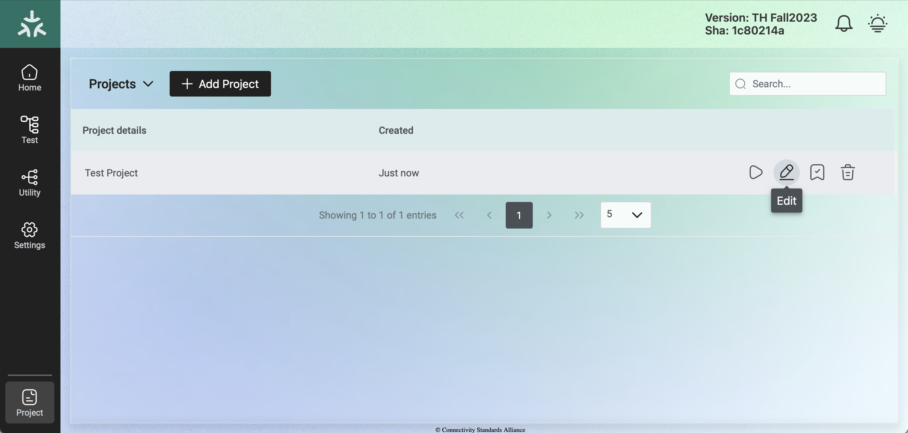
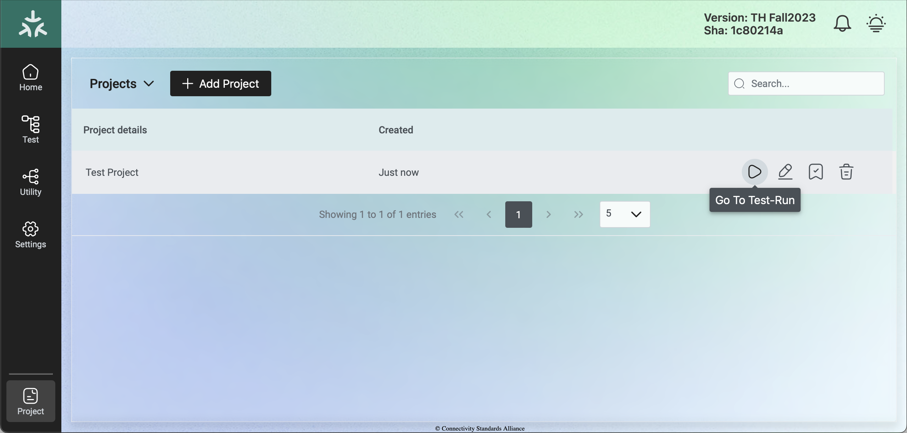
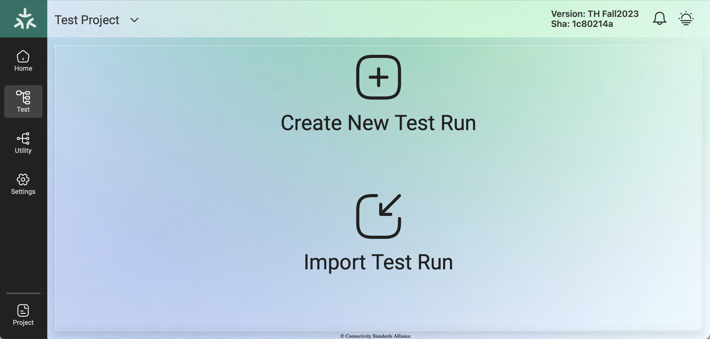
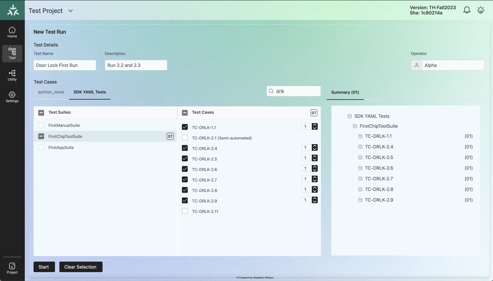
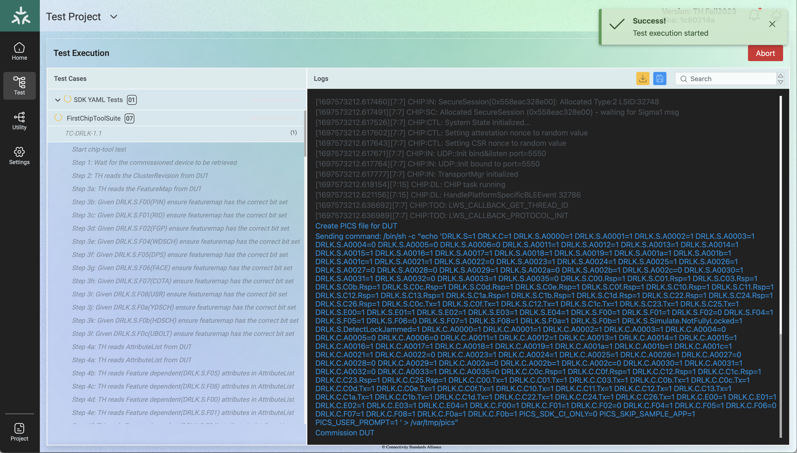
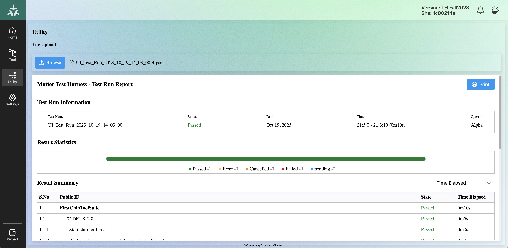

////
 *
 * Copyright (c) 2023 Project CHIP Authors
 *
 * Licensed under the Apache License, Version 2.0 (the "License");
 * you may not use this file except in compliance with the License.
 * You may obtain a copy of the License at
 *
 * http://www.apache.org/licenses/LICENSE-2.0
 *
 * Unless required by applicable law or agreed to in writing, software
 * distributed under the License is distributed on an "AS IS" BASIS,
 * WITHOUT WARRANTIES OR CONDITIONS OF ANY KIND, either express or implied.
 * See the License for the specific language governing permissions and
 * limitations under the License.
////
<<<
== *Test Configuration*

=== Project Configuration

When the DUT is a client, refer to <<simulated-tests>>. The TH brings up the example accessory using chip-app1 binary. The user will be prompted to commission the device. Once the commissioning process is completed, proceed with the test execution.

In the case where the DUT is a server, the TH spins up the controller, the DUT bring-up procedure should be completed and has to be paired with the controller. 

Depending on the DUT’s network transport, any one of the appropriate pairing modes can be opted:

* *‘ble-wifi* ’ to complete the pairing for the DUT using BLE Wi-Fi 
* *‘onnetwork’* to complete the pairing for the DUT that is already on the operational network (e.g., the device is already present on the same Ethernet network of the TH) connection
* *‘ble-thread’* to complete the pairing for the Thread Device

Follow the sections below for the project configuration and test execution.

==== Projects Menu
. Open a Web browser from the user's system and enter the IP address of the Raspberry Pi as given in <<th-installation-on-raspberry-pi, Section 4.1.2, TH Installation on Raspberry Pi>>. 
. In case the TH user interface does not launch, refer to <<bringing-up-of-docker-containers-manually, Section 4.2.3, Bringing Up of Docker Containers Manually>>.
+
image:images/img_15.png[]

. A new window will be opened as “Matter Test Harness”. 
. Click on the *Create New Project* button. Enter the project name as “Test Project” and edit the Project Config settings to provide additional details.
+
image:images/img_16.png[]

===== Wi-Fi Mode
.. To pair in the BLE Wi-Fi mode, configure the Network settings by providing the ssid and password.
+
image:images/img_17.png[]

.. Configure the DUT by providing details like discriminator, setup_code and set the *pairing_mode as “ble-wifi”*.
+
image:images/img_18.png[]

===== On Network Mode
.. If the DUT is already present on the operational network (e.g., connected to the same network as the controller via Ethernet) then the user can select this mode. 
.. Configure the DUT by providing details like discriminator, setup_code and set the *pairing_mode as “onnetwork”*.
+
image:images/img_19.png[]

===== Thread Device Mode
.. The TH loads the default thread configuration values that match the OTBR built on the TH image. The following configuration can be customized as per the user’s need.
+
image:images/img_20.png[]

.. Input the DUT configuration details like discriminator: “3840”, setup_code:”20202021”, and *pairing_mode as “ble-thread”*.
+
image:images/img_57.png[]
+
NOTE: _The OTBR docker is contained in the TH image and runs automatically upon the start of the TH tool._

===== PAA Certificates
For the case that the DUT requires a PAA certificate to perform a pairing operation, input “true" for the flag “chip_tool_use_paa_certs” to configure the Test-Harness to use them.

image:images/img_58.png[]

NOTE: Make sure to include the desired PAA certificates in the default path "*/var/paa-root-certs/*", in the Raspberry-Pi.

===== Test Parameters
.. Input the test parameters like endpoint on the DUT where the cluster to be tested is implemented.
+
image:images/img_21.png[]

On completion of the network and the device configuration, select the *Update* and then *Create* button to create the Test Project. 

===== Upload PICS File
The newly created project will be listed under the Project details column. +

Click on the Edit option to configure the project to load the required PICS file for the cluster to be tested and select the *Update* button. Refer to <<test-case-execution, Section 8, Test Case Execution>>.

image:images/img_24.png[]

==== Test Menu
. Now the Test Project is ready for execution. Click on the *Go To Test-Run* icon and create a new Test Run batch.
+

+

. The test cases are loaded based on the PICS file selection. Provide a Test name for this run such as Door Lock First Run. Input any additional description about the run. Enter the Test Engineers Name under Operator. Select only the test cases that are to be executed and deselect other test cases. There is a search option available to search for a particular test case. The number of times the test is to be executed can be given by clicking on the number spin control. +
Ensure that DUT is in the discoverable mode before clicking on the Start button. +
Example command to be used to launch the sample apps (e.g., all-cluster-app):

+
|===
|Ble-wifi: ./chip-all-clusters-app --wifi

Onnetwork: ./chip-all-clusters-app

Thread: Enable discoverable over Bluetooth LE (ex: On nRF52840 DK: Press Button 4 to start BLE advertisements)  
|===
+

. Click on the *Start* button for the test execution. Note that the test execution gets started and the log window appears. Click on the *Abort* button to stop the test execution.
+

. Once the test execution is completed, click on
* The Yellow icon to download the test logs
* The Blue icon to save the test reports

. Click on the *Result* button and select the test that was executed and click on *Show Report* to view the reports. The user can also select previously executed tests and view the reports and logs. There is an option provided to re-run the test cases. Refer to <<collect-logs-and-submit-to-teds, Section 9, Collect Logs and Submit to TEDS>> to collect the logs and submit the reports to TEDS.
+
image:images/img_29.png[]

==== Utility Menu
. Click on *Utility Menu* to review the previous test report.
+

. Click on the *Browse* button to upload the previous report and select the desired log filter options. The console logger contains a filter drop-down list to select the different categories of logs to display. Use the *Print* button to print the test report.

==== Settings Menu

Click on the “*Select theme*” option drop-down to select the different theme for the user interface.
