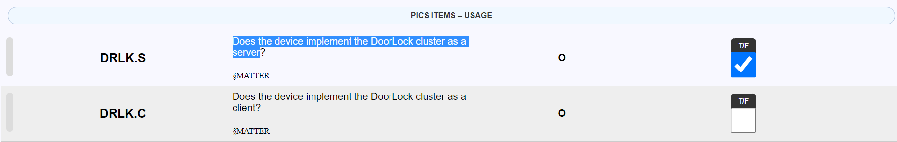
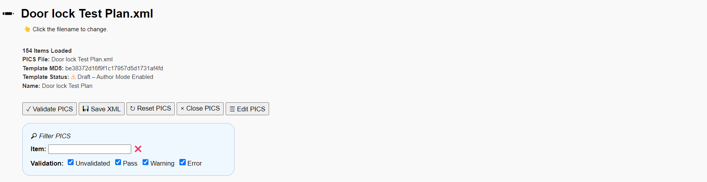
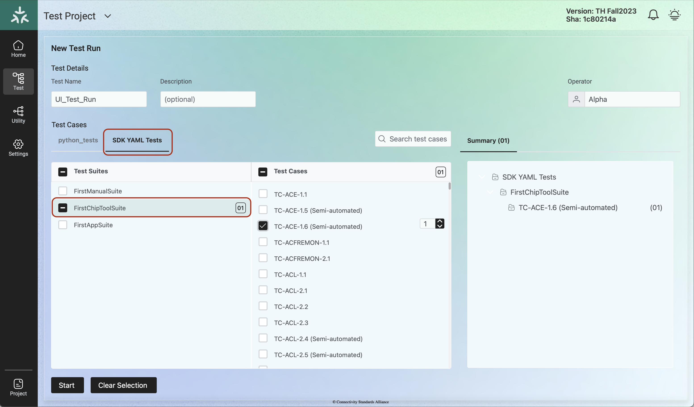
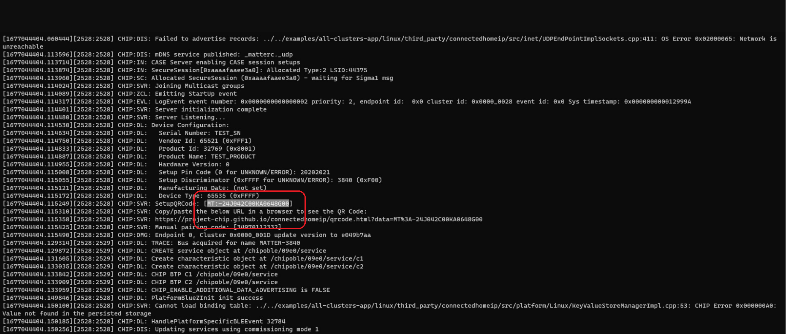
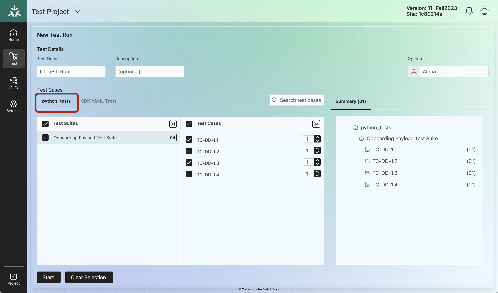
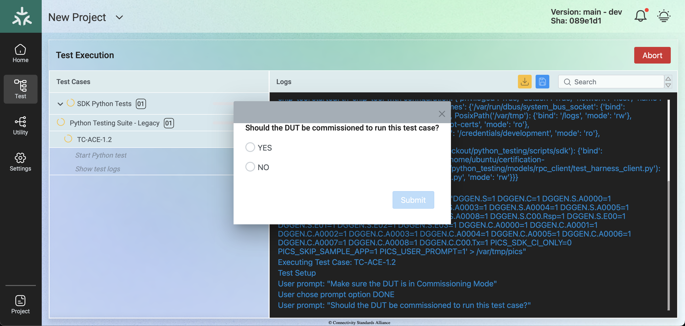

////
 *
 * Copyright (c) 2023 Project CHIP Authors
 *
 * Licensed under the Apache License, Version 2.0 (the "License");
 * you may not use this file except in compliance with the License.
 * You may obtain a copy of the License at
 *
 * http://www.apache.org/licenses/LICENSE-2.0
 *
 * Unless required by applicable law or agreed to in writing, software
 * distributed under the License is distributed on an "AS IS" BASIS,
 * WITHOUT WARRANTIES OR CONDITIONS OF ANY KIND, either express or implied.
 * See the License for the specific language governing permissions and
 * limitations under the License.
////
<<<
== *Test Case Execution*

Refer to <<references, Section 2, References>> for PICS tool documentation to generate the PICS XML files.

PICS (_Protocol Implementation Conformance Statement_) is a list of features supported by a device as defined by a technology _protocol_ , standard or specification. Each feature is known as a _PICS Item_ , and device _implementation_ is either mandatory or optional. PICS is used by the device manufacturer as a _statement_ of _conformance to_ a technology standard and a requirement for all CSA Product Certification programs.

PICS codes are generated from the Test Plans. The Base.xml file lists all the Core feature PICS from the Matter Base Specifications and the application cluster PICS are listed in the respective TestPlan.xml files. Follow the steps below to generate and upload the PICS files.

. Click on the following link to download the PICS XML files— https://groups.csa-iot.org/wg/matter-csg/document/26122[https://groups.csa-iot.org/wg/matter-csg/document/26122]
. Click on the following link to use the PICS tool— https://picstool.csa-iot.org/#userguide[PICS Tool v1.6.4 matter 1.0 - Connectivity Standards Alliance (csa-iot.org)]
. Load the Base.xml file by clicking on the *Browse* option. In case the following error is observed:
+
WARNING: *Base.xml: This XML PICS template is unapproved and has not been tested with this tool. To test new or updated PICS documents, please enable _author mode_ and try again.*
+
Enable author mode and retry uploading the XML file.
+

. Load the XML file that is required for testing, e.g., Doorlock.xml.
. Check the option for which the testing will be done for the DoorLock cluster. In the case of the Door Lock cluster to be tested in the Server mode, select the checkbox for DRLK.S. In case the cluster has to be tested in the Client mode, select the checkbox for DRLK.C.
+

. Review all the attributes/commands that are supported by the DoorLock cluster and ensure the corresponding options are checked in the PICS tool.
. Click on *Validate PICS* . Ensure that there are no warnings or errors. In case of any warnings or errors, revisit the options and check/uncheck the options as supported by the DUT.
+

. Prior to the test execution, the user will have to load the relevant PICS file to list the required test cases. Depending on the PICS file loaded, the test suites list will be updated accordingly.
+
image:images/img_33.png[]

=== Automated and Semi Automated Tests

==== Automated Test Cases

Click on the *SDK YAML Tests* tab. The automated and semi automated test cases will be listed in **FirstChipToolSuite**. The Automated test cases will be listed as the TC-<Cluster>-XX without any suffix, e.g., TC-DRLK-1.1. Automated test case execution will not require any manual intervention.

==== Semi Automated Test Cases

The Semi Automated test cases will be listed as TC-<Cluster>-XX(Semi-automated). During the Semi Automated test case execution, some of the steps will be executed automatically and the user will be prompted to perform a few steps as shown below in the screenshots. From the TH user interface, load the required PICS file to select the test cases, e.g., Doorlock Test Plan.xml.

Select the required Semi Automated test case to be executed and ensure other test cases are not selected. Take for example TC-ACE-1.6 as shown below:

Bring up the DUT (All Clusters as Server) by sending the following command `./chip-all-clusters-app` on the Raspberry Pi terminal and click on the *Start* button.

During the Test execution, as the log gets updated, copy the newly generated node ID.

image:images/img_35.png[]

Form the Chip-tool, execute the above command with node ID listed in the TH log. Save the Chip-tool logs in a text file. Verify the result in the Chip-tool log and select the applicable choice from the user prompt in the TH tool and select the *Submit* button.

|===
|Example: +
`docker exec -it th-chip-tool <popup command> <newly generated nodeID> <end-point id>`

`cd apps` +
`docker exec -it th-chip-tool ./chip-tool groups view-group 0x0105 Oxb1d2ee23dcf2f18b 0`
|===

Check for the response of the command in the Chip-tool log and compare with the expected response from the TH user prompt as shown below. In case both the responses match, click on *PASS* followed by the *Submit* button.

image:images/img_36.png[]

At the end of the test execution, the user will be prompted to upload the Chip-tool logs that were saved in the previous step.

=== Python Tests

The Onboarding Payload Device Discovery test cases are listed under this option. Before executing the Python tests, bring up the DUT in the Chip-tool and save the discovery log. During the Python test execution, the user is prompted to input data such as QR code. Copy the data from the previously saved logs and provide the input. Follow the sequence below to execute the python_tests.

During the DUT bring-up, note down the QR code and save it for future use.

Select the python_tests tab for the test execution.

During the test execution the user is prompted for the QR code. Use the code that was saved earlier and proceed with the testing.

image:images/img_39.png[]

=== Manual Tests

During the manual test case execution, the user is prompted for an action for each test step as shown below.

image:images/img_40.png[]

After the Manual pairing of the DUT, execute the command displayed on the prompt as shown below.

|===
|Example:  `./apps/chip-tool doorlock read-event door_lock-alarm 1 1`
|===

Save the Chip-tool logs in a text file. Validate the chip tool log and select the applicable choice from the user prompt in the TH tool and select the *Submit* button. At the end of the test execution, the user is prompted to upload the Chip-tool logs that were saved in the previous step.

=== Simulated Tests

Simulated tests must be executed when the DUT is considered as a Client. The simulated test cases will be listed in **FirstAppSuite** under the *SDK YAML Tests* tab.

image:images/img_59.png[]

During the execution of these tests, the user is prompted for an action to be performed on the device as shown in the following screenshot.

Follow the instructions provided in the user prompt to complete the test execution.

image:images/img_41.png[]

|===
|IMPORTANT: Currently the selection will be done automatically by TH based on the test execution result. In the future the User Prompt will be updated to proper represent this behavior.
|===

=== SDK Python Tests

==== Run Tests Inside SDK Docker Container

Some automated Python scripts are available inside the docker of the TH image.

E.g.: TC_ACE_1_3.py, TC_ACE_1_4.py , TC_CGEN_2_4.py , TC_DA_1_7.py , TC_RR_1_1.py  TC_SC_3_6.py

Follow the instructions below to execute the test cases.

===== Prerequisite

. A directory containing the PAA (Product) roots that will be mounted as /paa_roots.
. Run the following commands from the Raspberry Pi terminal.

+
|===
|`cd certification-tool` +
`./scripts/ubuntu/update-paa-certs.sh`
|===

. After execution of the above commands ensure that the PAA’s are available locally at */var/paa-root-certs* .

===== Placeholders for Steps

Device-specific configuration is shown as shell variables. *PLEASE REPLACE THOSE WITH THE CORRECT VALUE* in the steps below.

* *$PATH_TO_PAA_ROOTS*: Path on host where PAA roots are located. Failure to provide a correct path will cause early failure during commissioning (e.g., /var/paa-root-certs/)
* *$DISCRIMINATOR*: Long discriminator for DUT (e.g., 3840 for Linux examples)
* *$SETUP_PASSCODE*: Setup passcode for DUT (e.g., 20202021 for Linux examples)
* *$WIFI_SSID*: SSID of Wi-Fi AP to which to attempt connection
* *$WIFI_PASSPHRASE*: Passphrase of Wi-Fi AP to which to attempt connection
* *$BLE_INTERFACE_ID*: Interface ID for BLE interface (e.g., 0 for default, which usually works)
* *$THREAD_DATASET_HEX*: Thread operational dataset as a hex string (e.g., output of dataset active -x in OpenThread CLI on an existing end-device

===== Common Steps

|===
|Factory-reset the DUT

`docker run -v $PATH_TO_PAA_ROOTS:/paa_roots -v /var/run/dbus:/var/run/dbus -v $(pwd):/launch_dir --privileged --network host -it connectedhomeip/chip-cert-bins:<SDK SHA RECOMMENDED>`
|===

This downloads a Docker image with the test environment, and runs the environment including mounting the PAA trust store in */paa_roots* and mounts the local Avahi socket so that Avahi in the VM can run against its host.

* You will be shown a *#* root prompt

NOTE: *The first time running docker will be SLOW (around 5 minutes) due to the need to download data. Every other run after that will be instant.*

===== For On-Network Pairing

Execute the following command:

|===
|`rm -f admin_storage.json && python3 python_testing/TC_RR_1_1.py --discriminator $DISCRIMINATOR --passcode $SETUP_PASSCODE --commissioning-method on-network --paa-trust-store-path /paa_roots --storage-path admin_storage.json`
|===

To test this against a Linux target running on the same network as the host:

|===
|`clear && rm -f kvs1 && ./chip-all-clusters-app --discriminator 3842 --KVS kvs1 --trace_decode 1`
|===

[NOTE]
==== 
* The $DISCRIMINATOR to be used will be 3842 in this example.
* The *rm -f kvs1* is a factory reset.
====

===== For BLE+Wi-Fi Pairing

Execute the following command in the docker for the BLE+Wi-Fi pairing:

|===
|`rm -f admin_storage.json && python3 python_testing/TC_RR_1_1.py --discriminator $DISCRIMINATOR --passcode $SETUP_PASSCODE --commissioning-method ble-wifi --paa-trust-store-path /paa_roots --storage-path admin_storage.json --wifi-ssid $WIFI_SSID --wifi-passphrase $WIFI_PASSPHRASE --ble-interface-id $BLE_INTERFACE_ID`
|===

===== For BLE+Thread Pairing

Execute the below command in the docker for the BLE+Thread pairing:

|===
|`rm -f admin_storage.json && python3 python_testing/TC_RR_1_1.py --discriminator $DISCRIMINATOR --passcode $SETUP_PASSCODE --commissioning-method ble-thread --paa-trust-store-path /paa_roots --storage-path admin_storage.json --thread-dataset-hex $THREAD_DATASET_HEX --ble-interface-id $BLE_INTERFACE_ID`
|===

===== Post-Test Steps

Factory reset the DUT again → The test fills tons of stuff and the device will be in an odd state of ACL’s. This will be fixed once there is ample time to clean up after the test is completed by sending commands to, for example, remove the fabrics joined.

===== Possible Issues

* Failing at Step 9 during execution of TC_RR_1_1:
.. Some DUT’s have an incorrectly-configured UserLabel cluster where the backend is not implemented due to SDK example issues where some examples have the backend and others do not. This will fail at the last step (“Step 9: Fill UserLabel clusters on each endpoint”), with FAILURE writes. To override the test not to run this step, you can add “*--bool-arg skip_user_label_cluster_steps:true*“ to the command line of *TC_RR_1_1.py*, at the end.
.. Not having the *$PATH_TO_PAA_ROOTS* set properly when starting the docker or not having PAA roots certificates at that path.
.. Follow the instructions for item 2 in <<prerequisite, Section 8.5.1, Prerequisite>>.

====== Common Test Failures

The documents in this https://github.com/project-chip/matter-test-scripts/tree/main/docs/common_test_failures[link] are intended to be used to help root-cause common test failures, especially in cases where the underlying cause of the failure may not be immediately obvious from the test step or expected outcomes.

==== Run Tests on the TH User Interface

Some automated Python scripts are available in TH User Interface.

To execute the tests, the parameters *discriminator*, *setup_code* and *pairing_mode* need to be filled in the device configuration parameters (*dut_config*).

To configure specific/custom parameters, please edit the project configuration to include the parameters in the session (*test_parameters*).

Project configuration example:
[source,xml,options="unbreakable"]
----
{
  ...
  "dut_config": {
    "discriminator": "3840",
    "setup_code": "20202021",
    "pairing_mode": "onnetwork",
    "chip_tool_timeout": null,
    "chip_tool_use_paa_certs": false
  },
  "test_parameters": {
    "paa-trust-store-path": "/credentials/development/paa_roots",
    "storage-path": "admin_storage.json"
  }
  ...
}
----

===== Test suites

TH expects the SDK Python Tests to follow a certain template. New tests are being written with this template and the old tests are being updated to conform to it. The tests are divided in 3 test suites:

image:images/img_61.png[SDK Python Tests - Suites]

. Python Testing Suite
  * For test cases that follow the expected template and have a commissioning first step.
  * The user will be asked to make sure that the DUT is in Commissioning Mode at the start of the test suite setup and then the DUT will be commissioned.
  * The commissioning will be kept throughout the execution of all its tests.
. Python Testing Suite - No commissioning
  * For test cases that follow the expected template but don't have a commissioning first step.
  * The selected tests will be executed without commissioning the DUT.
  * The user will be asked to make sure that the DUT is in Commissioning Mode at the start of each test.
. Python Testing Suite - Legacy
  * For test cases that don't follow the expected template yet.
  * The user will be asked to make sure that the DUT is in Commissioning Mode at the start of each test.
  * The user will also be asked if the DUT should be commissioned at the start of each test. The DUT will be commissioned depending on the user's answer.

image:images/img_62.png[SDK Python Tests - Commissioning Mode prompt]

===== PIXIT Support

PIXIT type parameters must be filled in the *test_parameters* section.
The following example will be used to define the following parameters:

----
PIXIT.ACE.APPENDPOINT:1
PIXIT.ACE.APPDEVTYPEID:256
PIXIT.ACE.APPCLUSTER:OnOff
PIXIT.ACE.APPATTRIBUTE:OnOff
----

Project configuration example:
[source,xml,options="unbreakable"]
----
{
  ...
  "test_parameters": {
    "paa-trust-store-path": "/credentials/development/paa_roots",
    "storage-path": "admin_storage.json",
    "int-arg": "PIXIT.ACE.APPENDPOINT:1 PIXIT.ACE.APPDEVTYPEID:256",
    "string-arg": "PIXIT.ACE.APPCLUSTER:OnOff PIXIT.ACE.APPATTRIBUTE:OnOff"
  }
  ...
}
----

The above example will be used to define the following arguments when running the test:

----
--int-arg PIXIT.ACE.APPENDPOINT:1 PIXIT.ACE.APPDEVTYPEID:256 --string-arg PIXIT.ACE.APPCLUSTER:OnOff PIXIT.ACE.APPATTRIBUTE:OnOff
----
