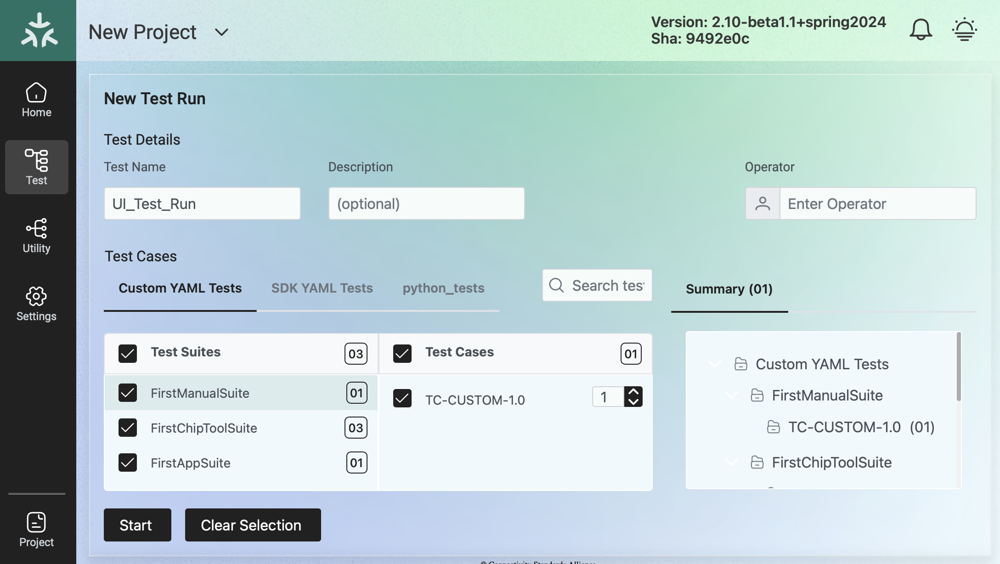

////
 *
 * Copyright (c) 2023 Project CHIP Authors
 *
 * Licensed under the Apache License, Version 2.0 (the "License");
 * you may not use this file except in compliance with the License.
 * You may obtain a copy of the License at
 *
 * http://www.apache.org/licenses/LICENSE-2.0
 *
 * Unless required by applicable law or agreed to in writing, software
 * distributed under the License is distributed on an "AS IS" BASIS,
 * WITHOUT WARRANTIES OR CONDITIONS OF ANY KIND, either express or implied.
 * See the License for the specific language governing permissions and
 * limitations under the License.
////
<<<
== *Getting Started with Matter Test-Harness (TH)*

The Matter Node (DUT) that is used for certification testing can either be a commissioner, controller or controlee. 

If the DUT is a controlee (e.g., light bulb), the TH spins a reference commissioner/controller using chip-tool binary shipped with the SDK. The TH commissioner provisions the DUT and is used to execute the certification tests on the controlee. 

If the DUT is a commissioner/controller, the Test TH spins an example accessory that is shipped with the SDK and uses that for the DUT to provision, control and run certification tests.

Refer to <<bringing-up-of-matter-node-dut-for-certification-testing, Section 5, Bringing Up of Matter Node (DUT) for Certification Testing>> to bring up the DUT and then proceed with device testing by referring to <<test-configuration, Section 7, Test Configuration>>.

For hobby developers who want to get acquainted with certification tools/process/TC’s, can spin DUT’s using the example apps provided in the SDK. Refer to the instructions to set up one https://groups.csa-iot.org/wg/matter-csg/document/folder/2756[here].

TH runs on Ubuntu 22.04 Server LTS. The official installation method uses a Raspberry Pi (<<th-image-installation-on-raspberry-pi>>), but there's an alternative method used in the tool's development that uses a virtual machine instead (<<th-installation-without-a-raspberry-pi>>). Keep in mind that thread networking is not officially supported in VM installations at the moment.

=== TH Image Installation on Raspberry Pi

There are two ways to obtain the latest TH image on Raspberry Pi. Follow the instructions in <<th-installation-on-raspberry-pi, Section 4.1.2, TH Installation on Raspberry Pi>> to install the image file OR if you already have an image, follow the instructions in <<update-existing-th, Section 4.4, Update Existing TH>> to update the TH image.

==== *Prerequisites*

The following equipment will be required to have a complete TH setup:

* *Raspberry Pi Version 4 with SD card of minimum 64 GB Memory*

The TH image will be installed on Raspberry PI. The TH image contains couple of docker container(s) with all the required dependencies for certification tests execution.

* *Windows or Linux System (Laptop/Desktop/Mac)*

The Mac/PC will be used to download the TH image and flash on the SD card to be used on Raspberry Pi. Download the https://www.raspberrypi.com/software/[Raspberry Pi Imager] or https://www.balena.io/etcher/[Balena Etcher] tool. The same can be used to set up the required build environment for the Matter SDK or building Matter reference apps for various platforms. 

* *RCP dongle*

If the DUT supports thread transport, an RCP dongle provisioned with a recommended RCP image for the default OTBR router that comes with the TH will be required to function properly. Currently, the OTBR can work with a Nordic RCP dongle or a SiLabs RCP dongle. Refer to <<ot-border-router-otbr-setup, Section 6, OT Border Router (OTBR) Setup>> on how to install an RCP image.

==== TH Installation on Raspberry Pi

. Go to the https://drive.google.com/drive/u/1/folders/1ca7CG8QHHYy0g4ScSmiGL3KApNwtZ-w9[TH release location] and download the official TH image from the given link on the user’s PC/Mac.
. Place the blank SD card into the user’s system USB slot. 
. Open the https://www.raspberrypi.com/software/[Raspberry Pi Imager] or https://www.balena.io/etcher/[Balena Etcher] tool on the Mac/PC and select the image file from the drop-down list to flash.
. After the SD card has been flashed with the image, remove the SD card and place it in the Raspberry Pi’s memory card slot.
. Power on the Raspberry Pi and ensure that the local area network, display monitor and keyboard are connected.
. Enter the default username and password:
* username: ubuntu
* password: raspberrypi
. Using the _ifconfig_ command, obtain the IP address of the Raspberry Pi. The same IP address will be used to launch the TH user interface on the user's system using the browser.
. Proceed with test configuration and execution (refer to <<test-configuration, Section 7, Test Configuration>> and <<test-case-execution, Section 8, Test Case Execution>> respectively).

=== Troubleshooting

==== Read-Only File System Error
* During the execution of the above commands if a read-only file system error or an error showing "Is docker daemon running?" occurs, follow the steps below to fix the issue:

|===
|`$sudo fsck` ( Press 'y' for fixing all the errors )   
|===

* Upon successful completion, try the following commands:

|===
|`$sudo reboot` +
ssh back into the TH IP address using: +
`$ssh ubuntu@<IPADDRESS-OF-THE-RASPI>`
|===

* In case “sudo fsck” fails, use the following commands:

|===
|`sudo fsck -y -f /dev/mmcblk0p2` +
`fsck -y /dev/mmcblk0p2`
|===

* In case the “remote: Repository not found” fatal error occurs, try the following steps to fix the issue. Clone the certification-tool with personal access token (Refer to <<generate-personal-access-token, Section 4.2.2, Generate Personal Access Token>> to generate the personal access token) and follow the steps below.

|===
|cd ~ +

Take the backup of Test Harness binary using below command: +
`$mv certification-tool certification-tool-backup` +
`$git clone https://<token>@github.com/project-chip/certification-tool.git`

Follow the instructions given in the section below on how to <<update-existing-th, update an existing Test-Harness>>
|===

==== Generate Personal Access Token

The Personal Access Token may be required during the process of updating an existing TH image. Below are the instructions to obtain the personal access token.

. Connect to the Github account (the one recognized and authorized by Matter).
. On the upper-right corner of the page, click on the profile photo, then click on *Settings*.
. On the left sidebar, click on *Developer settings*.
. On the left sidebar, click on *Personal access tokens* [Personal access tokens (classic)].
. Click on *Generate new token* .
. Provide a descriptive name for the token.
. Enter an expiration date, in days or using the calendar. 
. Select the scopes or permissions to grant this token.
. Click on *Generate new token* .
. The generated token will be printed out on the screen. Make sure to save it as a local copy as it will disappear.
+
NOTE: Sample token: pass:[ghp_hUQExoppLKma***************Urg4P]

==== Bringing Up of Docker Containers Manually

During the initial reboot of the Raspberry Pi, if the docker is not initiated automatically, try the following command on the Raspberry Pi terminal to bring up the dockers.

|===
|Use the command `ssh ubuntu@IP_address` from the PC to log in to Raspberry Pi. Refer above sections on how to obtain the IP address of Raspberry Pi.

Once the SSH connection is successful, start the docker container using the command +
*$* `./certification-tool/scripts/start.sh`

The above command might take a while to get executed, wait for 5-10 minutes and then proceed with the Test Execution Steps as outlined in the below sections.  
|===

=== TH installation without a Raspberry Pi

The official installation method uses a Raspberry Pi (<<th-image-installation-on-raspberry-pi>>). **This alternative installation method is targeted for development purpose and it only supports onnetwork pairing mode.**

To install TH without using a Raspberry Pi you'll need a machine with Ubuntu 22.04 Server LTS. You can <<create-an-ubuntu-virtual-machine, create a virtual machine>> for this purpose, but be aware that if the host's architecture is not arm64 you'll need to <<substitute-the-sdks-docker-image-and-update-sample-apps, substitute the SDK's docker image>> in order for it to work properly.

==== Create an Ubuntu virtual machine

Here's an example of how to create a virtual machine for TH using multipass (https://multipass.run/).

* Install multipass

|===
|`brew install multipass`
|===

* Create new VM with Ubuntu 22.04 (2 cpu cores, 8G mem and a 50G disk)

|===
|`multipass launch 22.04 -n matter-vm -c 2 -m 8G -d 50G`
|===

* SSH into VM

|===
|`multipass shell matter-vm`
|===

NOTE: About Multipass: +
Seems like bridged network is not available, so you will not be able to test with DUT outside the docker container, but you can develop using the sample apps on the platform.

==== Setup TH in Ubuntu

* Create new ssh key

|===
|`ssh-keygen -t ed25519 -C "user@matter-vm"`
|===

* Add SSH key to GitHub Settings

* Clone git repo

|===
|`git clone git@github.com:project-chip/certification-tool.git"`
|===

* Go into the repo directory

|===
|`cd certification-tool`
|===

* Run TH auto install script

|===
|`./scripts/ubuntu/auto-install.sh`
|===

* Reboot VM

If using multipass, to find the IP address use the command

|===
|`multipass list`
|===

==== Substitute the SDK's docker image and update sample apps

In order to run TH in a machine that uses the 'linux/amd64' platform, you'll need to first build a new SDK docker image.

* Get the SDK commit SHA

|===
|Value for variable `SDK_DOCKER_TAG` in TH repository path `certification-tool/backend/app/core/config.py`
|===

* Download the Dockerfile for chip-cert-bins from the commit you need

|===
|Substitute <COMMIT_SHA> with the value from `SDK_DOCKER_TAG`: +
`github.com/project-chip/connectedhomeip/blob/<COMMIT_SHA>/integrations/docker/images/chip-cert-bins/Dockerfile`
|===

* Copy Docker file to TH's machine

* Make sure that no other SDK image for that commit SHA is loaded in the machine

|===
|Run `docker images` +
If there's an image with a tag for the commit you're using, delete that image +
`docker image rm <IMAGE_ID>`
|===

* Build new SDK image (this could take about 3 hours)

|===
|Substitute <COMMIT_SHA> with the value from `SDK_DOCKER_TAG`: +
`docker buildx build --load --build-arg COMMITHASH=<COMMIT_SHA> --tag connectedhomeip/chip-cert-bins:<COMMIT_SHA> .`
|===

* Update TH sample apps

|===
|To update your sample apps using the new image, you should first edit the `certification-tool/scripts/ubuntu/update-sample-apps.sh` script to comment out or remove the following line: +
`sudo docker pull $SDK_DOCKER_IMAGE:$SDK_DOCKER_TAG` +
This is needed because the docker pull command downloads the image from the remote. Removing this line, the script will use your local image. +
Then run this script in the certification-tool repository +
`./scripts/ubuntu/update-sample-apps.sh`
|===

=== Update Existing TH

To update an existing TH environment, follow the instructions below on the terminal.

|===
|`cd ~/certification-tool` +
`git fetch` +
`git checkout <Target_Branch/Tag>` +
`git pull` +
`git submodule update --init --recursive` +
`./scripts/ubuntu/auto-update.sh <Target_Branch/Tag>` +
`./scripts/start.sh` +

Wait for 10 mins and open the TH application using the browser
|===

=== Updating Existing Yaml Test Script

It is possible to update yaml test script content by directly editing the file content. It is useful when validating small changes or fixing misspelled commands.

Yaml files are located at:
|===
|`~/certification-tool/backend/test_collections/sdk_tests/sdk_checkout/yaml_tests/yaml/sdk/`
|===

To update an existing Yaml test script: (e.g. `Test_TC_ACE_1_1.yaml`)

* Open the script file:
|===
|`~/certification-tool/backend/test_collections/sdk_tests/sdk_checkout/yaml_tests/yaml/sdk/Test_TC_ACE_1_1.yaml`
|===

* Update/change the desired information.

* Save and close the file.

* Restart TH's backend container:
|===
|`$docker restart certification-tool_backend_1`
|===

* Changes will be available on the next execution of the yaml test.

To create a new Yaml test script:

* Use an existing test script as a starting point.

* Rename the file to a new one: e.g. `Test_TC_ACE_1_1.yaml` to `Test_TC_ACE_9_9.yaml`

* Update the name entry inside the yaml file:

|===
|**FROM** name: 42.1.1. `[TC-ACE-1.1]` Privileges

**TO** name: 42.1.1. `[TC-ACE-9.9]` Privileges
|===

* Proceed as explained on updating an existent yaml file.

=== Customized Test Scripts (Yaml/Python Tests)

To use customized tests, the files must be placed in the specific folder (described below). This way, Test-Harness will load and display the available tests on the interface.
These tests will not be affected if the system is restarted or if the SDK Yaml tests are updated.

Custom Yaml files folder are located at:
|===
|`~/certification-tool/backend/test_collections/sdk_tests/sdk_checkout/yaml_tests/yaml/custom/`
|===

Custom Python files folder are located at:
|===
|`~/certification-tool/backend/test_collections/sdk_tests/sdk_checkout/python_testing/scripts/custom/`
|===

.Test-Harness displaying the custom tests.

|===
|Hint: You can copy the original SDK Yaml/Python test to Custom Yaml/Python folder and do any changes on it.
|===
