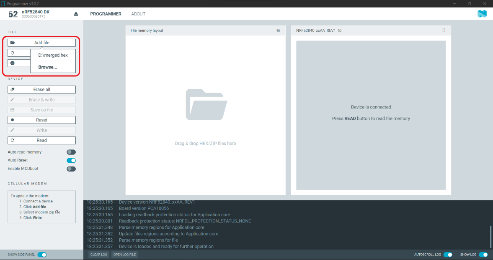
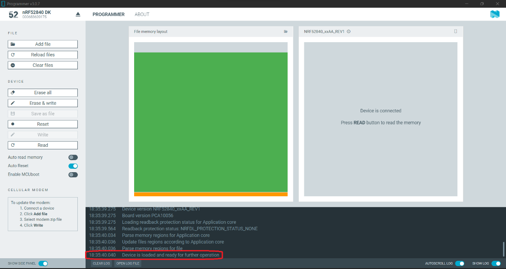

////
 *
 * Copyright (c) 2023 Project CHIP Authors
 *
 * Licensed under the Apache License, Version 2.0 (the "License");
 * you may not use this file except in compliance with the License.
 * You may obtain a copy of the License at
 *
 * http://www.apache.org/licenses/LICENSE-2.0
 *
 * Unless required by applicable law or agreed to in writing, software
 * distributed under the License is distributed on an "AS IS" BASIS,
 * WITHOUT WARRANTIES OR CONDITIONS OF ANY KIND, either express or implied.
 * See the License for the specific language governing permissions and
 * limitations under the License.
////
<<<
== *Bringing Up of Matter Node (DUT) for Certification Testing*

A Matter node can either be a commissioner, controller, controlee, software component or an application. The Matter SDK comes with a few example apps that can be used by Vendors as a reference to build their products. Refer to the examples folder in the https://github.com/project-chip/connectedhomeip[SDK github repo] for the same.

DUT vendors need to get the device flashed with the production firmware revision that they want to get their device certified and execute all the applicable TC’s for their products using the TH. DUT vendors can skip the below sections as the TH brings up the reference applications automatically during the certification tests execution.

A hobby developer can build Matter reference apps either using a Raspberry Pi or Nordic DK board (if the user wants to use thread transport). Follow the instructions below for the <<bringing-up-of-reference-matter-node-dut-on-raspberry-pi, Raspberry Pi>> and <<bringing-up-of-reference-matter-node-dut-on-thread-platform, Nordic>> platforms. 

=== Bringing Up of Reference Matter Node (DUT) on Raspberry Pi

In the case where a device maker/hobby developer needs to bring up a sample/reference DUT, i.e. light bulb, door lock, etc. using the example apps provided in SDK and verify provisioning of the DUT over the Bluetooth LE, Wi-Fi and Ethernet interfaces, follow the below steps to set up the DUT.

Users can either use the example apps (i.e. light bulb, door lock, etc.) that are shipped with the TH image OR build the apps from the latest SDK source. 

To use the apps that are shipped with the TH image, follow the instructions below:

* Flash the TH image on the Raspberry Pi. 
* Go to the apps folder in /home/ubuntu/apps (as shown below) and launch the app that the user is interested in.

image:images/img_3.png[]

To build the example apps from the latest SDK source, follow the instructions below: 

* User to acquire Raspberry Pi Version 4 with SD card of minimum 64 Gb memory.
* Flash the TH image on to the SDK card that will be inserted into the Raspberry Pi as the TH image comes with the default Ubuntu OS image OR the user can download the latest Ubuntu LTS image and install all the required dependencies as outlined in https://github.com/project-chip/connectedhomeip/blob/master/docs/guides/BUILDING.md[https://github.com/project-chip/connectedhomeip/blob/master/docs/guides/BUILDING.md].
* Clone the connected home SDK repo using the following commands:

|===
|*$* `git clone pass:[git@github.com:project-chip/connectedhomeip.git] --recursive` +
*$* `cd connectedhome` +
*$* `source scripts/bootstrap.sh` +
*$* `source scripts/activate.sh`  
|===

* Select the sample app that the user wants to build as available in the examples folder of the SDK repo e.g., lighting-app, all-cluster-app. The user needs to build these apps for the Linux platform using the following command:

|===
|Build the app using the below command:

`./scripts/examples/gn_build_example.sh examples/all-clusters-app/linux/examples/all-clusters-app/linux/out/all-clusters-app chip_inet_config_enable_ipv4=false`
|===

==== To Provision Raspberry Pi Using Wi-Fi Configuration

The sample app (lighting-app or lock-app or all-cluster-app) can be provisioned over the Wi-Fi network when the app is launched with the “--wifi” argument.

|===
|`./chip-all-clusters-app --wifi`
|===

==== To Provision Raspberry Pi Over Ethernet Configuration

The sample app (lighting-app or lock-app or all-cluster-app) can be provisioned over the Ethernet (using onnetwork configuration) that it is connected when the app is launched with no arguments.

|===
|`./chip-all-clusters-app`
|===

=== Bringing Up of Reference Matter Node (DUT) on Thread Platform

Follow the instructions below to set up the Matter Node on Thread Platform. For additional reference, go to the following link:

https://github.com/project-chip/connectedhomeip/tree/master/examples/all-clusters-app/nrfconnect#matter-nrf-connect-all-clusters-example-application

==== Prerequisites

The following devices are required for a stable and full Thread Setup:

* *DUT:* nRF52840-DK board and one nRF52840-Dongle

NOTE: _The DUT nRF52840-DK board mentioned in this manual is used for illustration purposes only. If the user has a different DUT, they will need to configure the DUT following the DUT requirements._

==== Setting Up Thread Board (nRF52840-DK)

To set up the Thread Board, follow the instructions below.

NOTE: _The nRF52840-DK setup can be performed in two methods either by flashing the pre-built binary hex of sample apps which is released along with the TH image by using the nRF Connect Desktop application tool (refer Section 5.2.2.1) or by building the docker environment to build the sample apps (refer Section 5.2.2.2)._

===== *Instructions to Set Up nRF52840-DK Using nRF Connect Desktop Application Tool*
.. Requirements:

. nRF Connect for Desktop tool: Installer for https://nsscprodmedia.blob.core.windows.net/prod/software-and-other-downloads/desktop-software/nrf-connect-for-desktop/4-0-0/nrfconnect-setup-4.0.0-ia32.exe[Windows], https://nsscprodmedia.blob.core.windows.net/prod/software-and-other-downloads/desktop-software/nrf-connect-for-desktop/4-0-0/nrfconnect-4.0.0.dmg[MAC] or https://nsscprodmedia.blob.core.windows.net/prod/software-and-other-downloads/desktop-software/nrf-connect-for-desktop/4-0-0/nrfconnect-4.0.0-x86_64.appimage[Linux]
+
NOTE: _The J-Link driver needs to be separately installed on macOS and Linux. Download and install it from https://www.segger.com/downloads/jlink[SEGGER] under the section J-Link Software and Documentation Pack._

. Download thread binary files which are released along with the TH image. 

.. From the User Interface:
. Connect nRF52840-DK to the USB port of the user’s operating system.
. From the nRF Connect for Desktop tool, install *Programmer* from the apps tab. +
image:images/img_4.jpg[]

. Open the Programmer tool to flash the downloaded binary hex file on nRF52840-DK. +
image:images/img_5.jpg[]

. In the Programmer tool, select the device name from the *SELECT DEVICE* drop-down list. +
image:images/img_6.png[]

. Select *Add file* and browse the downloaded file to upload the desired sample app hex file. +

. Select *Erase & write* to flash the hex file on the device. +
image:images/img_8.png[]

. Check the log for successful flash. +

. Connect the nRF52840-Dongle to the USB port of the Raspberry Pi having the latest TH image. 
. For the Thread DUT, enable discoverable over Bluetooth LE (e.g., on nRF52840 DK: select Button 4) and start the Thread Setup Test execution by referring to <<test-configuration, Section 7, Test Configuration>> .
      
===== *Instructions to Set Up nRF52840-DK Using Docker Environment*
. To build the sample apps for nRF-Connect, check out the Matter repository and bootstrap using following commands:

+
|===
|`git clone pass:[https://github.com/project-chip/connectedhomeip.git]` +
`cd ~/connectedhomeip/ +
source scripts/bootstrap.sh` +
`cd ~/connectedhomeip/ +
source scripts/activate.sh`
|===
+

. If the nRF-Connect SDK is not installed, create a directory running the following command:

+
|===
|*$* `mkdir ~/nrfconnect`
|===
+

. Download the latest version of the nRF-Connect SDK Docker image by running the following command:

+
|===
|*$* `sudo docker pull nordicsemi/nrfconnect-chip`
|===
+

. Start Docker using the downloaded image by running the following command:

+
|===
|`sudo docker run --rm -it -e RUNAS=$(id -u) -v ~/nrfconnect:/var/ncs -v ~/connectedhomeip:/var/chip      -v /dev/bus/usb:/dev/bus/usb --device-cgroup-rule "c 189:* rmw" nordicsemi/nrfconnect-chip`
|===
+

. The following commands can be executed to change the settings if required:

+
|===
|*~/nrfconnect* can be replaced with an absolute path to the nRF-Connect SDK source directory. +
*~/connectedhomeip* can be replaced with an absolute path to the CHIP source directory.  
|===
+

+
|===
|-v /dev/bus/usb:/dev/bus/usb --device-cgroup-rule "c 189: rmw"*  
|===
+

NOTE: _Parameters can be omitted if flashing the example app onto the hardware is not required. This parameter gives the container access to USB devices connected to your computer such as the nRF52840 DK._

+
|===
|*--rm* can be omitted if you do not want the container to be auto-removed when you exit the container shell session. +
*-e RUNAS=$(id -u)* is needed to start the container session as the current user instead of root.  
|===

. Update the nRF-Connect SDK to the most recent supported revision, by running the following command:

+
|===
|*$* `cd /var/chip` +
*$* `python3 scripts/setup/nrfconnect/update_ncs.py --update`
|===

===== *Building and Flashing Sample Apps for nRF-Connect*

Perform the following procedure, regardless of the method used for setting up the environment:

. Navigate to the example directory:

+
|===
|*$* `cd examples/all-clusters-app/nrfconnect`
|===

. Before building, remove all build artifacts by running the following command:

+
|===
|*$* `rm -r build`
|===

. Run the following command to build the example, with **__build-target__** replaced with the build target name of the Nordic Semiconductor's kit, for example, nrf52840dk_nrf52840:

+
|===
|*$* `west build -b <build-target> --pristine always -- -DCONFIG_CHIP_LIB_SHELL=y`
|===

+
|===
| *Target Name*            | *Compatible Kit*          
| nRF52840 DK              | nrf52840dk_nrf52840       
|  nRF5340 DK              | nrf5340dk_nrf5340_cpuapp  
| nRF52840 Dongle          | nrf52840dongle_nrf52840   
| nRF7002 DK	           | nrf7002dk_nrf5340_cpuapp  
|===

. To flash the application to the device, use the west tool and run the following command from the example directory:

+
|===
|*$* `west flash --erase`
|===

. Connect the nRF52840-Dongle to the USB port of the Raspberry Pi having the latest TH image. 
. For the Thread DUT, enable discoverable over Bluetooth LE (e.g., On nRF52840 DK: Press Button 4) and start the Thread Setup Test execution by referring to <<test-configuration, Section 7, Test Configuration>>.
