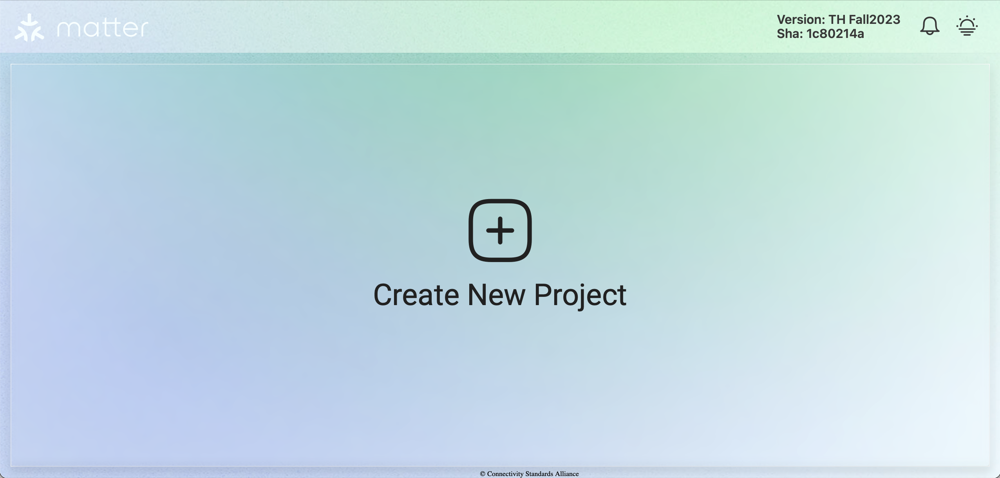
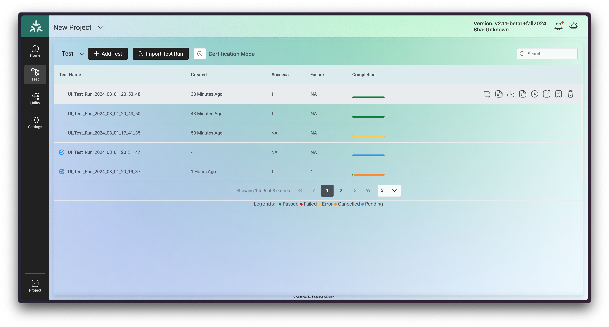
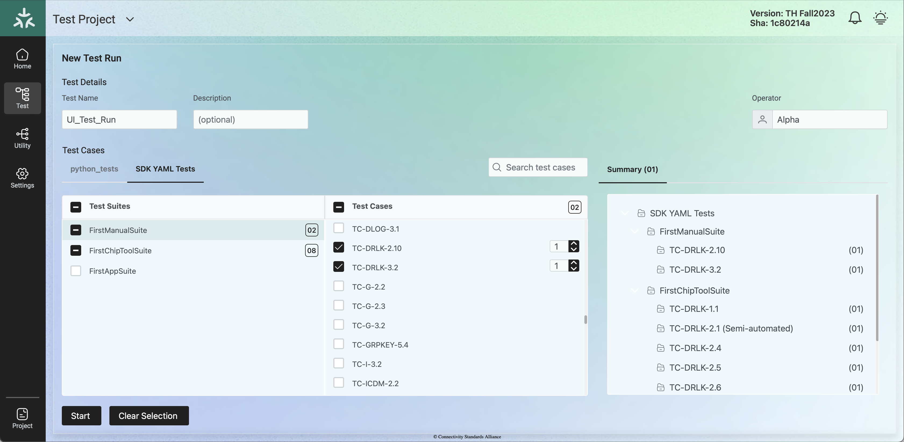
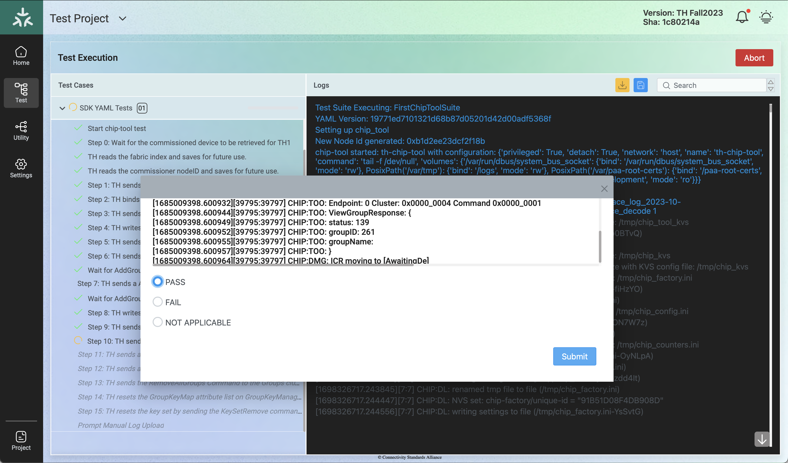
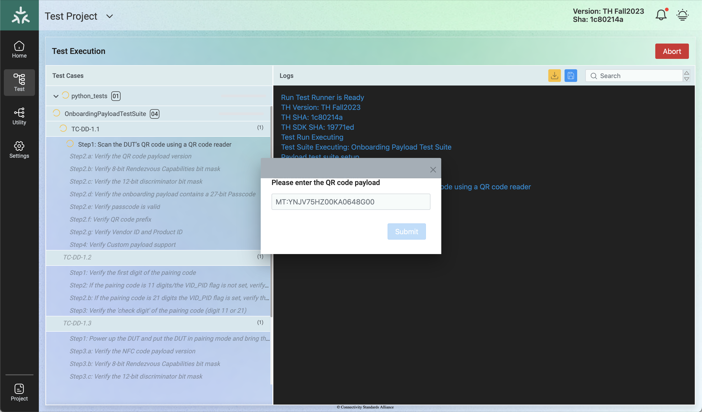

////
 *
 * Copyright (c) 2024 Project CHIP Authors
 *
 * Licensed under the Apache License, Version 2.0 (the "License");
 * you may not use this file except in compliance with the License.
 * You may obtain a copy of the License at
 *
 * http://www.apache.org/licenses/LICENSE-2.0
 *
 * Unless required by applicable law or agreed to in writing, software
 * distributed under the License is distributed on an "AS IS" BASIS,
 * WITHOUT WARRANTIES OR CONDITIONS OF ANY KIND, either express or implied.
 * See the License for the specific language governing permissions and
 * limitations under the License.
////

= *Matter Test-Harness User Manual*
ifdef::env-github[]
:tip-caption: :bulb:
:note-caption: :information_source:
:important-caption: :heavy_exclamation_mark:
:caution-caption: :fire:
:warning-caption: :warning:
endif::[]
ifndef::env-github[]
:icons: font
endif::[]
:title-page:
:idprefix:
:idseparator: -
:sectlinks:
:sectanchors:
:sectnumlevels: 4
:toc-title:
:toc: macro

[discrete]
== *Test-Harness Links*
[cols=".^15%,.^18%,.^12%,.^20%,.^10%,.^25%"]
|===
| *Matter Version* | *TH Version* | *TH image location*                                                                         | *Supporting Documentation*                                                     | *SDK commit* | *Comments*
| Matter 1.0       | v2.6      | https://drive.google.com/file/d/10YkV4mDulhLoA6RJOKZNNKWhHTH1tOfu/view?usp=drive_link[link] | https://groups.csa-iot.org/wg/matter-csg/document/folder/2947[Causeway Link] | 96c9357      |
| Matter 1.1       | v2.8.1    | https://drive.google.com/file/d/15fU3L7QE-MNBslf53A_6sFgn1Wq0Pvqd/view?usp=drive_link[link] | https://groups.csa-iot.org/wg/matter-csg/document/folder/2470[Causeway Link]   | 5a21d17      |
| Matter 1.2       | TH-Fall2023  | https://drive.google.com/file/d/1WTjhc7xbYt18RvpABU3_r47uqOLd7NN1/view?usp=drive_link[link] | https://groups.csa-iot.org/wg/matter-csg/document/folder/2756[Causeway Link] | 19771ed      |
| Matter 1.3       | v2.10-beta3+spring2024| Not Applicable | https://groups.csa-iot.org/wg/matter-csg/document/folder/3314[Causeway Link] | 9f6d627      | To install, substitute the TH version name for _<Target_Branch/Tag>_ in section <<fresh_install>> 
|===

<<<
[discrete]
== *Revision History*

[cols=".^11%,.^15%,.^20%,.^54%"]
|===
| *Revision*  | *Date*       | *Author*                            | *Description*                                                                                                       
| 1           | 11-Jan-2022  | [GRL]Suraj Seenivasan               | * Initial version of the user manual used for V1.0.                                                                 
| 2           | 22-Aug-2022  | [GRL]Suraj Seenivasan               | * Updated the steps required to run the Python script inside docker: Input given by Tennessee Carmel-Veilleux.
| 3           | 06-Feb-2023  | [GRL]Suraj Seenivasan               | * Added instructions to update the existing image and personal access token: How to execute simulated test cases.
| 4           | 09-Feb-2023  | [GRL]Suma                           | * Structuring the user manual. +
                                                                     * Added relevant screenshots.
| 5           | 24-Feb-2023  | [SiLabs]Yinyi Hu                    | * Instruction to Flash SiLabs RCP. +
                                                                     * Instruction to collect Logs and submit to TEDS.
| 6           | 01-Mar-2023  | [GRL]Suraj Seenivasan               | * Instructions to flash nRF52840 Dongle and nRF52840 DK.
| 7           | 16-Mar-2023  | [Apple]Fábio Wladimir Monteiro Maia | * Added TH layout explanation.
| 8           | 12-Jun-2023  | [Apple]Carolina Lopes               | * Added instructions to install TH without a Raspberry Pi.
| 9           | 06-Sep-2023  | [Apple]Antonio Melo Jr              | * Moved the table of contents to a further page. +
                                                                     * Added TH links for images and support documentations.
| 10          | 25-Oct-2023  | [Apple]Hilton Lima                  | * Added SDK commit column to Test-Harness Links table.
| 11          | 26-Oct-2023  | [Apple]Carolina Lopes               | * Updated some links and images.
| 12          | 06-Dec-2023  | [Apple]Hilton Lima                  | * Added Custom Yaml test section. +
                                                                     * Updated TH update instructions. +
                                                                     * Revision History table style formated.
| 13          | 07-Dec-2023  | [Apple]Carolina Lopes               | * Updated instructions on how to install TH without a Raspberry Pi.
| 14          | 14-Dec-2023  | [Apple]Hilton Lima                  | * Updated SDK Python Test section.
| 15          | 20-Dec-2023  | [Apple]Antonio Melo Jr.             | * Updated Test Harness links related to release of Spring 2024.
| 16          | 04-Jan-2024  | [Apple]Antonio Melo Jr.             | * Updated Test Harness Release location link to the new Drive folder.
| 17          | 04-Jan-2024  | [Apple]Romulo Quidute               | * Renamed Custom Yaml test section to Customized Test Scripts and also added Custom Python test information.
| 18          | 05-Jan-2024  | [Apple]Carolina Lopes               | * Added information about the SDK Python Test suites.
| 19          | 30-Jan-2024  | [Apple]Romulo Quidute               | * Updated some referenced links.
| 20          | 07-fev-2024  | [Apple]Hilton Lima                  | * Added 'Common Test Failures' section for SDK tests.
| 21          | 07-fev-2024  | [Apple]Carolina Lopes               | * Added 'Bringing up the Matter Python REPL' section.
| 22          | 15-fev-2024  | [Apple]Hilton Lima                  | * Updated 'TH Installation on Raspberry Pi' section.
| 23          | 26-fev-2024  | [Apple]Carolina Lopes               | * Added volume mapping for data model XML files on docker run commands for SDK containter.
| 23          | 27-fev-2024  | [Apple]Carolina Lopes               | * Updated mapping in docker run command for SDK container.
|===

<<<
[discrete]
== *Table of contents*
toc::[]

:sectnums:
<<<
== *Introduction*

The Matter Test-Harness is a comprehensive test tool used for certification testing of Matter devices in accordance with the Matter protocol as defined in the https://groups.csa-iot.org/wg/members-all/document/folder/2269[Matter specification]. 

This user guide serves as the primary user documentation to work with the Test-Harness ( *TH* ) tool, providing high-level architecture of the tool, how to use the tool to execute certification tests and submit the test results to CSA for certification.

The TH tool runs on the Raspberry Pi platform, providing an intuitive Web user interface to create a test project, configure the project/Device Under Test ( *DUT* ) settings, load the required test cases using the PICS xml file and execute test cases for various devices (commissioner, controller and controlee) as defined in the Matter specification. 

The TH tool provides an option to execute the following test scripts— Automated, Semi Automated, Python, Manual and Simulated. Upon completion of the test execution, detailed logs and test results will be available for user analysis. The user will also be able to submit logs to ATL’s for review to obtain device certification.

The TH tool can be used by any DUT vendor to run the Matter certification tests OR by any hobby developer to get acquainted with the Matter certification testing tools or technologies. 

<<<
== *References*
. Matter Specification: https://groups.csa-iot.org/wg/members-all/document/27349[Matter Specification (Causeway)] / https://github.com/CHIP-Specifications/connectedhomeip-spec[Matter Specification (Github)]
. Matter SDK Repo github: https://github.com/project-chip/connectedhomeip[https://github.com/project-chip/connectedhomeip]  
. Matter Test Plans: https://groups.csa-iot.org/wg/members-all/document/30026[Matter Test Plans (Causeway)] / https://github.com/CHIP-Specifications/chip-test-plans[Matter Test Plans (GitHub)]
. PICS Tool: https://picstool.csa-iot.org/#userguide[PICS Tool - Connectivity Standards Alliance (csa-iot.org)]
. XML Files: https://groups.csa-iot.org/wg/matter-csg/document/26122
. TEDS Matter tool: https://groups.csa-iot.org/wg/matter-wg/document/28545

*Important:*
Some links contained in this user manual require a CSA membership and authentication as a CSA authorized user in order to be accessed

<<<
== *Test-Harness (TH) Design*

This section outlines the TH architecture, data model and data flow on how different components of TH communicate with each other.

=== TH Layout
.The Test-Harness Layout
image::images/img_0.png[TH Layout]

Each of the main subsystems of the Test Harness (Proxy, Frontend, Backend and Database) runs on its own docker container deployed to a Ubuntu Raspberry Pi platform. The Proxy container hosts an instance of the traefik application proxy (https://traefik.io/traefik/[https://traefik.io/traefik/]) which is responsible to route user requests coming from an external (to the Raspberry Pi) web browser to either the Frontend or the Backend as appropriate. The Frontend container serves the dynamic web pages that comprise the Web GUI to be rendered on the user browser including the client-side logic. According to that client-side logic and user input, REST API requests are sent again by the external browser to the Application Proxy and get redirected to the Backend container, where a FastAPI (https://fastapi.tiangolo.com/[https://fastapi.tiangolo.com/]) Python application implements the server-side logic. Any application information that needs to be persisted gets serialized and written by the server-side logic to the Postgres database running in the Database container.

In addition to the four main containers described above, which get created and destroyed when the Raspberry Pi platform respectively boots up and shuts down, two other containers are created and destroyed dynamically on demand according to the test execution lifecycle: the SDK container and the OTBR container. The SDK container has copies of the Matter SDK tools (binary executables) which can be used to play the role of clients and servers of the Matter protocol in test interactions, either as Test Harness actuators or DUT simulators. That container gets automatically created and destroyed by the server-side logic at the start and at the end, respectively, of a Test Suite which needs actuators or simulators. The OTBR container, on the other hand, hosts an instance of the Open Thread Border Router and needs to be explicitly started by the TH user when they want to test a real Matter device that runs over a Thread fabric, as described in <<ot-border-router-otbr-setup, Section 7, OT Border Router (OTBR) Setup>>.

=== Data Model
.The Data Model
image::images/img_1.png[Data Model] 

The data model diagram in Figure 2 shows the various data objects that the Test Execution consumes and maintains and the relationship between these data objects.

* Test Run
* Test Run Config
* DUT Config
* Harness Config
* Test Case Execution
* Test Step Execution
* Test Case
* Test Step
* Test Suite
* Test Case Config

=== Data Flow
.The Data Flow
image::images/img_2.png[Data Flow]

<<<
== *Getting Started with Matter Test-Harness (TH)*

The Matter Node (DUT) that is used for certification testing can either be a commissioner, controller or controlee. 

If the DUT is a controlee (e.g., light bulb), the TH spins a reference commissioner/controller using chip-tool binary shipped with the SDK. The TH commissioner provisions the DUT and is used to execute the certification tests on the controlee. 

If the DUT is a commissioner/controller, the Test TH spins an example accessory that is shipped with the SDK and uses that for the DUT to provision, control and run certification tests.

Refer to <<bringing-up-of-matter-node-dut-for-certification-testing, Section 5, Bringing Up of Matter Node (DUT) for Certification Testing>> to bring up the DUT and then proceed with device testing by referring to <<test-configuration, Section 8, Test Configuration>>.

For hobby developers who want to get acquainted with certification tools/process/TC’s, can spin DUT’s using the example apps provided in the SDK. Refer to the instructions to set up one https://groups.csa-iot.org/wg/matter-csg/document/folder/2756[here].

TH runs on Ubuntu 22.04 Server LTS. The official installation method uses a Raspberry Pi (<<fresh_install>>), but there's an alternative method used in the tool's development that uses a virtual machine instead (<<th-installation-without-a-raspberry-pi>>). Keep in mind that thread networking is not officially supported in VM installations at the moment.

[#fresh_install]
=== TH Installation on Raspberry Pi

There are two ways to obtain the latest TH on Raspberry Pi. Follow the instructions in <<th-installation-on-raspberry-pi, Section 4.1.2, TH Installation on Raspberry Pi>> to install TH from scratch OR if you already have the TH, follow the instructions in <<update-existing-th, Section 4.4, Update Existing TH>> to update the TH.

==== *Prerequisites*

The following equipment will be required to have a complete TH setup:

* *Raspberry Pi Version 4 with SD card of minimum 64 GB Memory*

The TH will be installed on Raspberry PI. The TH contains couple of docker container(s) with all the required dependencies for certification tests execution.

* *Windows or Linux System (Laptop/Desktop/Mac)*

The Mac/PC will be used to flash the Ubuntu image on the SD card to be used on Raspberry Pi. Download the https://www.raspberrypi.com/software/[Raspberry Pi Imager] or https://www.balena.io/etcher/[Balena Etcher] tool. The same can be used to set up the required build environment for the Matter SDK or building Matter reference apps for various platforms. 

* *RCP dongle*

If the DUT supports thread transport, an RCP dongle provisioned with a recommended RCP firmware for the default OTBR router that comes with the TH will be required to function properly. Currently, the OTBR can work with a Nordic RCP dongle or a SiLabs RCP dongle. Refer to <<ot-border-router-otbr-setup, Section 6, OT Border Router (OTBR) Setup>> on how to install the RCP firmware.

==== TH Installation on Raspberry Pi

**************
**Starting with version v2.10 we have moved from distributing TH as an SD-Card image to publishing the TH Docker containers at Github Container Registry and pulling them at install time. By doing that the release process has been made much faster and less error-prone, while at the same time installation time has gone shorter.**
**************

. Place the blank SD card into the user’s system USB slot. 
. Open the https://www.raspberrypi.com/software/[Raspberry Pi Imager] or https://www.balena.io/etcher/[Balena Etcher] tool on the Mac/PC and select the 'Ubuntu Server 22.04 LTS (64-bit)'.
* Edit the SO custom settings to: 
** username: ubuntu
** password: raspberrypi
** hostname: ubuntu
* Make sure you have enabled the SSH service.
. After the SD card has been flashed, remove the SD card and place it in the Raspberry Pi’s memory card slot.
. Power on the Raspberry Pi and ensure that the local area network, display monitor and keyboard are connected.
. Enter the username and password.
. Install the TH system:
* Clone the TH repository: 
** `$git clone -b <Target_Branch/Tag> https://github.com/project-chip/certification-tool.git`
* Goto to TH folder: 
** `$cd certification-tool`
* Initialize the submodules: 
** `$git submodule update --init --recursive`
* Install/configure the TH dependencies: 
** `$./scripts/pi-setup/auto-install.sh`
** At the end of the script, select option 1 to restart the RaspberryPi.
. Wait about 10 minutes. 
. Using the _ifconfig_ command, obtain the IP address of the Raspberry Pi. The same IP address will be used to launch the TH user interface on the user's system using the browser.
. Proceed with test configuration and execution (refer to <<test-configuration, Section 8, Test Configuration>> and <<test-case-execution, Section 9, Test Case Execution>> respectively).

=== Troubleshooting

==== Read-Only File System Error
* During the execution of the above commands if a read-only file system error or an error showing "Is docker daemon running?" occurs, follow the steps below to fix the issue:

|===
|`$sudo fsck` ( Press 'y' for fixing all the errors )   
|===

* Upon successful completion, try the following commands:

|===
|`$sudo reboot` +
ssh back into the TH IP address using: +
`$ssh ubuntu@<IPADDRESS-OF-THE-RASPI>`
|===

* In case “sudo fsck” fails, use the following commands:

|===
|`sudo fsck -y -f /dev/mmcblk0p2` +
`fsck -y /dev/mmcblk0p2`
|===

* In case the “remote: Repository not found” fatal error occurs, try the following steps to fix the issue. Clone the certification-tool with personal access token (Refer to <<generate-personal-access-token, Section 4.2.2, Generate Personal Access Token>> to generate the personal access token) and follow the steps below.

|===
|cd ~ +

Take the backup of Test Harness binary using below command: +
`$mv certification-tool certification-tool-backup` +
`$git clone https://<token>@github.com/project-chip/certification-tool.git`

Follow the instructions given in the section below on how to <<update-existing-th, update an existing Test-Harness>>
|===

==== Generate Personal Access Token

The Personal Access Token may be required during the process of updating an existing TH image. Below are the instructions to obtain the personal access token.

. Connect to the Github account (the one recognized and authorized by Matter).
. On the upper-right corner of the page, click on the profile photo, then click on *Settings*.
. On the left sidebar, click on *Developer settings*.
. On the left sidebar, click on *Personal access tokens* [Personal access tokens (classic)].
. Click on *Generate new token* .
. Provide a descriptive name for the token.
. Enter an expiration date, in days or using the calendar. 
. Select the scopes or permissions to grant this token.
. Click on *Generate new token* .
. The generated token will be printed out on the screen. Make sure to save it as a local copy as it will disappear.
+
NOTE: Sample token: pass:[ghp_hUQExoppLKma***************Urg4P]

==== Bringing Up of Docker Containers Manually

During the initial reboot of the Raspberry Pi, if the docker is not initiated automatically, try the following command on the Raspberry Pi terminal to bring up the dockers.

|===
|Use the command `ssh ubuntu@IP_address` from the PC to log in to Raspberry Pi. Refer above sections on how to obtain the IP address of Raspberry Pi.

Once the SSH connection is successful, start the docker container using the command +
*$* `./certification-tool/scripts/start.sh`

The above command might take a while to get executed, wait for 5-10 minutes and then proceed with the Test Execution Steps as outlined in the below sections.  
|===

=== TH installation without a Raspberry Pi

The official installation method uses a Raspberry Pi (<<th-image-installation-on-raspberry-pi>>). **This alternative installation method is targeted for development purpose and it only supports onnetwork pairing mode.**

To install TH without using a Raspberry Pi you'll need a machine with Ubuntu 22.04 Server LTS. You can <<create-an-ubuntu-virtual-machine, create a virtual machine>> for this purpose, but be aware that if the host's architecture is not arm64 you'll need to <<substitute-the-sdks-docker-image-and-update-sample-apps, substitute the SDK's docker image>> in order for it to work properly.

==== Create an Ubuntu virtual machine

Here's an example of how to create a virtual machine for TH using multipass (https://multipass.run/).

* Install multipass

|===
|`brew install multipass`
|===

* Create new VM with Ubuntu 22.04 (2 cpu cores, 8G mem and a 50G disk)

|===
|`multipass launch 22.04 -n matter-vm -c 2 -m 8G -d 50G`
|===

* SSH into VM

|===
|`multipass shell matter-vm`
|===

NOTE: About Multipass: +
Seems like bridged network is not available, so you will not be able to test with DUT outside the docker container, but you can develop using the sample apps on the platform.

==== Setup TH in Ubuntu

* Create new ssh key

|===
|`ssh-keygen -t ed25519 -C "user@matter-vm"`
|===

* Add SSH key to GitHub Settings

* Clone git repo

|===
|`git clone git@github.com:project-chip/certification-tool.git"`
|===

* Go into the repo directory

|===
|`cd certification-tool`
|===

* Run TH auto install script

|===
|`./scripts/ubuntu/auto-install.sh`
|===

* Reboot VM

If using multipass, to find the IP address use the command

|===
|`multipass list`
|===

==== Substitute the SDK's docker image and update sample apps

In order to run TH in a machine that uses the 'linux/amd64' platform, you'll need to first build a new SDK docker image.

* Get the SDK commit SHA

|===
|Value for variable `SDK_DOCKER_TAG` in TH repository path `certification-tool/backend/app/core/config.py`
|===

* Download the Dockerfile for chip-cert-bins from the commit you need

|===
|Substitute <COMMIT_SHA> with the value from `SDK_DOCKER_TAG`: +
`github.com/project-chip/connectedhomeip/blob/<COMMIT_SHA>/integrations/docker/images/chip-cert-bins/Dockerfile`
|===

* Copy Docker file to TH's machine

* Make sure that no other SDK image for that commit SHA is loaded in the machine

|===
|Run `docker images` +
If there's an image with a tag for the commit you're using, delete that image +
`docker image rm <IMAGE_ID>`
|===

* Build new SDK image (this could take about 3 hours)

|===
|Substitute <COMMIT_SHA> with the value from `SDK_DOCKER_TAG`: +
`docker buildx build --load --build-arg COMMITHASH=<COMMIT_SHA> --tag connectedhomeip/chip-cert-bins:<COMMIT_SHA> .`
|===

* Update TH sample apps

|===
|To update your sample apps using the new image, you should first edit the `certification-tool/scripts/ubuntu/update-sample-apps.sh` script to comment out or remove the following line: +
`sudo docker pull $SDK_DOCKER_IMAGE:$SDK_DOCKER_TAG` +
This is needed because the docker pull command downloads the image from the remote. Removing this line, the script will use your local image. +
Then run this script in the certification-tool repository +
`./scripts/ubuntu/update-sample-apps.sh`
|===

=== Update Existing TH

To update an existing TH environment, follow the instructions below on the terminal.

|===
|`cd ~/certification-tool` +
`git fetch` +
`git checkout <Target_Branch/Tag>` +
`git pull` +
`git submodule update --init --recursive` +
`./scripts/ubuntu/auto-update.sh <Target_Branch/Tag>` +
`./scripts/start.sh` +

Wait for 10 mins and open the TH application using the browser
|===

=== Updating Existing Yaml Test Script

It is possible to update yaml test script content by directly editing the file content. It is useful when validating small changes or fixing misspelled commands.

Yaml files are located at:
|===
|`~/certification-tool/backend/test_collections/sdk_tests/sdk_checkout/yaml_tests/yaml/sdk/`
|===

To update an existing Yaml test script: (e.g. `Test_TC_ACE_1_1.yaml`)

* Open the script file:
|===
|`~/certification-tool/backend/test_collections/sdk_tests/sdk_checkout/yaml_tests/yaml/sdk/Test_TC_ACE_1_1.yaml`
|===

* Update/change the desired information.

* Save and close the file.

* Restart TH's backend container:
|===
|`$docker restart certification-tool_backend_1`
|===

* Changes will be available on the next execution of the yaml test.

To create a new Yaml test script:

* Use an existing test script as a starting point.

* Rename the file to a new one: e.g. `Test_TC_ACE_1_1.yaml` to `Test_TC_ACE_9_9.yaml`

* Update the name entry inside the yaml file:

|===
|**FROM** name: 42.1.1. `[TC-ACE-1.1]` Privileges

**TO** name: 42.1.1. `[TC-ACE-9.9]` Privileges
|===

* Proceed as explained on updating an existent yaml file.

=== Customized Test Scripts (Yaml/Python Tests)

To use customized tests, the files must be placed in the specific folder (described below). This way, Test-Harness will load and display the available tests on the interface.
These tests will not be affected if the system is restarted or if the SDK Yaml tests are updated.

Custom Yaml files folder are located at:
|===
|`~/certification-tool/backend/test_collections/sdk_tests/sdk_checkout/yaml_tests/yaml/custom/`
|===

Custom Python files folder are located at:
|===
|`~/certification-tool/backend/test_collections/sdk_tests/sdk_checkout/python_testing/scripts/custom/`
|===

.Test-Harness displaying the custom tests.
image::images/img_60.png[]

|===
|Hint: You can copy the original SDK Yaml/Python test to Custom Yaml/Python folder and do any changes on it.
|===

<<<
== *Bringing Up of Matter Node (DUT) for Certification Testing*

A Matter node can either be a commissioner, controller, controlee, software component or an application. The Matter SDK comes with a few example apps that can be used by Vendors as a reference to build their products. Refer to the examples folder in the https://github.com/project-chip/connectedhomeip[SDK github repo] for the same.

DUT vendors need to get the device flashed with the production firmware revision that they want to get their device certified and execute all the applicable TC’s for their products using the TH. DUT vendors can skip the below sections as the TH brings up the reference applications automatically during the certification tests execution.

A hobby developer can build Matter reference apps either using a Raspberry Pi or Nordic DK board (if the user wants to use thread transport). Follow the instructions below for the <<bringing-up-of-reference-matter-node-dut-on-raspberry-pi, Raspberry Pi>> and <<bringing-up-of-reference-matter-node-dut-on-thread-platform, Nordic>> platforms. 

=== Bringing Up of Reference Matter Node (DUT) on Raspberry Pi

In the case where a device maker/hobby developer needs to bring up a sample/reference DUT, i.e. light bulb, door lock, etc. using the example apps provided in SDK and verify provisioning of the DUT over the Bluetooth LE, Wi-Fi and Ethernet interfaces, follow the below steps to set up the DUT.

Users can either use the example apps (i.e. light bulb, door lock, etc.) that are shipped with the TH image OR build the apps from the latest SDK source. 

To use the apps that are shipped with the TH image, follow the instructions below:

* Flash the TH image on the Raspberry Pi. 
* Go to the apps folder in /home/ubuntu/apps (as shown below) and launch the app that the user is interested in.

image:images/img_3.png[]

To build the example apps from the latest SDK source, follow the instructions below: 

* User to acquire Raspberry Pi Version 4 with SD card of minimum 64 Gb memory.
* Flash the TH image on to the SDK card that will be inserted into the Raspberry Pi as the TH image comes with the default Ubuntu OS image OR the user can download the latest Ubuntu LTS image and install all the required dependencies as outlined in https://github.com/project-chip/connectedhomeip/blob/master/docs/guides/BUILDING.md[https://github.com/project-chip/connectedhomeip/blob/master/docs/guides/BUILDING.md].
* Clone the connected home SDK repo using the following commands:

|===
|*$* `git clone pass:[git@github.com:project-chip/connectedhomeip.git] --recursive` +
*$* `cd connectedhome` +
*$* `source scripts/bootstrap.sh` +
*$* `source scripts/activate.sh`  
|===

* Select the sample app that the user wants to build as available in the examples folder of the SDK repo e.g., lighting-app, all-cluster-app. The user needs to build these apps for the Linux platform using the following command:

|===
|Build the app using the below command:

`./scripts/examples/gn_build_example.sh examples/all-clusters-app/linux/examples/all-clusters-app/linux/out/all-clusters-app chip_inet_config_enable_ipv4=false`
|===

==== To Provision Raspberry Pi Using Wi-Fi Configuration

The sample app (lighting-app or lock-app or all-cluster-app) can be provisioned over the Wi-Fi network when the app is launched with the “--wifi” argument.

|===
|`./chip-all-clusters-app --wifi`
|===

==== To Provision Raspberry Pi Over Ethernet Configuration

The sample app (lighting-app or lock-app or all-cluster-app) can be provisioned over the Ethernet (using onnetwork configuration) that it is connected when the app is launched with no arguments.

|===
|`./chip-all-clusters-app`
|===

=== Bringing Up of Reference Matter Node (DUT) on Thread Platform

Follow the instructions below to set up the Matter Node on Thread Platform. For additional reference, go to the following link:

https://github.com/project-chip/connectedhomeip/tree/master/examples/all-clusters-app/nrfconnect#matter-nrf-connect-all-clusters-example-application

==== Prerequisites

The following devices are required for a stable and full Thread Setup:

* *DUT:* nRF52840-DK board and one nRF52840-Dongle

NOTE: _The DUT nRF52840-DK board mentioned in this manual is used for illustration purposes only. If the user has a different DUT, they will need to configure the DUT following the DUT requirements._

==== Setting Up Thread Board (nRF52840-DK)

To set up the Thread Board, follow the instructions below.

NOTE: _The nRF52840-DK setup can be performed in two methods either by flashing the pre-built binary hex of sample apps which is released along with the TH image by using the nRF Connect Desktop application tool (refer Section 5.2.2.1) or by building the docker environment to build the sample apps (refer Section 5.2.2.2)._

===== *Instructions to Set Up nRF52840-DK Using nRF Connect Desktop Application Tool*
.. Requirements:

. nRF Connect for Desktop tool: Installer for https://nsscprodmedia.blob.core.windows.net/prod/software-and-other-downloads/desktop-software/nrf-connect-for-desktop/4-0-0/nrfconnect-setup-4.0.0-ia32.exe[Windows], https://nsscprodmedia.blob.core.windows.net/prod/software-and-other-downloads/desktop-software/nrf-connect-for-desktop/4-0-0/nrfconnect-4.0.0.dmg[MAC] or https://nsscprodmedia.blob.core.windows.net/prod/software-and-other-downloads/desktop-software/nrf-connect-for-desktop/4-0-0/nrfconnect-4.0.0-x86_64.appimage[Linux]
+
NOTE: _The J-Link driver needs to be separately installed on macOS and Linux. Download and install it from https://www.segger.com/downloads/jlink[SEGGER] under the section J-Link Software and Documentation Pack._

. Download thread binary files which are released along with the TH image. 

.. From the User Interface:
. Connect nRF52840-DK to the USB port of the user’s operating system.
. From the nRF Connect for Desktop tool, install *Programmer* from the apps tab. +

. Open the Programmer tool to flash the downloaded binary hex file on nRF52840-DK. +
image:images/img_5.jpg[]

. In the Programmer tool, select the device name from the *SELECT DEVICE* drop-down list. +
image:images/img_6.png[]

. Select *Add file* and browse the downloaded file to upload the desired sample app hex file. +
image:images/img_7.png[]

. Select *Erase & write* to flash the hex file on the device. +
image:images/img_8.png[]

. Check the log for successful flash. +
image:images/img_9.png[]

. Connect the nRF52840-Dongle to the USB port of the Raspberry Pi having the latest TH image. 
. For the Thread DUT, enable discoverable over Bluetooth LE (e.g., on nRF52840 DK: select Button 4) and start the Thread Setup Test execution by referring to <<test-configuration, Section 8, Test Configuration>> .
      
===== *Instructions to Set Up nRF52840-DK Using Docker Environment*
. To build the sample apps for nRF-Connect, check out the Matter repository and bootstrap using following commands:

+
|===
|`git clone pass:[https://github.com/project-chip/connectedhomeip.git]` +
`cd ~/connectedhomeip/ +
source scripts/bootstrap.sh` +
`cd ~/connectedhomeip/ +
source scripts/activate.sh`
|===
+

. If the nRF-Connect SDK is not installed, create a directory running the following command:

+
|===
|*$* `mkdir ~/nrfconnect`
|===
+

. Download the latest version of the nRF-Connect SDK Docker image by running the following command:

+
|===
|*$* `sudo docker pull nordicsemi/nrfconnect-chip`
|===
+

. Start Docker using the downloaded image by running the following command:

+
|===
|`sudo docker run --rm -it -e RUNAS=$(id -u) -v ~/nrfconnect:/var/ncs -v ~/connectedhomeip:/var/chip      -v /dev/bus/usb:/dev/bus/usb --device-cgroup-rule "c 189:* rmw" nordicsemi/nrfconnect-chip`
|===
+

. The following commands can be executed to change the settings if required:

+
|===
|*~/nrfconnect* can be replaced with an absolute path to the nRF-Connect SDK source directory. +
*~/connectedhomeip* can be replaced with an absolute path to the CHIP source directory.  
|===
+

+
|===
|-v /dev/bus/usb:/dev/bus/usb --device-cgroup-rule "c 189: rmw"*  
|===
+

NOTE: _Parameters can be omitted if flashing the example app onto the hardware is not required. This parameter gives the container access to USB devices connected to your computer such as the nRF52840 DK._

+
|===
|*--rm* can be omitted if you do not want the container to be auto-removed when you exit the container shell session. +
*-e RUNAS=$(id -u)* is needed to start the container session as the current user instead of root.  
|===

. Update the nRF-Connect SDK to the most recent supported revision, by running the following command:

+
|===
|*$* `cd /var/chip` +
*$* `python3 scripts/setup/nrfconnect/update_ncs.py --update`
|===

===== *Building and Flashing Sample Apps for nRF-Connect*

Perform the following procedure, regardless of the method used for setting up the environment:

. Navigate to the example directory:

+
|===
|*$* `cd examples/all-clusters-app/nrfconnect`
|===

. Before building, remove all build artifacts by running the following command:

+
|===
|*$* `rm -r build`
|===

. Run the following command to build the example, with **__build-target__** replaced with the build target name of the Nordic Semiconductor's kit, for example, nrf52840dk_nrf52840:

+
|===
|*$* `west build -b <build-target> --pristine always -- -DCONFIG_CHIP_LIB_SHELL=y`
|===

+
|===
| *Target Name*            | *Compatible Kit*          
| nRF52840 DK              | nrf52840dk_nrf52840       
|  nRF5340 DK              | nrf5340dk_nrf5340_cpuapp  
| nRF52840 Dongle          | nrf52840dongle_nrf52840   
|  nRF7002 DK	           | nrf7002dk_nrf5340_cpuapp  
|===

. To flash the application to the device, use the west tool and run the following command from the example directory:

+
|===
|*$* `west flash --erase`
|===

. Connect the nRF52840-Dongle to the USB port of the Raspberry Pi having the latest TH image. 
. For the Thread DUT, enable discoverable over Bluetooth LE (e.g., On nRF52840 DK: Press Button 4) and start the Thread Setup Test execution by referring to <<test-configuration, Section 8, Test Configuration>>.

<<<
== *Bringing up the Matter Python REPL*

The https://github.com/project-chip/connectedhomeip/blob/master/docs/guides/matter-repl.md[Matter Python REPL], also known as `chip-repl`, is a native IPython shell environment loaded with a Python-wrapped version of the C++ Matter stack to permit interacting as a controller to other Matter-compliant devices.

You can use the `chip-cert-bins` SDK image to run `chip-repl` on your Test Harness by follwing these instructions:

* Start container: +
Remember to set `PATH_TO_PAA_ROOTS` and substitute `<SDK SHA RECOMMENDED>`
|===
|`docker run -v $PATH_TO_PAA_ROOTS:/paa_roots -v /var/run/dbus/system_bus_socket:/var/run/dbus/system_bus_socket -v /home/ubuntu/certification-tool/backend/test_collections/matter/sdk_tests/sdk_checkout/python_testing:/root/python_testing -v $(pwd):/launch_dir --privileged --network host -it connectedhomeip/chip-cert-bins:<SDK SHA RECOMMENDED>`
|===

* Activate python environment:
|===
|`source python_env/bin/activate`
|===

* Run chip-repl:
|===
|`python3 python_env/bin/chip-repl`
|===

<<<
== *OT Border Router (OTBR) Setup*

If the DUT supports Thread Transport, DUT vendors need to use the OTBR that is shipped with the TH image for certification testing. Here are the instructions to set up OTBR that comes with the TH. Users need to get the RCP programmed with the recommended version and connect it to the Raspberry Pi running the TH. The OTBR will be started when the TH runs the thread transport related TC’s.

Currently the OTBR in the TH works with either the Nordic RCP dongle or SiLabs RCP dongle. Refer to <<instructions-to-flash-the-firmware-nrf52840-rcpdongle, Section 7.1>> to flash the NRF52840 firmware or <<instructions-to-flash-silabs-rcp, Section 7.2>> to flash the SiLabs firmware and get the RCP’s ready. Once the RCP’s are programmed, the user needs to insert the RCP dongle on to the Raspberry Pi running the TH and reboot the Raspberry Pi.

=== Instructions to Flash the Firmware NRF52840 RCPDongle
. Download RCP firmware package from the following link on the user’s system — https://groups.csa-iot.org/wg/matter-csg/document/26977[https://groups.csa-iot.org/wg/matter-csg/document/26977] 
. nRF Util is a unified command line utility for Nordic products. For more details, refer to the following link— https://www.nordicsemi.com/Products/Development-tools/nrf-util[https://www.nordicsemi.com/Products/Development-tools/nrf-util]
. Install the nRF Util dependency in the user’s system using the following command:

+
|===
|`python3 -m pip install -U nrfutil`
|===

. Connect the nRF52840 Dongle to the USB port of the user’s system.
. Press the Reset button on the dongle to enter the DFU mode (the red LED on the dongle starts blinking).
+
image:images/img_10.png[]

. To install the RCP firmware package on to the dongle, run the following command from the path where the firmware package was downloaded: 

+
|===
|`nrfutil dfu usb-serial -pkg <FILE NAME> -p /dev/ttyACM0` +
Example: +
`nrfutil dfu usb-serial -pkg nrf52840dongle_rcp_c084c62.zip -p /dev/ttyACM0`
|===

. Once the flash is successful, the red LED turns off slowly.
. Remove the Dongle from the user’s system and connect it to the Raspberry Pi running TH.
. In case any permission issue occurs during flashing, launch the terminal and retry in sudo mode.

=== Instructions to Flash SiLabs RCP

Download the firmware from the following URL: https://www.dropbox.com/s/rrov679am165b3z/ot-rcp-binaries-1.1.0-1.1.zip?dl=0[https://www.dropbox.com/s/rrov679am165b3z/ot-rcp-binaries-1.1.0-1.1.zip?dl=0] 

For detailed RCP firmware usage, refer to: https://www.silabs.com/documents/public/application-notes/an1256-using-sl-rcp-with-openthread-border-router.pdf[https://www.silabs.com/documents/public/application-notes/an1256-using-sl-rcp-with-openthread-border-router.pdf]

Requirements:

* SiLabs RCP: https://www.silabs.com/development-tools/thunderboard/thunderboard-sense-two-kit[Thunderboard Sense 2 Sensor-to-Cloud Advanced IoT Kit] or https://www.silabs.com/products/development-tools/wireless/mesh-networking/mighty-gecko-starter-kit[EFR32MG Wireless Starter Kit]
* SiLabs RCP Firmware: See Session 6.2
* Simplicity Commander: Installer for https://www.silabs.com/documents/public/software/SimplicityCommander-Windows.zip[Windows], https://www.silabs.com/documents/public/software/SimplicityCommander-Mac.zip[MAC] or https://www.silabs.com/documents/public/software/SimplicityCommander-Linux.zip[Linux]

From UI:

* Connect the RCP dongle to the USB port of the user’s operating system or via Ethernet.
* From the Simplicity Commander app, select and connect to RCP:
  ** For USB connection, select the corresponding Serial Number from the drop-down list.
  ** For Ethernet connection, enter the IP address of the RCP and click on *Connect* .
+
image:images/img_11.png[]

* To flash an image, go to “Flash”, select the RCP binary file, and click on *Flash* .
+
image:images/img_12.png[]

From CLI:

* In case RCP is connected via Ethernet and the Simplicity Commander UI is not an option, the RCP image can be flashed using CLI.
* From path to Simplicity Commander: +
`commander flash <rcp-image-path> --ip <rcp-ip-address>`

=== Forming Thread Network and Generating Dataset for Thread Pairing

TH spins the OTBR docker image automatically when executing the thread related test cases. Follow the steps below if the user wants to start OTBR with custom parameters. The user needs to generate a dataset for the custom OTBR. To generate hexadecimal code required for manual Thread pairing procedure, use the instructions below. +
ssh the Raspberry-Pi in the User System using the command “*ssh ubuntu@IP_address*” +
Example output for the above command to generate the dataset value: 
|===
|ubuntu@ubuntu:~*$* ./certification-tool/scripts/OTBR/otbr_start.sh connectedhomeip/otbr             sve2                                       cd81003a4ffe   7 months ago   436MB +
otbr image connectedhomeip/otbr:sve2 already installed adbc48b536dc5a350c2e5dcf9c09b378290fe79ac423a15943e8c970473fd44f

waiting 10 seconds to give the docker container enough time to start up... +
Param: 'dataset init new' +
Done +
Param: 'dataset channel 25' +
Done +
Param: 'dataset panid 0x5b35' +
Done +
Param: 'dataset extpanid 5b35dead5b35beef' +
Done +
Param: 'dataset networkname 5b35' +
Done +
Param: 'dataset networkkey 00112233445566778899aabbccddeeff' +
Done +
Param: 'dataset commit active' +
Done +
Param: 'prefix add fd11:35::/64 pasor' +
Done +
Param: 'ifconfig up' +
Done +
Param: 'thread start' +
Done +
Param: 'netdata register' +
Done +
Param: 'dataset active -x 0e080000000000010000000300001935060004001fffe002085b35dead5b35beef0708fd902fb12bca8af9051000112233445566778899aabbccddeeff03043562333501025b350410cdfe3b9ac95afd445e659161b03b3c4a0c0402a0f7f8 +
Done +
Simple Dataset: +
000300001902085b35dead5b35beef051000112233445566778899aabbccddeeff01025b35  
|===

If any issue occurs while using *otbr_start.sh*, follow the steps below to generate the dataset value manually: 

*On Terminal 1:*

. Follow the steps below to build the OTBR docker:
.. Create the docker network by executing the following commands:
+
|===
|`sudo docker network create --ipv6 --subnet fd11:db8:1::/64 -o com.docker.network.bridge.name=otbr0 otbr` +
`sudo sysctl net.ipv6.conf.otbr0.accept_ra_rt_info_max_plen=128` +
`sudo sysctl net.ipv6.conf.otbr0.accept_ra=2`
|===

.. Run the dependency:
+
|===
|`sudo modprobe ip6table_filter`
|===

.. Run the docker:
+
|===
|`sudo docker run -it --rm --privileged --network otbr -p 8080:80 --sysctl "net.ipv6.conf.all.disable_ipv6=0 net.ipv6.conf.all.forwarding=1" --name otbr -e NAT64=0 --volume /dev/ttyACM0:/dev/ttyACM0 connectedhomeip/otbr:sve2 --radio-url spinel+hdlc+uart:///dev/ttyACM0`
|===

. Generate the Thread form for dataset by entering ‘<Raspberry-Pi IP>:8080’ on the user’s system browser. The OTBR form will be generated as shown below. 
. Click on the *Form* option and follow the sequence to generate the OTBR form.
+
image:images/img_13.png[]
+
image:images/img_14.png[]

*On Terminal 2:*

. Generation of Hex Code: +
Obtain the dataset hex value by running the following command:

+
|===
|`sudo docker exec -ti otbr ot-ctl dataset active -x`

*Example hex code :* +
`0e080000000000010000000300000f35060004001fffe0020811111111222222220708fdabd97fc1941f29051000112233445566778899aabbccddeeff030e4f70656e54687265616444656d6f010212340410445f2b5ca6f2a93a55ce570a70efeecb0c0402a0f7f8`
|===

. The above generated sample pairing code can be used during the manual Thread pairing procedure with the following command:

+
|===
|`./chip-tool pairing ble-thread <node-id> hex:<dataset hex value> <setup-pin> <discriminator>` +
`./chip-tool pairing ble-thread 97 hex:0e080000000000010000000300001035060004001fffe0020811111111222222020708fd882e3d3a7373dc051000112233445566778899aabbccddeeff030f4f70656e54687265616444656d70790102123404101570fcfd6de18b3d78d6d39881a8a5710c0402a0f7f8 20202021 3840`
|===

=== Troubleshooting: Boarder Router Container failure to initialize

. Error message: (Example)

+
|===

|Error occurred during setup of test suite.FirstChipToolSuite. 409 Client Error for http+docker://localhost/v1.42/containers/10ad48500522af3d5a23c181a6018053248250b958a353ed88d5a5f538dcbf33/exec: Conflict ("Container 10ad48500522af3d5a23c181a6018053248250b958a353ed88d5a5f538dcbf33 is not running")

|===

+

Solution:

.. Check for the presence of  rogue executions of the otbr-chip container. Using command:
+
|===
|`$docker ps`
|===
Stop any running otbr-chip  containers from the  result.
+
|===
|`$docker container stop <container_id>`
|===

.. Check   host  (*raspberry*) network configuration  interface’s  ip address does not conflict with *otbr-chip* default interface ip address.
+
Conflicting network  configuration could be pointed out by checking  container’s initialization log.
+
|===
|`$docker logs <container_id>`
|===
Example Log Output:
+
|===
|... +
+ service tayga start +
* Starting userspace NAT64 tayga +
RTNETLINK answers: File exists +
RTNETLINK answers: File exists +
RTNETLINK answers: File exists +
RTNETLINK answers: File exists +
...fail! +
+ die 'Failed to start tayga' +
+ echo ' *** ERROR:  Failed to start tayga' +
*** ERROR:  Failed to start tayga +
+ exit 1 +
tail: cannot open '/var/log/syslog' for reading: No such file or directory +
tail: no files remaining +
|===
Default  Tayga interface address: +
+
|===
|`ipv4-addr 192.168.255.1`  # This  address could be checked on  */etc/tayga.conf* on *otbr-chip* container
|===
Use command below on host (*raspberrypi*) to check interface's ip addresses
+
|===
|`$ifconfig` +
... +
eth0: flags=4163<UP,BROADCAST,RUNNING,MULTICAST>  mtu 1500 +
        inet 192.168.2.2  netmask 255.255.255.0  broadcast 192.168.2.255
        inet6 fdcb:377:2b62:f8fd:dea6:32ff:fe94:c54c  prefixlen 64  scopeid 0x0<global>
        inet6 fe80::dea6:32ff:fe94:c54c  prefixlen 64  scopeid 0x20<link>
        ether dc:a6:32:94:c5:4c  txqueuelen 1000  (Ethernet)
        RX packets 250969  bytes 184790487 (184.7 MB)
        RX errors 0  dropped 0  overruns 0  frame 0
        TX packets 125202  bytes 85904550 (85.9 MB)
        TX errors 0  dropped 0 overruns 0  carrier 0  collisions 0

lo: flags=73<UP,LOOPBACK,RUNNING>  mtu 65536 +
        inet 127.0.0.1  netmask 255.0.0.0
        inet6 ::1  prefixlen 128  scopeid 0x10<host>
        loop  txqueuelen 1000  (Local Loopback)
        RX packets 520  bytes 48570 (48.5 KB)
        RX errors 0  dropped 0  overruns 0  frame 0
        TX packets 520  bytes 48570 (48.5 KB)
        TX errors 0  dropped 0 overruns 0  carrier 0  collisions 0

|===
*If any interface matches tayga ip address, change the conflicting IP on host.*

<<<
== *Test Configuration*

=== Project Configuration

When the DUT is a client, refer to <<simulated-tests>>. The TH brings up the example accessory using chip-app1 binary. The user will be prompted to commission the device. Once the commissioning process is completed, proceed with the test execution.

In the case where the DUT is a server, the TH spins up the controller, the DUT bring-up procedure should be completed and has to be paired with the controller. 

Depending on the DUT’s network transport, any one of the appropriate pairing modes can be opted:

* *‘ble-wifi* ’ to complete the pairing for the DUT using BLE Wi-Fi 
* *‘onnetwork’* to complete the pairing for the DUT that is already on the operational network (e.g., the device is already present on the same Ethernet network of the TH) connection
* *‘ble-thread’* to complete the pairing for the Thread Device

Follow the sections below for the project configuration and test execution.

==== Projects Menu
. Open a Web browser from the user's system and enter the IP address of the Raspberry Pi as given in <<th-installation-on-raspberry-pi, Section 4.1.2, TH Installation on Raspberry Pi>>. 
. In case the TH user interface does not launch, refer to <<bringing-up-of-docker-containers-manually, Section 4.2.3, Bringing Up of Docker Containers Manually>>.
+

. A new window will be opened as “Matter Test Harness”. 
. Click on the *Create New Project* button. Enter the project name as “Test Project” and edit the Project Config settings to provide additional details.
+
image:images/img_16.png[]

===== Wi-Fi Mode
.. To pair in the BLE Wi-Fi mode, configure the Network settings by providing the ssid and password.
+
image:images/img_17.png[]

.. Configure the DUT by providing details like discriminator, setup_code and set the *pairing_mode as “ble-wifi”*.
+
image:images/img_18.png[]

===== On Network Mode
.. If the DUT is already present on the operational network (e.g., connected to the same network as the controller via Ethernet) then the user can select this mode. 
.. Configure the DUT by providing details like discriminator, setup_code and set the *pairing_mode as “onnetwork”*.
+
image:images/img_19.png[]

===== Thread Device Mode
.. The TH loads the default thread configuration values that match the OTBR built on the TH image. The following configuration can be customized as per the user’s need.
+
image:images/img_20.png[]

.. Input the DUT configuration details like discriminator: “3840”, setup_code:”20202021”, and *pairing_mode as “ble-thread”*.
+
image:images/img_57.png[]
+
NOTE: _The OTBR docker is contained in the TH image and runs automatically upon the start of the TH tool._

===== PAA Certificates
For the case that the DUT requires a PAA certificate to perform a pairing operation, input “true" for the flag “chip_tool_use_paa_certs” to configure the Test-Harness to use them.

image:images/img_58.png[]

NOTE: Make sure to include the desired PAA certificates in the default path "*/var/paa-root-certs/*", in the Raspberry-Pi.

===== Test Parameters
.. Input the test parameters like endpoint on the DUT where the cluster to be tested is implemented.
+
image:images/img_21.png[]

On completion of the network and the device configuration, select the *Update* and then *Create* button to create the Test Project. 

===== Upload PICS File
The newly created project will be listed under the Project details column. +

Click on the Edit option to configure the project to load the required PICS file for the cluster to be tested and select the *Update* button. Refer to <<test-case-execution, Section 9, Test Case Execution>>.

image:images/img_23.png[]

image:images/img_24.png[]

==== Test Menu
. Now the Test Project is ready for execution. Click on the *Go To Test-Run* icon and create a new Test Run batch.
+
image:images/img_25.png[]
+
image:images/img_26.png[]

. The test cases are loaded based on the PICS file selection. Provide a Test name for this run such as Door Lock First Run. Input any additional description about the run. Enter the Test Engineers Name under Operator. Select only the test cases that are to be executed and deselect other test cases. There is a search option available to search for a particular test case. The number of times the test is to be executed can be given by clicking on the number spin control. +
Ensure that DUT is in the discoverable mode before clicking on the Start button. +
Example command to be used to launch the sample apps (e.g., all-cluster-app):

+
|===
|Ble-wifi: ./chip-all-clusters-app --wifi

Onnetwork: ./chip-all-clusters-app

Thread: Enable discoverable over Bluetooth LE (ex: On nRF52840 DK: Press Button 4 to start BLE advertisements)  
|===
+
image:images/img_27.png[]

. Click on the *Start* button for the test execution. Note that the test execution gets started and the log window appears. Click on the *Abort* button to stop the test execution.
+
image:images/img_28.png[]

. Once the test execution is completed, click on
* The Yellow icon to download the test logs
* The Blue icon to save the test reports

. Click on the *Result* button and select the test that was executed and click on *Show Report* to view the reports. The user can also select previously executed tests and view the reports and logs. There is an option provided to re-run the test cases. Refer to <<collect-logs-and-submit-to-teds, Section 10, Collect Logs and Submit to TEDS>> to collect the logs and submit the reports to TEDS.
+

==== Utility Menu
. Click on *Utility Menu* to review the previous test report.
+
image:images/img_30.png[]

. Click on the *Browse* button to upload the previous report and select the desired log filter options. The console logger contains a filter drop-down list to select the different categories of logs to display. Use the *Print* button to print the test report.

==== Settings Menu

Click on the “*Select theme*” option drop-down to select the different theme for the user interface.

<<<
== *Test Case Execution*

Refer to <<references, Section 2, References>> for PICS tool documentation to generate the PICS XML files.

PICS (_Protocol Implementation Conformance Statement_) is a list of features supported by a device as defined by a technology _protocol_ , standard or specification. Each feature is known as a _PICS Item_ , and device _implementation_ is either mandatory or optional. PICS is used by the device manufacturer as a _statement_ of _conformance to_ a technology standard and a requirement for all CSA Product Certification programs.

PICS codes are generated from the Test Plans. The Base.xml file lists all the Core feature PICS from the Matter Base Specifications and the application cluster PICS are listed in the respective TestPlan.xml files. Follow the steps below to generate and upload the PICS files.

. Click on the following link to download the PICS XML files— https://groups.csa-iot.org/wg/matter-csg/document/26122[https://groups.csa-iot.org/wg/matter-csg/document/26122]
. Click on the following link to use the PICS tool— https://picstool.csa-iot.org/#userguide[PICS Tool v1.6.4 matter 1.0 - Connectivity Standards Alliance (csa-iot.org)]
. Load the Base.xml file by clicking on the *Browse* option. In case the following error is observed:
+
WARNING: *Base.xml: This XML PICS template is unapproved and has not been tested with this tool. To test new or updated PICS documents, please enable _author mode_ and try again.*
+
Enable author mode and retry uploading the XML file.
+
image:images/img_31.png[]

. Load the XML file that is required for testing, e.g., Doorlock.xml.
. Check the option for which the testing will be done for the DoorLock cluster. In the case of the Door Lock cluster to be tested in the Server mode, select the checkbox for DRLK.S. In case the cluster has to be tested in the Client mode, select the checkbox for DRLK.C.
+
image:images/img_56.png[]

. Review all the attributes/commands that are supported by the DoorLock cluster and ensure the corresponding options are checked in the PICS tool.
. Click on *Validate PICS* . Ensure that there are no warnings or errors. In case of any warnings or errors, revisit the options and check/uncheck the options as supported by the DUT.
+
image:images/img_32.png[]

. Prior to the test execution, the user will have to load the relevant PICS file to list the required test cases. Depending on the PICS file loaded, the test suites list will be updated accordingly.
+

=== Automated and Semi Automated Tests

==== Automated Test Cases

Click on the *SDK YAML Tests* tab. The automated and semi automated test cases will be listed in **FirstChipToolSuite**. The Automated test cases will be listed as the TC-<Cluster>-XX without any suffix, e.g., TC-DRLK-1.1. Automated test case execution will not require any manual intervention.

==== Semi Automated Test Cases

The Semi Automated test cases will be listed as TC-<Cluster>-XX(Semi-automated). During the Semi Automated test case execution, some of the steps will be executed automatically and the user will be prompted to perform a few steps as shown below in the screenshots. From the TH user interface, load the required PICS file to select the test cases, e.g., Doorlock Test Plan.xml.

Select the required Semi Automated test case to be executed and ensure other test cases are not selected. Take for example TC-ACE-1.6 as shown below:

image:images/img_34.png[]

Bring up the DUT (All Clusters as Server) by sending the following command `./chip-all-clusters-app` on the Raspberry Pi terminal and click on the *Start* button.

During the Test execution, as the log gets updated, copy the newly generated node ID.

Form the Chip-tool, execute the above command with node ID listed in the TH log. Save the Chip-tool logs in a text file. Verify the result in the Chip-tool log and select the applicable choice from the user prompt in the TH tool and select the *Submit* button.

|===
|Example: +
`docker exec -it th-sdk <popup command> <newly generated nodeID> <end-point id>`

`cd apps` +
`docker exec -it th-sdk ./chip-tool groups view-group 0x0105 Oxb1d2ee23dcf2f18b 0`
|===

Check for the response of the command in the Chip-tool log and compare with the expected response from the TH user prompt as shown below. In case both the responses match, click on *PASS* followed by the *Submit* button.

At the end of the test execution, the user will be prompted to upload the Chip-tool logs that were saved in the previous step.

=== Python Tests

The Onboarding Payload Device Discovery test cases are listed under this option. Before executing the Python tests, bring up the DUT in the Chip-tool and save the discovery log. During the Python test execution, the user is prompted to input data such as QR code. Copy the data from the previously saved logs and provide the input. Follow the sequence below to execute the python_tests.

During the DUT bring-up, note down the QR code and save it for future use.

image:images/img_37.png[]

Select the python_tests tab for the test execution.

image:images/img_38.png[]

During the test execution the user is prompted for the QR code. Use the code that was saved earlier and proceed with the testing.

=== Manual Tests

During the manual test case execution, the user is prompted for an action for each test step as shown below.

After the Manual pairing of the DUT, execute the command displayed on the prompt as shown below.

|===
|Example:  `./apps/chip-tool doorlock read-event door_lock-alarm 1 1`
|===

Save the Chip-tool logs in a text file. Validate the chip tool log and select the applicable choice from the user prompt in the TH tool and select the *Submit* button. At the end of the test execution, the user is prompted to upload the Chip-tool logs that were saved in the previous step.

=== Simulated Tests

Simulated tests must be executed when the DUT is considered as a Client. The simulated test cases will be listed in **FirstAppSuite** under the *SDK YAML Tests* tab.

During the execution of these tests, the user is prompted for an action to be performed on the device as shown in the following screenshot.

Follow the instructions provided in the user prompt to complete the test execution.

|===
|IMPORTANT: Currently the selection will be done automatically by TH based on the test execution result. In the future the User Prompt will be updated to proper represent this behavior.
|===

=== SDK Python Tests

==== Run Tests Inside SDK Docker Container

Some automated Python scripts are available inside the docker of the TH image.

E.g.: TC_ACE_1_3.py, TC_ACE_1_4.py , TC_CGEN_2_4.py , TC_DA_1_7.py , TC_RR_1_1.py  TC_SC_3_6.py

Follow the instructions below to execute the test cases.

===== Prerequisite

. A directory containing the PAA (Product) roots that will be mounted as /paa_roots.
. Run the following commands from the Raspberry Pi terminal.

+
|===
|`cd certification-tool` +
`./scripts/ubuntu/update-paa-certs.sh`
|===

. After execution of the above commands ensure that the PAA’s are available locally at */var/paa-root-certs* .

===== Placeholders for Steps

Device-specific configuration is shown as shell variables. *PLEASE REPLACE THOSE WITH THE CORRECT VALUE* in the steps below.

* *$PATH_TO_PAA_ROOTS*: Path on host where PAA roots are located. Failure to provide a correct path will cause early failure during commissioning (e.g., /var/paa-root-certs/)
* *$DISCRIMINATOR*: Long discriminator for DUT (e.g., 3840 for Linux examples)
* *$SETUP_PASSCODE*: Setup passcode for DUT (e.g., 20202021 for Linux examples)
* *$WIFI_SSID*: SSID of Wi-Fi AP to which to attempt connection
* *$WIFI_PASSPHRASE*: Passphrase of Wi-Fi AP to which to attempt connection
* *$BLE_INTERFACE_ID*: Interface ID for BLE interface (e.g., 0 for default, which usually works)
* *$THREAD_DATASET_HEX*: Thread operational dataset as a hex string (e.g., output of dataset active -x in OpenThread CLI on an existing end-device

===== Common Steps

|===
|Factory-reset the DUT

`docker run -v $PATH_TO_PAA_ROOTS:/paa_roots -v /var/run/dbus/system_bus_socket:/var/run/dbus/system_bus_socket -v /home/ubuntu/certification-tool/backend/test_collections/matter/sdk_tests/sdk_checkout/python_testing:/root/python_testing -v $(pwd):/launch_dir --privileged --network host -it connectedhomeip/chip-cert-bins:<SDK SHA RECOMMENDED>`
|===

This downloads a Docker image with the test environment, and runs the environment including mounting the PAA trust store in */paa_roots* and mounts the local Avahi socket so that Avahi in the VM can run against its host.

* You will be shown a *#* root prompt

NOTE: *The first time running docker will be SLOW (around 5 minutes) due to the need to download data. Every other run after that will be instant.*

===== For On-Network Pairing

Execute the following command:

|===
|`rm -f admin_storage.json && python3 python_testing/scripts/sdk/TC_RR_1_1.py --discriminator $DISCRIMINATOR --passcode $SETUP_PASSCODE --commissioning-method on-network --paa-trust-store-path /paa_roots --storage-path admin_storage.json`
|===

To test this against a Linux target running on the same network as the host:

|===
|`clear && rm -f kvs1 && ./chip-all-clusters-app --discriminator 3842 --KVS kvs1 --trace_decode 1`
|===

[NOTE]
==== 
* The $DISCRIMINATOR to be used will be 3842 in this example.
* The *rm -f kvs1* is a factory reset.
====

===== For BLE+Wi-Fi Pairing

Execute the following command in the docker for the BLE+Wi-Fi pairing:

|===
|`rm -f admin_storage.json && python3 python_testing/scripts/sdk/TC_RR_1_1.py --discriminator $DISCRIMINATOR --passcode $SETUP_PASSCODE --commissioning-method ble-wifi --paa-trust-store-path /paa_roots --storage-path admin_storage.json --wifi-ssid $WIFI_SSID --wifi-passphrase $WIFI_PASSPHRASE --ble-interface-id $BLE_INTERFACE_ID`
|===

===== For BLE+Thread Pairing

Execute the below command in the docker for the BLE+Thread pairing:

|===
|`rm -f admin_storage.json && python3 python_testing/scripts/sdk/TC_RR_1_1.py --discriminator $DISCRIMINATOR --passcode $SETUP_PASSCODE --commissioning-method ble-thread --paa-trust-store-path /paa_roots --storage-path admin_storage.json --thread-dataset-hex $THREAD_DATASET_HEX --ble-interface-id $BLE_INTERFACE_ID`
|===

===== Post-Test Steps

Factory reset the DUT again → The test fills tons of stuff and the device will be in an odd state of ACL’s. This will be fixed once there is ample time to clean up after the test is completed by sending commands to, for example, remove the fabrics joined.

===== Possible Issues

* Failing at Step 9 during execution of TC_RR_1_1:
.. Some DUT’s have an incorrectly-configured UserLabel cluster where the backend is not implemented due to SDK example issues where some examples have the backend and others do not. This will fail at the last step (“Step 9: Fill UserLabel clusters on each endpoint”), with FAILURE writes. To override the test not to run this step, you can add “*--bool-arg skip_user_label_cluster_steps:true*“ to the command line of *TC_RR_1_1.py*, at the end.
.. Not having the *$PATH_TO_PAA_ROOTS* set properly when starting the docker or not having PAA roots certificates at that path.
.. Follow the instructions for item 2 in <<prerequisite, Section 9.5.1.1, Prerequisite>>.

====== Common Test Failures

The documents in this https://github.com/project-chip/matter-test-scripts/tree/main/docs/common_test_failures[link] are intended to be used to help root-cause common test failures, especially in cases where the underlying cause of the failure may not be immediately obvious from the test step or expected outcomes.

==== Run Tests on the TH User Interface

Some automated Python scripts are available in TH User Interface.

To execute the tests, the parameters *discriminator*, *setup_code* and *pairing_mode* need to be filled in the device configuration parameters (*dut_config*).

To configure specific/custom parameters, please edit the project configuration to include the parameters in the session (*test_parameters*).

Project configuration example:
[source,xml,options="unbreakable"]
----
{
  ...
  "dut_config": {
    "discriminator": "3840",
    "setup_code": "20202021",
    "pairing_mode": "onnetwork",
    "chip_tool_timeout": null,
    "chip_tool_use_paa_certs": false
  },
  "test_parameters": {
    "paa-trust-store-path": "/credentials/development/paa_roots",
    "storage-path": "admin_storage.json"
  }
  ...
}
----

===== Test suites

TH expects the SDK Python Tests to follow a certain template. New tests are being written with this template and the old tests are being updated to conform to it. The tests are divided in 3 test suites:

. Python Testing Suite
  * For test cases that follow the expected template and have a commissioning first step.
  * The user will be asked to make sure that the DUT is in Commissioning Mode at the start of the test suite setup and then the DUT will be commissioned.
  * The commissioning will be kept throughout the execution of all its tests.
. Python Testing Suite - No commissioning
  * For test cases that follow the expected template but don't have a commissioning first step.
  * The selected tests will be executed without commissioning the DUT.
  * The user will be asked to make sure that the DUT is in Commissioning Mode at the start of each test.
. Python Testing Suite - Legacy
  * For test cases that don't follow the expected template yet.
  * The user will be asked to make sure that the DUT is in Commissioning Mode at the start of each test.
  * The user will also be asked if the DUT should be commissioned at the start of each test. The DUT will be commissioned depending on the user's answer.

image:images/img_62.png[SDK Python Tests - Commissioning Mode prompt]

image:images/img_63.png[SDK Python Tests - DUT should be commissioned prompt]

===== PIXIT Support

PIXIT type parameters must be filled in the *test_parameters* section.
The following example will be used to define the following parameters:

----
PIXIT.ACE.APPENDPOINT:1
PIXIT.ACE.APPDEVTYPEID:256
PIXIT.ACE.APPCLUSTER:OnOff
PIXIT.ACE.APPATTRIBUTE:OnOff
----

Project configuration example:
[source,xml,options="unbreakable"]
----
{
  ...
  "test_parameters": {
    "paa-trust-store-path": "/credentials/development/paa_roots",
    "storage-path": "admin_storage.json",
    "int-arg": "PIXIT.ACE.APPENDPOINT:1 PIXIT.ACE.APPDEVTYPEID:256",
    "string-arg": "PIXIT.ACE.APPCLUSTER:OnOff PIXIT.ACE.APPATTRIBUTE:OnOff"
  }
  ...
}
----

The above example will be used to define the following arguments when running the test:

----
--int-arg PIXIT.ACE.APPENDPOINT:1 PIXIT.ACE.APPDEVTYPEID:256 --string-arg PIXIT.ACE.APPCLUSTER:OnOff PIXIT.ACE.APPATTRIBUTE:OnOff
----

<<<
== *Collect Logs and Submit to TEDS*

DUT’s that require certification from CSA, need to submit the results to CSA’s TEDS portal for ATL’s to review the test results. 

Any hobby developer that is executing these tests using TH need not submit results to TEDS. 

=== Instructions to Download Test Results

==== From the TH User Interface

After completing the test case execution, the user has two options to download the test logs and test reports.

From the Test Execution page, you can download reports and logs as shown below.

image:images/img_42.png[]

image:images/img_43.png[]

Test logs and reports can also be retrieved from the Test-Run page as shown below. 

image:images/img_44.png[]

image:images/img_45.png[]

==== Python Tests in Docker

When executing Python tests from the Docker, pipe test logs to file. 

|===
|`rm -f admin_storage.json && python3 python_testing/scripts/sdk/TC_<test_case>.py <test_parameters> \| tee /launch_dir/<test_log_file>.log`
|===

Result logs will be available typically under the TH home directory where the docker container is launched.

=== Upload Test Results

To upload test results, you must log in to TEDS.

==== Results Recording

Go to your assigned time slot on your dashboard under “Test Slots” and select *Add test results* in your test slot details.

image:images/img_46.png[]

Under the “View Test Slot Details”, you will see a menu.

image:images/img_47.png[]

* Base Device Tests: These tests are required for all DUT’s.
* Controller Tests: These tests are only required for Controller devices. If you register your device as a controller, you need to complete this testing. 
* Cluster Tests: This is a list of all Matter clusters. Here you will enter the test results for the clusters your DUT supports.

==== Base Device Results Recording

Selecting “Base Device Tests” from the menu will take you to Based Device tests. +
The left panel is where you select tests and record your results. +
The right panel displays the tests you have recorded for a particular set of tests.

image:images/img_48.png[]

==== Cluster and Controller Tests

Selecting “Cluster Tests” or “Controller Tests” from the menu will take you to the corresponding test page. +
Select your test clusters and record your test results in the same way as the Based Device tests.

image:images/img_49.png[]

image:images/img_50.png[]

=== Finalizing Results

When testing has completed, finalize your test results using the *Finalize Test Results* button on the “View Test Slot Details” page. 

image:images/img_51.png[]

image:images/img_52.png[]

=== Test Results Summary

When all testing has completed for your DUT, you can review the results in the “Test Results Summary” page.

image:images/img_53.png[]

In this summary you can check to see if a particular test case has been reviewed. If the test has been reviewed, you will see the “Test Reviewed” and “Test House Notes” statuses.

image:images/img_54.png[]

You can also review your results and the results from your company on the TEDS Matter Dashboard.  You can export your results and share them with your company.

image:images/img_55.png[]
