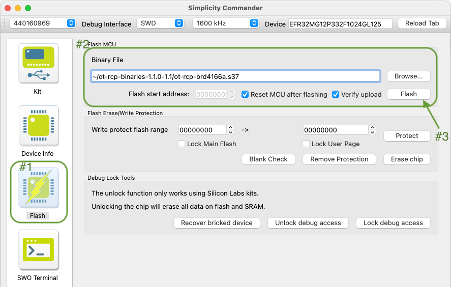
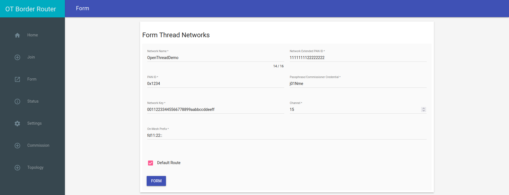

////
 *
 * Copyright (c) 2024 Project CHIP Authors
 *
 * Licensed under the Apache License, Version 2.0 (the "License");
 * you may not use this file except in compliance with the License.
 * You may obtain a copy of the License at
 *
 * http://www.apache.org/licenses/LICENSE-2.0
 *
 * Unless required by applicable law or agreed to in writing, software
 * distributed under the License is distributed on an "AS IS" BASIS,
 * WITHOUT WARRANTIES OR CONDITIONS OF ANY KIND, either express or implied.
 * See the License for the specific language governing permissions and
 * limitations under the License.
////
<<<
== *OT Border Router (OTBR) Setup*

If the DUT supports Thread Transport, DUT vendors need to use the OTBR that is shipped with the TH image for certification testing. Here are the instructions to set up OTBR that comes with the TH. Users need to get the RCP programmed with the recommended version and connect it to the Raspberry Pi running the TH. The OTBR will be started when the TH runs the thread transport related TC’s.

Currently the OTBR in the TH works with either the Nordic RCP dongle or SiLabs RCP dongle. Refer to <<instructions-to-flash-the-firmware-nrf52840-rcpdongle, Section 7.1>> to flash the NRF52840 firmware or <<instructions-to-flash-silabs-rcp, Section 7.2>> to flash the SiLabs firmware and get the RCP’s ready. Once the RCP’s are programmed, the user needs to insert the RCP dongle on to the Raspberry Pi running the TH and reboot the Raspberry Pi.

=== Instructions to Flash the Firmware NRF52840 RCPDongle
. Download RCP firmware package from the following link on the user’s system — https://groups.csa-iot.org/wg/matter-csg/document/26977[https://groups.csa-iot.org/wg/matter-csg/document/26977] 
. nRF Util is a unified command line utility for Nordic products. For more details, refer to the following link— https://www.nordicsemi.com/Products/Development-tools/nrf-util[https://www.nordicsemi.com/Products/Development-tools/nrf-util]
. Install the nRF Util dependency in the user’s system using the following command:

+
|===
|`python3 -m pip install -U nrfutil`
|===

. Connect the nRF52840 Dongle to the USB port of the user’s system.
. Press the Reset button on the dongle to enter the DFU mode (the red LED on the dongle starts blinking).
+
image:images/img_10.png[]

. To install the RCP firmware package on to the dongle, run the following command from the path where the firmware package was downloaded: 

+
|===
|`nrfutil dfu usb-serial -pkg <FILE NAME> -p /dev/ttyACM0` +
Example: +
`nrfutil dfu usb-serial -pkg nrf52840dongle_rcp_c084c62.zip -p /dev/ttyACM0`
|===

. Once the flash is successful, the red LED turns off slowly.
. Remove the Dongle from the user’s system and connect it to the Raspberry Pi running TH.
. In case any permission issue occurs during flashing, launch the terminal and retry in sudo mode.

=== Instructions to Flash SiLabs RCP

Download the firmware from the following URL: https://www.dropbox.com/s/rrov679am165b3z/ot-rcp-binaries-1.1.0-1.1.zip?dl=0[https://www.dropbox.com/s/rrov679am165b3z/ot-rcp-binaries-1.1.0-1.1.zip?dl=0] 

For detailed RCP firmware usage, refer to: https://www.silabs.com/documents/public/application-notes/an1256-using-sl-rcp-with-openthread-border-router.pdf[https://www.silabs.com/documents/public/application-notes/an1256-using-sl-rcp-with-openthread-border-router.pdf]

Requirements:

* SiLabs RCP: https://www.silabs.com/development-tools/thunderboard/thunderboard-sense-two-kit[Thunderboard Sense 2 Sensor-to-Cloud Advanced IoT Kit] or https://www.silabs.com/products/development-tools/wireless/mesh-networking/mighty-gecko-starter-kit[EFR32MG Wireless Starter Kit]
* SiLabs RCP Firmware: See Session 6.2
* Simplicity Commander: Installer for https://www.silabs.com/documents/public/software/SimplicityCommander-Windows.zip[Windows], https://www.silabs.com/documents/public/software/SimplicityCommander-Mac.zip[MAC] or https://www.silabs.com/documents/public/software/SimplicityCommander-Linux.zip[Linux]

From UI:

* Connect the RCP dongle to the USB port of the user’s operating system or via Ethernet.
* From the Simplicity Commander app, select and connect to RCP:
  ** For USB connection, select the corresponding Serial Number from the drop-down list.
  ** For Ethernet connection, enter the IP address of the RCP and click on *Connect* .
+
image:images/img_11.png[]

* To flash an image, go to “Flash”, select the RCP binary file, and click on *Flash* .
+

From CLI:

* In case RCP is connected via Ethernet and the Simplicity Commander UI is not an option, the RCP image can be flashed using CLI.
* From path to Simplicity Commander: +
`commander flash <rcp-image-path> --ip <rcp-ip-address>`

=== Forming Thread Network and Generating Dataset for Thread Pairing

TH spins the OTBR docker image automatically when executing the thread related test cases. Follow the steps below if the user wants to start OTBR with custom parameters. The user needs to generate a dataset for the custom OTBR. To generate hexadecimal code required for manual Thread pairing procedure, use the instructions below. +
ssh the Raspberry-Pi in the User System using the command “*ssh ubuntu@IP_address*” +
Example output for the above command to generate the dataset value: 
|===
|ubuntu@ubuntu:~*$* ./certification-tool/scripts/OTBR/otbr_start.sh connectedhomeip/otbr             sve2                                       cd81003a4ffe   7 months ago   436MB +
otbr image connectedhomeip/otbr:sve2 already installed adbc48b536dc5a350c2e5dcf9c09b378290fe79ac423a15943e8c970473fd44f

waiting 10 seconds to give the docker container enough time to start up... +
Param: 'dataset init new' +
Done +
Param: 'dataset channel 25' +
Done +
Param: 'dataset panid 0x5b35' +
Done +
Param: 'dataset extpanid 5b35dead5b35beef' +
Done +
Param: 'dataset networkname 5b35' +
Done +
Param: 'dataset networkkey 00112233445566778899aabbccddeeff' +
Done +
Param: 'dataset commit active' +
Done +
Param: 'prefix add fd11:35::/64 pasor' +
Done +
Param: 'ifconfig up' +
Done +
Param: 'thread start' +
Done +
Param: 'netdata register' +
Done +
Param: 'dataset active -x 0e080000000000010000000300001935060004001fffe002085b35dead5b35beef0708fd902fb12bca8af9051000112233445566778899aabbccddeeff03043562333501025b350410cdfe3b9ac95afd445e659161b03b3c4a0c0402a0f7f8 +
Done +
Simple Dataset: +
000300001902085b35dead5b35beef051000112233445566778899aabbccddeeff01025b35  
|===

If any issue occurs while using *otbr_start.sh*, follow the steps below to generate the dataset value manually: 

*On Terminal 1:*

. Follow the steps below to build the OTBR docker:
.. Create the docker network by executing the following commands:
+
|===
|`sudo docker network create --ipv6 --subnet fd11:db8:1::/64 -o com.docker.network.bridge.name=otbr0 otbr` +
`sudo sysctl net.ipv6.conf.otbr0.accept_ra_rt_info_max_plen=128` +
`sudo sysctl net.ipv6.conf.otbr0.accept_ra=2`
|===

.. Run the dependency:
+
|===
|`sudo modprobe ip6table_filter`
|===

.. Run the docker:
+
|===
|`sudo docker run -it --rm --privileged --network otbr -p 8080:80 --sysctl "net.ipv6.conf.all.disable_ipv6=0 net.ipv6.conf.all.forwarding=1" --name otbr -e NAT64=0 --volume /dev/ttyACM0:/dev/ttyACM0 connectedhomeip/otbr:sve2 --radio-url spinel+hdlc+uart:///dev/ttyACM0`
|===

. Generate the Thread form for dataset by entering ‘<Raspberry-Pi IP>:8080’ on the user’s system browser. The OTBR form will be generated as shown below. 
. Click on the *Form* option and follow the sequence to generate the OTBR form.
+
image:images/img_13.png[]
+

*On Terminal 2:*

. Generation of Hex Code: +
Obtain the dataset hex value by running the following command:

+
|===
|`sudo docker exec -ti otbr ot-ctl dataset active -x`

*Example hex code :* +
`0e080000000000010000000300000f35060004001fffe0020811111111222222220708fdabd97fc1941f29051000112233445566778899aabbccddeeff030e4f70656e54687265616444656d6f010212340410445f2b5ca6f2a93a55ce570a70efeecb0c0402a0f7f8`
|===

. The above generated sample pairing code can be used during the manual Thread pairing procedure with the following command:

+
|===
|`./chip-tool pairing ble-thread <node-id> hex:<dataset hex value> <setup-pin> <discriminator>` +
`./chip-tool pairing ble-thread 97 hex:0e080000000000010000000300001035060004001fffe0020811111111222222020708fd882e3d3a7373dc051000112233445566778899aabbccddeeff030f4f70656e54687265616444656d70790102123404101570fcfd6de18b3d78d6d39881a8a5710c0402a0f7f8 20202021 3840`
|===

=== Troubleshooting: Boarder Router Container failure to initialize

. Error message: (Example)

+
|===

|Error occurred during setup of test suite.FirstChipToolSuite. 409 Client Error for http+docker://localhost/v1.42/containers/10ad48500522af3d5a23c181a6018053248250b958a353ed88d5a5f538dcbf33/exec: Conflict ("Container 10ad48500522af3d5a23c181a6018053248250b958a353ed88d5a5f538dcbf33 is not running")

|===

+

Solution:

.. Check for the presence of  rogue executions of the otbr-chip container. Using command:
+
|===
|`$docker ps`
|===
Stop any running otbr-chip  containers from the  result.
+
|===
|`$docker container stop <container_id>`
|===

.. Check   host  (*raspberry*) network configuration  interface’s  ip address does not conflict with *otbr-chip* default interface ip address.
+
Conflicting network  configuration could be pointed out by checking  container’s initialization log.
+
|===
|`$docker logs <container_id>`
|===
Example Log Output:
+
|===
|... +
+ service tayga start +
* Starting userspace NAT64 tayga +
RTNETLINK answers: File exists +
RTNETLINK answers: File exists +
RTNETLINK answers: File exists +
RTNETLINK answers: File exists +
...fail! +
+ die 'Failed to start tayga' +
+ echo ' *** ERROR:  Failed to start tayga' +
*** ERROR:  Failed to start tayga +
+ exit 1 +
tail: cannot open '/var/log/syslog' for reading: No such file or directory +
tail: no files remaining +
|===
Default  Tayga interface address: +
+
|===
|`ipv4-addr 192.168.255.1`  # This  address could be checked on  */etc/tayga.conf* on *otbr-chip* container
|===
Use command below on host (*raspberrypi*) to check interface's ip addresses
+
|===
|`$ifconfig` +
... +
eth0: flags=4163<UP,BROADCAST,RUNNING,MULTICAST>  mtu 1500 +
        inet 192.168.2.2  netmask 255.255.255.0  broadcast 192.168.2.255
        inet6 fdcb:377:2b62:f8fd:dea6:32ff:fe94:c54c  prefixlen 64  scopeid 0x0<global>
        inet6 fe80::dea6:32ff:fe94:c54c  prefixlen 64  scopeid 0x20<link>
        ether dc:a6:32:94:c5:4c  txqueuelen 1000  (Ethernet)
        RX packets 250969  bytes 184790487 (184.7 MB)
        RX errors 0  dropped 0  overruns 0  frame 0
        TX packets 125202  bytes 85904550 (85.9 MB)
        TX errors 0  dropped 0 overruns 0  carrier 0  collisions 0

lo: flags=73<UP,LOOPBACK,RUNNING>  mtu 65536 +
        inet 127.0.0.1  netmask 255.0.0.0
        inet6 ::1  prefixlen 128  scopeid 0x10<host>
        loop  txqueuelen 1000  (Local Loopback)
        RX packets 520  bytes 48570 (48.5 KB)
        RX errors 0  dropped 0  overruns 0  frame 0
        TX packets 520  bytes 48570 (48.5 KB)
        TX errors 0  dropped 0 overruns 0  carrier 0  collisions 0

|===
*If any interface matches tayga ip address, change the conflicting IP on host.*
