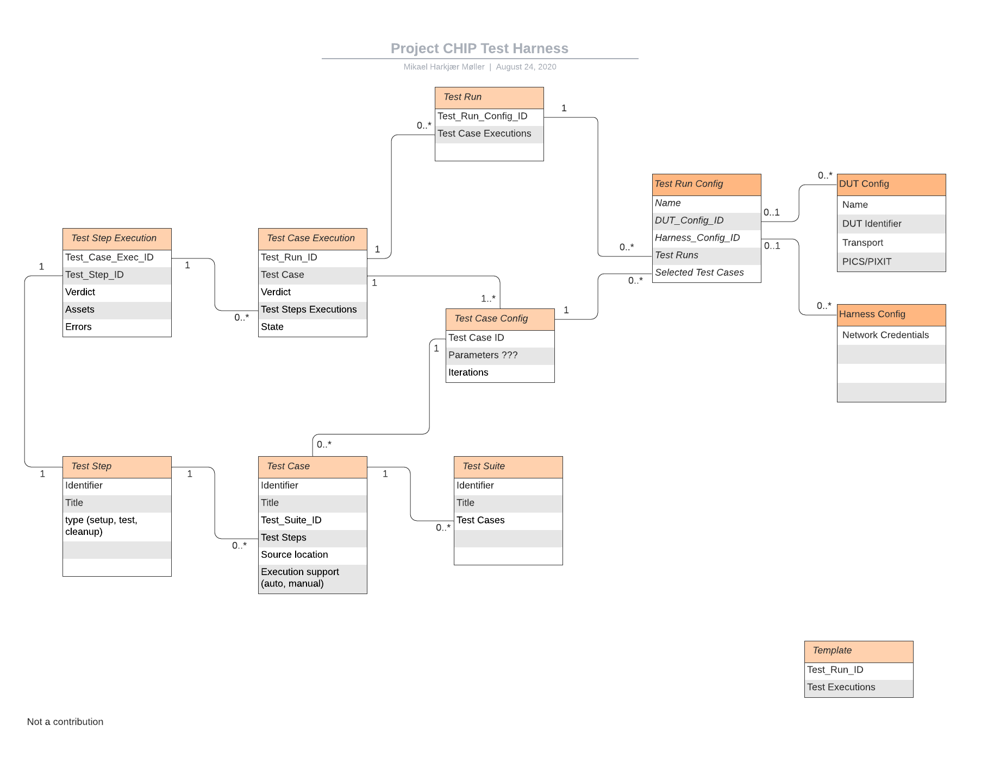

////
 *
 * Copyright (c) 2024 Project CHIP Authors
 *
 * Licensed under the Apache License, Version 2.0 (the "License");
 * you may not use this file except in compliance with the License.
 * You may obtain a copy of the License at
 *
 * http://www.apache.org/licenses/LICENSE-2.0
 *
 * Unless required by applicable law or agreed to in writing, software
 * distributed under the License is distributed on an "AS IS" BASIS,
 * WITHOUT WARRANTIES OR CONDITIONS OF ANY KIND, either express or implied.
 * See the License for the specific language governing permissions and
 * limitations under the License.
////
<<<
== *Test-Harness (TH) Design*

This section outlines the TH architecture, data model and data flow on how different components of TH communicate with each other.

=== TH Layout
.The Test-Harness Layout
image::images/img_0.png[TH Layout]

Each of the main subsystems of the Test Harness (Proxy, Frontend, Backend and Database) runs on its own docker container deployed to a Ubuntu Raspberry Pi platform. The Proxy container hosts an instance of the traefik application proxy (https://traefik.io/traefik/[https://traefik.io/traefik/]) which is responsible to route user requests coming from an external (to the Raspberry Pi) web browser to either the Frontend or the Backend as appropriate. The Frontend container serves the dynamic web pages that comprise the Web GUI to be rendered on the user browser including the client-side logic. According to that client-side logic and user input, REST API requests are sent again by the external browser to the Application Proxy and get redirected to the Backend container, where a FastAPI (https://fastapi.tiangolo.com/[https://fastapi.tiangolo.com/]) Python application implements the server-side logic. Any application information that needs to be persisted gets serialized and written by the server-side logic to the Postgres database running in the Database container.

In addition to the four main containers described above, which get created and destroyed when the Raspberry Pi platform respectively boots up and shuts down, two other containers are created and destroyed dynamically on demand according to the test execution lifecycle: the SDK container and the OTBR container. The SDK container has copies of the Matter SDK tools (binary executables) which can be used to play the role of clients and servers of the Matter protocol in test interactions, either as Test Harness actuators or DUT simulators. That container gets automatically created and destroyed by the server-side logic at the start and at the end, respectively, of a Test Suite which needs actuators or simulators. The OTBR container, on the other hand, hosts an instance of the Open Thread Border Router and needs to be explicitly started by the TH user when they want to test a real Matter device that runs over a Thread fabric, as described in <<ot-border-router-otbr-setup, Section 7, OT Border Router (OTBR) Setup>>.

=== Data Model
.The Data Model
 

The data model diagram in Figure 2 shows the various data objects that the Test Execution consumes and maintains and the relationship between these data objects.

* Test Run
* Test Run Config
* DUT Config
* Harness Config
* Test Case Execution
* Test Step Execution
* Test Case
* Test Step
* Test Suite
* Test Case Config

=== Data Flow
.The Data Flow
image::images/img_2.png[Data Flow]
