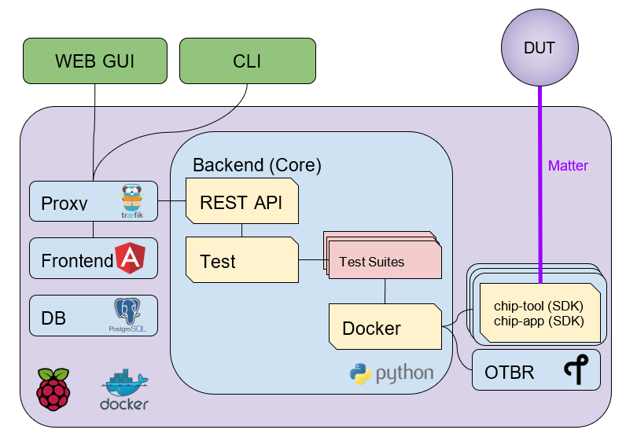

# Test Harness - Matter User Guide

-   [Test Harness - Matter User Guide](#test-harness---matter-user-guide)
-   [**Test-Harness Links**](#test-harness-links)
-   [**Introduction**](#introduction)
-   [**References**](#references)
-   [**Test-Harness (TH) Design**](#test-harness-th-design)
    -   [TH Layout](#th-layout)
    -   [Data Model](#data-model)
    -   [Data Flow](#data-flow)
-   [**Getting Started with Matter Test-Harness (TH)**](#getting-started-with-matter-test-harness-th)
    -   [TH Image Installation on Raspberry Pi](#th-image-installation-on-raspberry-pi)
        -   [**Prerequisites**](#prerequisites)
        -   [TH Installation on Raspberry Pi](#th-installation-on-raspberry-pi)
    -   [Troubleshooting](#troubleshooting)
        -   [Read-Only File System Error](#read-only-file-system-error)
        -   [Generate Personal Access Token](#generate-personal-access-token)
        -   [Bringing Up of Docker Containers Manually](#bringing-up-of-docker-containers-manually)
    -   [TH installation without a Raspberry Pi](#th-installation-without-a-raspberry-pi)
        -   [Create an Ubuntu virtual machine](#create-an-ubuntu-virtual-machine)
        -   [Setup TH in Ubuntu](#setup-th-in-ubuntu)
        -   [Substitute the SDK’s docker image and update sample apps](#substitute-the-sdks-docker-image-and-update-sample-apps)
    -   [Update Existing TH](#update-existing-th)
    -   [Updating Existing Yaml Test Script](#updating-existing-yaml-test-script)
-   [**Bringing Up of Matter Node (DUT) for Certification Testing**](#bringing-up-of-matter-node-dut-for-certification-testing)
    -   [Bringing Up of Reference Matter Node (DUT) on Raspberry Pi](#bringing-up-of-reference-matter-node-dut-on-raspberry-pi)
        -   [To Provision Raspberry Pi Using Wi-Fi Configuration](#to-provision-raspberry-pi-using-wi-fi-configuration)
        -   [To Provision Raspberry Pi Over Ethernet Configuration](#to-provision-raspberry-pi-over-ethernet-configuration)
    -   [Bringing Up of Reference Matter Node (DUT) on Thread Platform](#bringing-up-of-reference-matter-node-dut-on-thread-platform)
        -   [Prerequisites](#prerequisites-1)
        -   [Setting Up Thread Board (nRF52840-DK)](#setting-up-thread-board-nrf52840-dk)
            -   [**Instructions to Set Up nRF52840-DK Using nRF Connect Desktop Application Tool**](#instructions-to-set-up-nrf52840-dk-using-nrf-connect-desktop-application-tool)
            -   [**Instructions to Set Up nRF52840-DK Using Docker Environment**](#instructions-to-set-up-nrf52840-dk-using-docker-environment)
            -   [**Building and Flashing Sample Apps for nRF-Connect**](#building-and-flashing-sample-apps-for-nrf-connect)
-   [**OT Border Router (OTBR) Setup**](#ot-border-router-otbr-setup)
    -   [Instructions to Flash the Firmware NRF52840 RCPDongle](#instructions-to-flash-the-firmware-nrf52840-rcpdongle)
    -   [Instructions to Flash SiLabs RCP](#instructions-to-flash-silabs-rcp)
    -   [Forming Thread Network and Generating Dataset for Thread Pairing](#forming-thread-network-and-generating-dataset-for-thread-pairing)
    -   [Troubleshooting: Border Router Container failure to initialize](#troubleshooting-border-router-container-failure-to-initialize)
-   [**Test Configuration**](#test-configuration)
    -   [Project Configuration](#project-configuration)
        -   [Projects Menu](#projects-menu)
            -   [Wi-Fi Mode](#wi-fi-mode)
            -   [On Network Mode](#on-network-mode)
            -   [Thread Device Mode](#thread-device-mode)
            -   [PAA Certificates](#paa-certificates)
            -   [Test Parameters](#test-parameters)
            -   [Upload PICS File](#upload-pics-file)
        -   [Test Menu](#test-menu)
        -   [Utility Menu](#utility-menu)
        -   [Settings Menu](#settings-menu)
-   [**Test Case Execution**](#test-case-execution)
    -   [Automated and Semi Automated Tests](#automated-and-semi-automated-tests)
        -   [Automated Test Cases](#automated-test-cases)
        -   [Semi Automated Test Cases](#semi-automated-test-cases)
    -   [Python Tests](#python-tests)
    -   [Manual Tests](#manual-tests)
    -   [Simulated Tests (app1_tests)](#simulated-tests-app1_tests)
    -   [“Python test” Inside Docker](#python-test-inside-docker)
        -   [Prerequisite](#prerequisite)
        -   [Placeholders for Steps](#placeholders-for-steps)
        -   [Common Steps](#common-steps)
        -   [For On-Network Pairing](#for-on-network-pairing)
        -   [For BLE+Wi-Fi Pairing](#for-blewi-fi-pairing)
        -   [For BLE+Thread Pairing](#for-blethread-pairing)
        -   [Post-Test Steps](#post-test-steps)
        -   [Possible Issues](#possible-issues)
-   [**Collect Logs and Submit to TEDS**](#collect-logs-and-submit-to-teds)
    -   [Instructions to Download Test Results](#instructions-to-download-test-results)
        -   [From the TH User Interface](#from-the-th-user-interface)
        -   [Python Tests in Docker](#python-tests-in-docker)
    -   [Upload Test Results](#upload-test-results)
        -   [Results Recording](#results-recording)
        -   [Base Device Results Recording](#base-device-results-recording)
        -   [Cluster and Controller Tests](#cluster-and-controller-tests)
    -   [Finalizing Results](#finalizing-results)
    -   [Test Results Summary](#test-results-summary)

# **Test-Harness Links**

| Matter Version   | TH Version   | TH image location                                                                             | Supporting Documentation                                                         | Comments     |
| ---------------- | ------------ | --------------------------------------------------------------------------------------------- | -------------------------------------------------------------------------------- | ------------ |
| Matter 1.0       | TH v2.6      | [link](https://drive.google.com/file/d/1aw6cie59N3OGRCFjG_sw0Uv7JzXMyLda/view?usp=share_link) | [TH Verification Steps](https://groups.csa-iot.org/wg/matter-csg/document/26925) |              |
| Matter 1.1       | TH v2.8.1    | [link](https://drive.google.com/file/d/1cObNwYQjTpNYJaQ2Wz_ThNDEWqVasHxe/view?usp=share_link) | [Causeway Link](https://groups.csa-iot.org/wg/matter-csg/document/folder/2470)   |              |
| Matter 1.2       | TH-Fall2023  | [link](https://drive.google.com/drive/folders/1vZbfqRWNrttJOUZbYskKJaGGdOm54ugq?usp=sharing)  |                                                                                  |              |

# **Introduction**

The Matter Test-Harness is a comprehensive test tool used for
certification testing of Matter devices in accordance with the Matter
protocol as defined in the Matter specification
[\[2\]](https://docs.google.com/document/d/1bYDjmGrj6dPnu0KHoVRaDF7YhsFzGslw/edit#heading=h.3znysh7).

This user guide serves as the primary user documentation to work with
the Test-Harness ( **TH** ) tool, providing high-level architecture of
the tool, how to use the tool to execute certification tests and submit
the test results to CSA for certification.

The TH tool runs on the Raspberry Pi platform, providing an intuitive
Web user interface to create a test project, configure the
project/Device Under Test ( **DUT** ) settings, load the required test
cases using the PICS xml file and execute test cases for various devices
(commissioner, controller and controlee) as defined in the Matter
specification.

The TH tool provides an option to execute the following test scripts—
Automated, Semi Automated, Python, Manual and Simulated. Upon completion
of the test execution, detailed logs and test results will be available
for user analysis. The user will also be able to submit logs to ATL’s
for review to obtain device certification.

The TH tool can be used by any DUT vendor to run the Matter
certification tests OR by any hobby developer to get acquainted with the
Matter certification testing tools or technologies.

# **References**

1.  Matter Specification: [Matter Specification
    (Causeway)](https://groups.csa-iot.org/wg/members-all/document/27349)
    / [Matter Specification
    (Github)](https://github.com/CHIP-Specifications/connectedhomeip-spec)

2.  Matter SDK Repo github:
    <https://github.com/project-chip/connectedhomeip>

3.  Matter Test Plans: [Matter Test Plans
    (Causeway)](https://groups.csa-iot.org/wg/members-all/document/30026)
    / [Matter Test Plans
    (GitHub)](https://github.com/CHIP-Specifications/chip-test-plans)

4.  PICS Tool: [PICS Tool v1.6.4 matter 1.0 - Connectivity Standards
    Alliance (csa-iot.org)](https://picstool.csa-iot.org/#userguide)

5.  XML Files Link:
    <https://groups.csa-iot.org/wg/matter-csg/document/26122>

6.  TEDS Matter tool:
    <https://groups.csa-iot.org/wg/matter-wg/document/28545>

# **Test-Harness (TH) Design**

This section outlines the TH architecture, data model and data flow on
how different components of TH communicate with each other.

## TH Layout

Each of the main subsystems of the Test Harness (Proxy, Frontend,
Backend and Database) runs on its own docker container deployed to a
Ubuntu Raspberry Pi platform. The Proxy container hosts an instance of
the traefik application proxy (<https://traefik.io/traefik/>) which is
responsible to route user requests coming from an external (to the
Raspberry Pi) web browser to either the Frontend or the Backend as
appropriate. The Frontend container serves the dynamic web pages that
comprise the Web GUI to be rendered on the user browser including the
client-side logic. According to that client-side logic and user input,
REST API requests are sent again by the external browser to the
Application Proxy and get redirected to the Backend container, where a
FastAPI (<https://fastapi.tiangolo.com/>) Python application implements
the server-side logic. Any application information that needs to be
persisted gets serialized and written by the server-side logic to the
Postgres database running in the Database container.

In addition to the four main containers described above, which get
created and destroyed when the Raspberry Pi platform respectively boots
up and shuts down, two other containers are created and destroyed
dynamically on demand according to the test execution lifecycle: the SDK
container and the OTBR container. The SDK container has copies of the
Matter SDK tools (binary executables) which can be used to play the role
of clients and servers of the Matter protocol in test interactions,
either as Test Harness actuators or DUT simulators. That container gets
automatically created and destroyed by the server-side logic at the
start and at the end, respectively, of a Test Suite which needs
actuators or simulators. The OTBR container, on the other hand, hosts an
instance of the Open Thread Border Router and needs to be explicitly
started by the TH user when she wants to test a real Matter device that
runs over a Thread fabric, as described in [section
6](#ot-border-router-otbr-setup).

## Data Model

The data model diagram in Figure 2 shows the various data objects that
the Test Execution consumes and maintains and the relationship between
these data objects.

-   Test Run

-   Test Run Config

-   DUT Config

-   Harness Config

-   Test Case Execution

-   Test Step Execution

-   Test Case

-   Test Step

-   Test Suite

-   Test Case Config

## Data Flow

# **Getting Started with Matter Test-Harness (TH)**

The Matter Node (DUT) that is used for certification testing can either
be a commissioner, controller or controlee.

If the DUT is a controlee (e.g., light bulb), the TH spins a reference
commissioner/controller using chip-tool binary shipped with the SDK. The
TH commissioner provisions the DUT and is used to execute the
certification tests on the controlee.

If the DUT is a commissioner/controller, the Test TH spins an example
accessory that is shipped with the SDK and uses that for the DUT to
provision, control and run certification tests.

Refer to [Section
5](#bringing-up-of-matter-node-dut-for-certification-testing) to bring
up the DUT and then proceed with device testing by referring to [Section
7](#test-configuration).

For hobby developers who want to get acquainted with certification
tools/process/TC’s, can spin DUT’s using the example apps provided in
the SDK. Refer to the instructions to set up one
[here](https://groups.csa-iot.org/wg/matter-csg/document/folder/2756).

TH runs on Ubuntu 22.04 Server LTS. It can be set up in a [Raspberry Pi](#th-image-installation-on-raspberry-pi) or [not](#th-installation-without-a-raspberry-pi)

## TH Image Installation on Raspberry Pi

There are two ways to obtain the latest TH image on Raspberry Pi. Follow
the instructions in [Section 4.1.2](#th-installation-on-raspberry-pi) to
install the image file OR if you already have an image, follow the
instructions in [Section 4.4](#update-existing-th) to update the TH
image.

### **Prerequisites**

The following equipment will be required to have a complete TH setup:

-   **Raspberry Pi Version 4 with SD card of minimum 64 GB Memory**

The TH image will be installed on Raspberry PI. The TH image contains
couple of docker container(s) with all the required dependencies for
certification tests execution.

-   **Windows or Linux System (Laptop/Desktop/Mac)**

The Mac/PC will be used to download the TH image and flash on the SD
card to be used on Raspberry Pi. Download the [Raspberry Pi
Imager](https://www.raspberrypi.com/software/) or [Balena
Etcher](https://www.balena.io/etcher/) tool. The same can be used to set
up the required build environment for the Matter SDK or building Matter
reference apps for various platforms.

-   **RCP dongle**

If the DUT supports thread transport, an RCP dongle provisioned with a
recommended RCP image for the default OTBR router that comes with the TH
will be required to function properly. Currently, the OTBR can work with
a Nordic RCP dongle or a SiLabs RCP dongle. Refer to [Section
6](#ot-border-router-otbr-setup) on how to install an RCP image.

### TH Installation on Raspberry Pi

1.  Go to the [TH release location](https://drive.google.com/drive/folders/1vZbfqRWNrttJOUZbYskKJaGGdOm54ugq?usp=sharing)
    and download the official TH image from the given link on the user’s
    PC/Mac.

2.  Place the blank SD card into the user’s system USB slot.

3.  Open the [Raspberry Pi
    Imager](https://www.raspberrypi.com/software/) or [Balena
    Etcher](https://www.balena.io/etcher/) tool on the Mac/PC and select
    the image file from the drop-down list to flash.

4.  After the SD card has been flashed with the image, remove the SD
    card and place it in the Raspberry Pi’s memory card slot.

5.  Power on the Raspberry Pi and ensure that the local area network,
    display monitor and keyboard are connected.

6.  Enter the default username and password:

    -   username: ubuntu

    -   password: raspberrypi

7.  Using the _ifconfig_ command, obtain the IP address of the Raspberry
    Pi. The same IP address will be used to launch the TH user interface
    on the user’s system using the browser.

8.  Proceed with test configuration and execution (refer to [Section
    7](#test-configuration) and [Section 8](#test-case-execution)
    respectively).

## Troubleshooting

### Read-Only File System Error

-   During the execution of the above commands if a read-only file
    system error or an error showing "Is docker daemon running?" occurs,
    follow the steps below to fix the issue:

<table>
<colgroup>
<col style="width: 100%" />
</colgroup>
<tbody>
<tr class="odd">
<td>
<code>$sudo fsck</code> ( Press <em>y</em> for fixing all the errors )
</td>
</tr>
</tbody>
</table>

-   Upon successful completion, try the following commands:

<table>
<colgroup>
<col style="width: 100%" />
</colgroup>
<tbody>
<tr class="odd">
<td>
<code>$sudo reboot</code> 
ssh back into the TH IP address using: 
<code>$ssh ubuntu@&lt;IPADDRESS-OF-THE-RASPI&gt;</code>
</td>
</tr>
</tbody>
</table>

-   In case “sudo fsck” fails, use the following commands:

<table>
<colgroup>
<col style="width: 100%" />
</colgroup>
<tbody>
<tr class="odd">
<td>
<code>sudo fsck -y -f /dev/mmcblk0p2</code> 
<code>fsck -y /dev/mmcblk0p2</code>
</td>
</tr>
</tbody>
</table>

-   In case the “remote: Repository not found” fatal error occurs, try
    the following steps to fix the issue. Clone the
    certification-tool with personal access token (Refer to
    [Section 4.2.2](#generate-personal-access-token) to generate the
    personal access token) and follow the steps below.

<table>
<colgroup>
<col style="width: 100%" />
</colgroup>
<tbody>
<tr class="odd">
<td>
cd ~ 

Take the backup of Test Harness binary using below command: 
<code>$mv certification-tool certification-tool-backup</code> 
<code>$git clone https://&lt;token&gt;@github.com/project-chip/certification-tool.git</code>

Follow the instructions given in the above section on how to update an existing Test-Harness image
</td>
</tr>
</tbody>
</table>

### Generate Personal Access Token

The Personal Access Token may be required during the process of updating
an existing TH image. Below are the instructions to obtain the personal
access token.

1.  Connect to the Github account (the one recognized and authorized by
    Matter).

2.  On the upper-right corner of the page, click on the profile photo,
    then click on **Settings**.

3.  On the left sidebar, click on **Developer settings**.

4.  On the left sidebar, click on **Personal access tokens** \[Personal
    access tokens (classic)\].

5.  Click on **Generate new token** .

6.  Provide a descriptive name for the token.

7.  Enter an expiration date, in days or using the calendar.

8.  Select the scopes or permissions to grant this token.

9.  Click on **Generate new token** .

10. The generated token will be printed out on the screen. Make sure to
    save it as a local copy as it will disappear.

    Sample token: ghp_hUQExoppLKma\*\*\*\*\*\*\*\*\*\*\*\*\*\*\*Urg4P

### Bringing Up of Docker Containers Manually

During the initial reboot of the Raspberry Pi, if the docker is not
initiated automatically, try the following command on the Raspberry Pi
terminal to bring up the dockers.

<table>
<colgroup>
<col style="width: 100%" />
</colgroup>
<tbody>
<tr class="odd">
<td>
Use the command <code>ssh ubuntu@IP_address</code> from the PC to log in to Raspberry Pi. Refer above sections on how to obtain the IP address of Raspberry Pi.

Once the SSH connection is successful, start the docker container using the command 
<strong>$</strong> <code>./certification-tool/scripts/start.sh</code>

The above command might take a while to get executed, wait for 5-10 minutes and then proceed with the Test Execution Steps as outlined in the below sections.
</td>
</tr>
</tbody>
</table>

## TH installation without a Raspberry Pi

To install TH without using a Raspberry Pi you’ll need a machine with
Ubuntu 22.04 Server LTS. You can create a virtual machine for this
purpose [here](#create-an-ubuntu-virtual-machine), but be aware that if
the host’s architecture is not arm64 you’ll need to substitute the SDK’s
docker image in order for it to work properly
[here](#substitute-the-sdks-docker-image-and-update-sample-apps).

### Create an Ubuntu virtual machine

Here’s an example of how to create a virtual machine for TH using
multipass (<https://multipass.run/>).

-   Install multipass

<table>
<colgroup>
<col style="width: 100%" />
</colgroup>
<tbody>
<tr class="odd">
<td>
<code>brew install multipass</code>
</td>
</tr>
</tbody>
</table>

-   Create new VM with Ubuntu 22.04 (2 cpu cores, 8G mem and a 50G disk)

<table>
<colgroup>
<col style="width: 100%" />
</colgroup>
<tbody>
<tr class="odd">
<td>
<code>multipass launch 22.04 -n matter-vm -c 2 -m 8G -d 50G</code>
</td>
</tr>
</tbody>
</table>

-   SSH into VM

<table>
<colgroup>
<col style="width: 100%" />
</colgroup>
<tbody>
<tr class="odd">
<td>
<code>multipass shell matter-vm</code>
</td>
</tr>
</tbody>
</table>

About Multipass:  
Seems like bridged network is not available, so you will not be able to
test with DUT outside the docker container, but you can develop using
the sample apps on the platform.

### Setup TH in Ubuntu

-   Create new ssh key

<table>
<colgroup>
<col style="width: 100%" />
</colgroup>
<tbody>
<tr class="odd">
<td>
<code>ssh-keygen -t ed25519 -C "user@matter-vm"</code>
</td>
</tr>
</tbody>
</table>

-   Add SSH key to GitHub Settings

-   Clone git repo

<table>
<colgroup>
<col style="width: 100%" />
</colgroup>
<tbody>
<tr class="odd">
<td>
<code>git clone git@github.com:project-chip/certification-tool.git"</code>
</td>
</tr>
</tbody>
</table>

-   Go into the repo directory

<table>
<colgroup>
<col style="width: 100%" />
</colgroup>
<tbody>
<tr class="odd">
<td>
<code>cd certification-tool</code>
</td>
</tr>
</tbody>
</table>

-   Run TH auto install script

<table>
<colgroup>
<col style="width: 100%" />
</colgroup>
<tbody>
<tr class="odd">
<td>
<code>./scripts/ubuntu/auto-install.sh</code>
</td>
</tr>
</tbody>
</table>

-   Reboot VM

If using multipass, to find the IP address use the command

<table>
<colgroup>
<col style="width: 100%" />
</colgroup>
<tbody>
<tr class="odd">
<td>
<code>multipass list</code>
</td>
</tr>
</tbody>
</table>

### Substitute the SDK’s docker image and update sample apps

In order to run TH in a machine that uses the _linux/amd64_ platform,
you’ll need to first build a new SDK docker image.

-   Get the SDK commit SHA

<table>
<colgroup>
<col style="width: 100%" />
</colgroup>
<tbody>
<tr class="odd">
<td>
Value for variable <code>SDK_DOCKER_TAG</code> in TH repository path <code>certification-tool/backend/app/core/config.py</code>
</td>
</tr>
</tbody>
</table>

-   Download the Dockerfile for chip-cert-bins from the commit you need

<table>
<colgroup>
<col style="width: 100%" />
</colgroup>
<tbody>
<tr class="odd">
<td>
Substitute &lt;COMMIT_SHA&gt; with the value from <code>SDK_DOCKER_TAG</code>: 
<code>github.com/project-chip/connectedhomeip/blob/&lt;COMMIT_SHA&gt;/integrations/docker/images/chip-cert-bins/Dockerfile</code>
</td>
</tr>
</tbody>
</table>

-   Copy Docker file to TH’s machine

-   Make sure that no other SDK image for that commit SHA is loaded in
    the machine

<table>
<colgroup>
<col style="width: 100%" />
</colgroup>
<tbody>
<tr class="odd">
<td>
Run <code>docker images</code> 
If there’s an image with a tag for the commit you’re using, delete that image 
<code>docker image rm &lt;IMAGE_ID&gt;</code>
</td>
</tr>
</tbody>
</table>

-   Build new SDK image (this could take about 3 hours)

<table>
<colgroup>
<col style="width: 100%" />
</colgroup>
<tbody>
<tr class="odd">
<td>
Substitute &lt;COMMIT_SHA&gt; with the value from <code>SDK_DOCKER_TAG</code>: 
<code>docker buildx build --load --build-arg COMMITHASH=&lt;COMMIT_SHA&gt; --tag connectedhomeip/chip-cert-bins:&lt;COMMIT_SHA&gt; .</code>
</td>
</tr>
</tbody>
</table>

-   Update TH sample apps

<table>
<colgroup>
<col style="width: 100%" />
</colgroup>
<tbody>
<tr class="odd">
<td>
To update your sample apps using the new image, you should first edit the <code>certification-tool/scripts/ubuntu/update-sample-apps.sh`</code> script to comment out or remove the following line: 
<code>sudo docker pull $SDK_DOCKER_IMAGE:$SDK_DOCKER_TAG</code> 
This is needed because the docker pull command downloads the image from the remote. Removing this line, the script will use your local image. 
Then run this script in the certification-tool repository 
<code>./scripts/ubuntu/update-sample-apps.sh</code>
</td>
</tr>
</tbody>
</table>

## Update Existing TH

To update an existing TH environment, follow the instructions below on
the terminal.

<table>
<colgroup>
<col style="width: 100%" />
</colgroup>
<tbody>
<tr class="odd">
<td>
<code>cd ~/certification-tool</code> 
<code>git fetch</code> 
<code>git checkout &lt;Target_Branch&gt;</code> 
<code>git pull</code> 
<code>./scripts/ubuntu/auto-update.sh &lt;Target_Branch&gt;</code> 
<code>./scripts/start.sh</code> 

Wait for 10 mins and open the TH application using the browser
</td>
</tr>
</tbody>
</table>

## Updating Existing Yaml Test Script

It is possible to update yaml test script content by directly editing the file content. It is useful when validating small changes or fixing misspelled commands.

Yaml files are located at:
<table>
<colgroup>
<col style="width: 100%" />
</colgroup>
<tbody>
<tr class="odd">
<td>
<code>~/certification-tool/backend/test_collections/yaml_tests/yaml/sdk/</code> 

</tr>
</tbody>
</table>

To update an existing Yaml test script: (e.g. `Test_TC_ACE_1_1.yaml`)

* Open the script file:
<table>
<colgroup>
<col style="width: 100%" />
</colgroup>
<tbody>
<tr class="odd">
<td>
<code>~/certification-tool/backend/test_collections/yaml_tests/yaml/sdk/Test_TC_ACE_1_1.yaml</code> 

</tr>
</tbody>
</table>

* Update/change the desired information.

* Save and close the file.

* Restart TH's backend container:
<table>
<colgroup>
<col style="width: 100%" />
</colgroup>
<tbody>
<tr class="odd">
<td>
<code>$docker restart certification-tool_backend_1</code> 

</tr>
</tbody>
</table>

* Changes will be available on the next execution of the yaml test.

To create a new Yaml test script:

* Use an existing test script as a starting point.

* Rename the file to a new one: e.g. `Test_TC_ACE_1_1.yaml` to `Test_TC_ACE_9_9.yaml`

* Update the name entry inside the yaml file:
<table>
<colgroup>
<col style="width: 100%" />
</colgroup>
<tbody>
<tr class="odd">
<td>
<b>FROM</b> name: 42.1.1. <code>[TC-ACE-1.1]</code> Privileges 

<b>TO</b> name: 42.1.1. <code>[TC-ACE-9.9]</code> Privileges 

</tr>
</tbody>
</table>

* Proceed as explained on updating an existent yaml file.

# **Bringing Up of Matter Node (DUT) for Certification Testing**

A Matter node can either be a commissioner, controller, controlee,
software component or an application. The Matter SDK comes with a few
example apps that can be used by Vendors as a reference to build their
products. Refer to the examples folder in the
[SDK](https://docs.google.com/document/d/1bYDjmGrj6dPnu0KHoVRaDF7YhsFzGslw/edit#heading=h.3znysh7)
repo github for the same.

DUT vendors need to get the device flashed with the production firmware
revision that they want to get their device certified and execute all
the applicable TC’s for their products using the TH. DUT vendors can
skip the below sections as the TH brings up the reference applications
automatically during the certification tests execution.

A hobby developer can build Matter reference apps either using a
Raspberry Pi or Nordic DK board (if the user wants to use thread
transport). Follow the instructions below for the [Raspberry
Pi](https://docs.google.com/document/d/1bYDjmGrj6dPnu0KHoVRaDF7YhsFzGslw/edit#heading=h.hjsjhcfwbnv8)
and
[Nordic](https://docs.google.com/document/d/1bYDjmGrj6dPnu0KHoVRaDF7YhsFzGslw/edit#heading=h.exwnxjd209ly)
platforms.

## Bringing Up of Reference Matter Node (DUT) on Raspberry Pi

In the case where a device maker/hobby developer needs to bring up a
sample/reference DUT, i.e. light bulb, door lock, etc. using the example
apps provided in SDK and verify provisioning of the DUT over the
Bluetooth LE, Wi-Fi and Ethernet interfaces, follow the below steps to
set up the DUT.

Users can either use the example apps (i.e. light bulb, door lock, etc.)
that are shipped with the TH image OR build the apps from the latest SDK
source.

To use the apps that are shipped with the TH image, follow the
instructions below:

-   Flash the TH image on the Raspberry Pi.

-   Go to the apps folder in /home/ubuntu/apps (as shown below) and
    launch the app that the user is interested in.

To build the example apps from the latest SDK source, follow the
instructions below:

-   User to acquire Raspberry Pi Version 4 with SD card of minimum 64 Gb
    memory.

-   Flash the TH image on to the SDK card that will be inserted into the
    Raspberry Pi as the TH image comes with the default Ubuntu OS image
    OR the user can download the latest Ubuntu LTS image and install all
    the required dependencies as outlined in
    <https://github.com/project-chip/connectedhomeip/blob/master/docs/guides/BUILDING.md>.

-   Clone the connected home SDK repo using the following commands:

<table>
<colgroup>
<col style="width: 100%" />
</colgroup>
<tbody>
<tr class="odd">
<td>
<strong>$</strong> <code>git clone git@github.com:project-chip/connectedhomeip.git --recursive</code> 
<strong>$</strong> <code>cd connectedhome</code> 
<strong>$</strong> <code>source scripts/bootstrap.sh</code> 
<strong>$</strong> <code>source scripts/activate.sh</code>
</td>
</tr>
</tbody>
</table>

-   Select the sample app that the user wants to build as available in
    the examples folder of the SDK repo e.g., lighting-app,
    all-cluster-app. The user needs to build these apps for the Linux
    platform using the following command:

<table>
<colgroup>
<col style="width: 100%" />
</colgroup>
<tbody>
<tr class="odd">
<td>
Build the app using the below command:

<code>./scripts/examples/gn_build_example.sh examples/all-clusters-app/linux/examples/all-clusters-app/linux/out/all-clusters-app chip_inet_config_enable_ipv4=false</code>
</td>
</tr>
</tbody>
</table>

### To Provision Raspberry Pi Using Wi-Fi Configuration

The sample app (lighting-app or lock-app or all-cluster-app) can be
provisioned over the Wi-Fi network when the app is launched with the
“--wifi” argument.

<table>
<colgroup>
<col style="width: 100%" />
</colgroup>
<tbody>
<tr class="odd">
<td>
<code>./chip-all-clusters-app --wifi</code>
</td>
</tr>
</tbody>
</table>

### To Provision Raspberry Pi Over Ethernet Configuration

The sample app (lighting-app or lock-app or all-cluster-app) can be
provisioned over the Ethernet (using onnetwork configuration) that it is
connected when the app is launched with no arguments.

<table>
<colgroup>
<col style="width: 100%" />
</colgroup>
<tbody>
<tr class="odd">
<td>
<code>./chip-all-clusters-app</code>
</td>
</tr>
</tbody>
</table>

## Bringing Up of Reference Matter Node (DUT) on Thread Platform

Follow the instructions below to set up the Matter Node on Thread
Platform. For additional reference, go to the following link:

<https://github.com/project-chip/connectedhomeip/tree/master/examples/all-clusters-app/nrfconnect#matter-nrf-connect-all-clusters-example-application>

### Prerequisites

The following devices are required for a stable and full Thread Setup:

-   **DUT:** nRF52840-DK board and one nRF52840-Dongle

_The DUT nRF52840-DK board mentioned in this manual is used for
illustration purposes only. If the user has a different DUT, they will
need to configure the DUT following the DUT requirements._

### Setting Up Thread Board (nRF52840-DK)

To set up the Thread Board, follow the instructions below.

_The nRF52840-DK setup can be performed in two methods either by
flashing the pre-built binary hex of sample apps which is released along
with the TH image by using the nRF Connect Desktop application tool
(refer Section 5.2.2.1) or by building the docker environment to build
the sample apps (refer Section 5.2.2.2)._

#### **Instructions to Set Up nRF52840-DK Using nRF Connect Desktop Application Tool**

1.  Requirements:

    1.  nRF Connect for Desktop tool: Installer for
        [Windows](https://nsscprodmedia.blob.core.windows.net/prod/software-and-other-downloads/desktop-software/nrf-connect-for-desktop/4-0-0/nrfconnect-setup-4.0.0-ia32.exe),
        [MAC](https://nsscprodmedia.blob.core.windows.net/prod/software-and-other-downloads/desktop-software/nrf-connect-for-desktop/4-0-0/nrfconnect-4.0.0.dmg)
        or
        [Linux](https://nsscprodmedia.blob.core.windows.net/prod/software-and-other-downloads/desktop-software/nrf-connect-for-desktop/4-0-0/nrfconnect-4.0.0-x86_64.appimage)

        _The J-Link driver needs to be separately installed on macOS and
        Linux. Download and install it from
        [SEGGER](https://www.segger.com/downloads/jlink) under the
        section J-Link Software and Documentation Pack._

    2.  Download thread binary files which are released along with the
        TH image.

2.  From the User Interface:

    1.  Connect nRF52840-DK to the USB port of the user’s operating
        system.

    2.  From the nRF Connect for Desktop tool, install **Programmer**
        from the apps tab.  
        

    3.  Open the Programmer tool to flash the downloaded binary hex file
        on nRF52840-DK.  
        

    4.  In the Programmer tool, select the device name from the **SELECT
        DEVICE** drop-down list.  
        

    5.  Select **Add file** and browse the downloaded file to upload the
        desired sample app hex file.  
        

    6.  Select **Erase & write** to flash the hex file on the device.  
        

    7.  Check the log for successful flash.  
        

    8.  Connect the nRF52840-Dongle to the USB port of the Raspberry Pi
        having the latest TH image.

    9.  For the Thread DUT, enable discoverable over Bluetooth LE (e.g.,
        on nRF52840 DK: select Button 4) and start the Thread Setup Test
        execution by referring to [Section 7](#test-configuration) .

#### **Instructions to Set Up nRF52840-DK Using Docker Environment**

1.  To build the sample apps for nRF-Connect, check out the Matter
    repository and bootstrap using following commands:

\+

<table>
<colgroup>
<col style="width: 100%" />
</colgroup>
<tbody>
<tr class="odd">
<td>
<code>git clone https://github.com/project-chip/connectedhomeip.git</code> 
<code>cd ~/connectedhomeip/ +
source scripts/bootstrap.sh</code> 
<code>cd ~/connectedhomeip/ +
source scripts/activate.sh</code>
</td>
</tr>
</tbody>
</table>

\+

1.  If the nRF-Connect SDK is not installed, create a directory running
    the following command:

\+

<table>
<colgroup>
<col style="width: 100%" />
</colgroup>
<tbody>
<tr class="odd">
<td>
<strong>$</strong> <code>mkdir ~/nrfconnect</code>
</td>
</tr>
</tbody>
</table>

\+

1.  Download the latest version of the nRF-Connect SDK Docker image by
    running the following command:

\+

<table>
<colgroup>
<col style="width: 100%" />
</colgroup>
<tbody>
<tr class="odd">
<td>
<strong>$</strong> <code>sudo docker pull nordicsemi/nrfconnect-chip</code>
</td>
</tr>
</tbody>
</table>

\+

1.  Start Docker using the downloaded image by running the following
    command:

\+

<table>
<colgroup>
<col style="width: 100%" />
</colgroup>
<tbody>
<tr class="odd">
<td>
<code>sudo docker run --rm -it -e RUNAS=$(id -u) -v ~/nrfconnect:/var/ncs -v ~/connectedhomeip:/var/chip      -v /dev/bus/usb:/dev/bus/usb --device-cgroup-rule "c 189:* rmw" nordicsemi/nrfconnect-chip</code>
</td>
</tr>
</tbody>
</table>

\+

1.  The following commands can be executed to change the settings if
    required:

\+

<table>
<colgroup>
<col style="width: 100%" />
</colgroup>
<tbody>
<tr class="odd">
<td>
<strong>/nrfconnect</strong> can be replaced with an absolute path to the nRF-Connect SDK source directory. 
<strong>&lt;/subscript&gt;/connectedhomeip</strong> can be replaced with an absolute path to the CHIP source directory.
</td>
</tr>
</tbody>
</table>

\+

\+

<table>
<colgroup>
<col style="width: 100%" />
</colgroup>
<tbody>
<tr class="odd">
<td>
-v /dev/bus/usb:/dev/bus/usb --device-cgroup-rule "c 189: rmw"*
</td>
</tr>
</tbody>
</table>

\+

_Parameters can be omitted if flashing the example app onto the hardware
is not required. This parameter gives the container access to USB
devices connected to your computer such as the nRF52840 DK._

\+

<table>
<colgroup>
<col style="width: 100%" />
</colgroup>
<tbody>
<tr class="odd">
<td>
<strong>--rm</strong> can be omitted if you do not want the container to be auto-removed when you exit the container shell session. 
<strong>-e RUNAS=$(id -u)</strong> is needed to start the container session as the current user instead of root.
</td>
</tr>
</tbody>
</table>

1.  Update the nRF-Connect SDK to the most recent supported revision, by
    running the following command:

\+

<table>
<colgroup>
<col style="width: 100%" />
</colgroup>
<tbody>
<tr class="odd">
<td>
<strong>$</strong> <code>cd /var/chip</code> 
<strong>$</strong> <code>python3 scripts/setup/nrfconnect/update_ncs.py --update</code>
</td>
</tr>
</tbody>
</table>

#### **Building and Flashing Sample Apps for nRF-Connect**

Perform the following procedure, regardless of the method used for
setting up the environment:

1.  Navigate to the example directory:

\+

<table>
<colgroup>
<col style="width: 100%" />
</colgroup>
<tbody>
<tr class="odd">
<td>
<strong>$</strong> <code>cd examples/all-clusters-app/nrfconnect</code>
</td>
</tr>
</tbody>
</table>

1.  Before building, remove all build artifacts by running the following
    command:

\+

<table>
<colgroup>
<col style="width: 100%" />
</colgroup>
<tbody>
<tr class="odd">
<td>
<strong>$</strong> <code>rm -r build</code>
</td>
</tr>
</tbody>
</table>

1.  Run the following command to build the example, with
    **_build-target_** replaced with the build target name of the Nordic
    Semiconductor’s kit, for example, nrf52840dk_nrf52840:

\+

<table>
<colgroup>
<col style="width: 100%" />
</colgroup>
<tbody>
<tr class="odd">
<td>
<strong>$</strong> <code>west build -b &lt;build-target&gt; --pristine always -- -DCONFIG_CHIP_LIB_SHELL=y</code>
</td>
</tr>
</tbody>
</table>

\+

<table>
<colgroup>
<col style="width: 50%" />
<col style="width: 50%" />
</colgroup>
<tbody>
<tr class="odd">
<td>
<strong>Target Name</strong>
</td>
<td>
<strong>Compatible Kit</strong>
</td>
</tr>
<tr class="even">
<td>
nRF52840 DK
</td>
<td>
nrf52840dk_nrf52840
</td>
</tr>
<tr class="odd">
<td>
nRF5340 DK
</td>
<td>
nrf5340dk_nrf5340_cpuapp
</td>
</tr>
<tr class="even">
<td>
nRF52840 Dongle
</td>
<td>
nrf52840dongle_nrf52840
</td>
</tr>
<tr class="odd">
<td>
nRF7002 DK
</td>
<td>
nrf7002dk_nrf5340_cpuapp
</td>
</tr>
</tbody>
</table>

1.  To flash the application to the device, use the west tool and run
    the following command from the example directory:

\+

<table>
<colgroup>
<col style="width: 100%" />
</colgroup>
<tbody>
<tr class="odd">
<td>
<strong>$</strong> <code>west flash --erase</code>
</td>
</tr>
</tbody>
</table>

1.  Connect the nRF52840-Dongle to the USB port of the Raspberry Pi
    having the latest TH image.

2.  For the Thread DUT, enable discoverable over Bluetooth LE (e.g., On
    nRF52840 DK: Press Button 4) and start the Thread Setup Test
    execution by referring to [Section 7](#test-configuration).

# **OT Border Router (OTBR) Setup**

If the DUT supports Thread Transport, DUT vendors need to use the OTBR
that is shipped with the TH image for certification testing. Here are
the instructions to set up OTBR that comes with the TH. Users need to
get the RCP programmed with the recommended version and connect it to
the Raspberry Pi running the TH. The OTBR will be started when the TH
runs the thread transport related TC’s.

Currently the OTBR in the TH works with either the Nordic RCP dongle or
SiLabs RCP dongle. Refer to Section 6.1 to flash the NRF52840 firmware
or Section 6.2 to flash the SiLabs firmware and get the RCP’s ready.
Once the RCP’s are programmed, the user needs to insert the RCP dongle
on to the Raspberry Pi running the TH and reboot the Raspberry Pi.

## Instructions to Flash the Firmware NRF52840 RCPDongle

1.  Download RCP firmware package from the following link on the user’s
    system — <https://groups.csa-iot.org/wg/matter-csg/document/26977>

2.  nRF Util is a unified command line utility for Nordic products. For
    more details, refer to the following link—
    <https://www.nordicsemi.com/Products/Development-tools/nrf-util>

3.  Install the nRF Util dependency in the user’s system using the
    following command:

\+

<table>
<colgroup>
<col style="width: 100%" />
</colgroup>
<tbody>
<tr class="odd">
<td>
<code>python3 -m pip install -U nrfutil</code>
</td>
</tr>
</tbody>
</table>

1.  Connect the nRF52840 Dongle to the USB port of the user’s system.

2.  Press the Reset button on the dongle to enter the DFU mode (the red
    LED on the dongle starts blinking).

    

3.  To install the RCP firmware package on to the dongle, run the
    following command from the path where the firmware package was
    downloaded:

\+

<table>
<colgroup>
<col style="width: 100%" />
</colgroup>
<tbody>
<tr class="odd">
<td>
<code>nrfutil dfu usb-serial -pkg &lt;FILE NAME&gt; -p /dev/ttyACM0</code> 
Example: 
<code>nrfutil dfu usb-serial -pkg nrf52840dongle_rcp_c084c62.zip -p /dev/ttyACM0</code>
</td>
</tr>
</tbody>
</table>

1.  Once the flash is successful, the red LED turns off slowly.

2.  Remove the Dongle from the user’s system and connect it to the
    Raspberry Pi running TH.

3.  In case any permission issue occurs during flashing, launch the
    terminal and retry in sudo mode.

## Instructions to Flash SiLabs RCP

Download the firmware from the following URL:
<https://www.dropbox.com/s/rrov679am165b3z/ot-rcp-binaries-1.1.0-1.1.zip?dl=0>

For detailed RCP firmware usage, refer to:
<https://www.silabs.com/documents/public/application-notes/an1256-using-sl-rcp-with-openthread-border-router.pdf>

Requirements:

-   SiLabs RCP: [Thunderboard Sense 2 Sensor-to-Cloud Advanced IoT
    Kit](https://www.silabs.com/development-tools/thunderboard/thunderboard-sense-two-kit)
    or [EFR32MG Wireless Starter
    Kit](https://www.silabs.com/products/development-tools/wireless/mesh-networking/mighty-gecko-starter-kit)

-   SiLabs RCP Firmware: See Session 6.2

-   Simplicity Commander: Installer for
    [Windows](https://www.silabs.com/documents/public/software/SimplicityCommander-Windows.zip),
    [MAC](https://www.silabs.com/documents/public/software/SimplicityCommander-Mac.zip)
    or
    [Linux](https://www.silabs.com/documents/public/software/SimplicityCommander-Linux.zip)

From UI:

-   Connect the RCP dongle to the USB port of the user’s operating
    system or via Ethernet.

-   From the Simplicity Commander app, select and connect to RCP:

    -   For USB connection, select the corresponding Serial Number from
        the drop-down list.

    -   For Ethernet connection, enter the IP address of the RCP and
        click on **Connect** .

        

-   To flash an image, go to “Flash”, select the RCP binary file, and
    click on **Flash** .

    

From CLI:

-   In case RCP is connected via Ethernet and the Simplicity Commander
    UI is not an option, the RCP image can be flashed using CLI.

-   From path to Simplicity Commander:  
    `commander flash <rcp-image-path> --ip <rcp-ip-address>`

## Forming Thread Network and Generating Dataset for Thread Pairing

TH spins the OTBR docker image automatically when executing the thread
related test cases. Follow the steps below if the user wants to start
OTBR with custom parameters. The user needs to generate a dataset for
the custom OTBR. To generate hexadecimal code required for manual Thread
pairing procedure, use the instructions below.  
ssh the Raspberry-Pi in the User System using the command “**ssh
ubuntu@IP_address**”  
Example output for the above command to generate the dataset value:

<table>
<colgroup>
<col style="width: 100%" />
</colgroup>
<tbody>
<tr class="odd">
<td>
<a href="mailto:ubuntu@ubuntu">ubuntu@ubuntu</a>:~<strong>$</strong> ./certification-tool/scripts/OTBR/otbr_start.sh connectedhomeip/otbr sve2 cd81003a4ffe 7 months ago 436MB 
otbr image connectedhomeip/otbr:sve2 already installed adbc48b536dc5a350c2e5dcf9c09b378290fe79ac423a15943e8c970473fd44f

waiting 10 seconds to give the docker container enough time to start up… 
Param: <em>dataset init new</em> 
Done 
Param: <em>dataset channel 25</em> 
Done 
Param: <em>dataset panid 0x5b35</em> 
Done 
Param: <em>dataset extpanid 5b35dead5b35beef</em> 
Done 
Param: <em>dataset networkname 5b35</em> 
Done 
Param: <em>dataset networkkey 00112233445566778899aabbccddeeff</em> 
Done 
Param: <em>dataset commit active</em> 
Done 
Param: <em>prefix add fd11:35::/64 pasor</em> 
Done 
Param: <em>ifconfig up</em> 
Done 
Param: <em>thread start</em> 
Done 
Param: <em>netdata register</em> 
Done 
Param: 'dataset active -x 0e080000000000010000000300001935060004001fffe002085b35dead5b35beef0708fd902fb12bca8af9051000112233445566778899aabbccddeeff03043562333501025b350410cdfe3b9ac95afd445e659161b03b3c4a0c0402a0f7f8 
Done 
Simple Dataset: 
000300001902085b35dead5b35beef051000112233445566778899aabbccddeeff01025b35
</td>
</tr>
</tbody>
</table>

If any issue occurs while using **otbr_start.sh**, follow the steps
below to generate the dataset value manually:

**On Terminal 1:**

1.  Follow the steps below to build the OTBR docker:

    1.  Create the docker network by executing the following commands:

        <table>
        <colgroup>
        <col style="width: 100%" />
        </colgroup>
        <tbody>
        <tr class="odd">
        <td>
<code>sudo docker network create --ipv6 --subnet fd11:db8:1::/64 -o com.docker.network.bridge.name=otbr0 otbr</code> 
        <code>sudo sysctl net.ipv6.conf.otbr0.accept_ra_rt_info_max_plen=128</code> 
        <code>sudo sysctl net.ipv6.conf.otbr0.accept_ra=2</code>
</td>
        </tr>
        </tbody>
        </table>

    2.  Run the dependency:

        <table>
        <colgroup>
        <col style="width: 100%" />
        </colgroup>
        <tbody>
        <tr class="odd">
        <td>
<code>sudo modprobe ip6table_filter</code>
</td>
        </tr>
        </tbody>
        </table>

    3.  Run the docker:

        <table>
        <colgroup>
        <col style="width: 100%" />
        </colgroup>
        <tbody>
        <tr class="odd">
        <td>
<code>sudo docker run -it --rm --privileged --network otbr -p 8080:80 --sysctl "net.ipv6.conf.all.disable_ipv6=0 net.ipv6.conf.all.forwarding=1" --name otbr -e NAT64=0 --volume /dev/ttyACM0:/dev/ttyACM0 connectedhomeip/otbr:sve2 --radio-url spinel+hdlc+uart:///dev/ttyACM0</code>
</td>
        </tr>
        </tbody>
        </table>

2.  Generate the Thread form for dataset by entering ‘ &lt;Raspberry-Pi
    IP&gt;:8080 ’ on the user’s system browser. The OTBR form will be
    generated as shown below.

3.  Click on the **Form** option and follow the sequence to generate the
    OTBR form.

    

    

**On Terminal 2:**

1.  Generation of Hex Code:  
    Obtain the dataset hex value by running the following command:

\+

<table>
<colgroup>
<col style="width: 100%" />
</colgroup>
<tbody>
<tr class="odd">
<td>
<code>sudo docker exec -ti otbr ot-ctl dataset active -x</code>

<strong>Example hex code :</strong> 
<code>0e080000000000010000000300000f35060004001fffe0020811111111222222220708fdabd97fc1941f29051000112233445566778899aabbccddeeff030e4f70656e54687265616444656d6f010212340410445f2b5ca6f2a93a55ce570a70efeecb0c0402a0f7f8</code>
</td>
</tr>
</tbody>
</table>

1.  The above generated sample pairing code can be used during the
    manual Thread pairing procedure with the following command:

\+

<table>
<colgroup>
<col style="width: 100%" />
</colgroup>
<tbody>
<tr class="odd">
<td>
<code>./chip-tool pairing ble-thread &lt;node-id&gt; hex:&lt;dataset hex value&gt; &lt;setup-pin&gt; &lt;discriminator&gt;</code> 
<code>./chip-tool pairing ble-thread 97 hex:0e080000000000010000000300001035060004001fffe0020811111111222222020708fd882e3d3a7373dc051000112233445566778899aabbccddeeff030f4f70656e54687265616444656d70790102123404101570fcfd6de18b3d78d6d39881a8a5710c0402a0f7f8 20202021 3840</code>
</td>
</tr>
</tbody>
</table>

## Troubleshooting: Border Router Container failure to initialize

1.  Error message: (Example)

\+

<table>
<tbody>
<tr class="odd">
</tr>
</tbody>
</table>

\+

Solution:

1.  Check for the presence of rogue executions of the otbr-chip
    container. Using command:

    <table>
    <colgroup>
    <col style="width: 100%" />
    </colgroup>
    <tbody>
    <tr class="odd">
    <td>
<code>$docker ps</code>
</td>
    </tr>
    </tbody>
    </table>

Stop any running otbr-chip containers from the result.

\+

<table>
<colgroup>
<col style="width: 100%" />
</colgroup>
<tbody>
<tr class="odd">
<td>
<code>$docker container stop &lt;container_id&gt;</code>
</td>
</tr>
</tbody>
</table>

1.  Check host (**raspberry**) network configuration interface’s ip
    address does not conflict with **otbr-chip** default interface ip
    address.

    Conflicting network configuration could be pointed out by checking
    container’s initialization log.

    <table>
    <colgroup>
    <col style="width: 100%" />
    </colgroup>
    <tbody>
    <tr class="odd">
    <td>
<code>$docker logs &lt;container_id&gt;</code>
</td>
    </tr>
    </tbody>
    </table>

Example Log Output:

\+

<table>
<colgroup>
<col style="width: 100%" />
</colgroup>
<tbody>
<tr class="odd">
<td>
… 
+ service tayga start 
* Starting userspace NAT64 tayga 
RTNETLINK answers: File exists 
RTNETLINK answers: File exists 
RTNETLINK answers: File exists 
RTNETLINK answers: File exists 
…fail! 
+ die <em>Failed to start tayga</em> 
+ echo ' <strong>* ERROR: Failed to start tayga' 
</strong>* ERROR: Failed to start tayga 
+ exit 1 
tail: cannot open <em>/var/log/syslog</em> for reading: No such file or directory 
tail: no files remaining 

</td>
</tr>
</tbody>
</table>

Default Tayga interface address:

\+

<table>
<colgroup>
<col style="width: 100%" />
</colgroup>
<tbody>
<tr class="odd">
<td>
<code>ipv4-addr 192.168.255.1</code> # This address could be checked on <strong>/etc/tayga.conf</strong> on <strong>otbr-chip</strong> container
</td>
</tr>
</tbody>
</table>

Use command below on host (**raspberrypi**) to check interface’s ip
addresses

\+

<table>
<colgroup>
<col style="width: 100%" />
</colgroup>
<tbody>
<tr class="odd">
<td>
<code>$ifconfig</code> 
… 
eth0: flags=4163&lt;UP,BROADCAST,RUNNING,MULTICAST&gt; mtu 1500 
inet 192.168.2.2 netmask 255.255.255.0 broadcast 192.168.2.255 inet6 fdcb:377:2b62:f8fd:dea6:32ff:fe94:c54c prefixlen 64 scopeid 0x0&lt;global&gt; inet6 fe80::dea6:32ff:fe94:c54c prefixlen 64 scopeid 0x20&lt;link&gt; ether dc:a6:32:94:c5:4c txqueuelen 1000 (Ethernet) RX packets 250969 bytes 184790487 (184.7 MB) RX errors 0 dropped 0 overruns 0 frame 0 TX packets 125202 bytes 85904550 (85.9 MB) TX errors 0 dropped 0 overruns 0 carrier 0 collisions 0

lo: flags=73&lt;UP,LOOPBACK,RUNNING&gt; mtu 65536 
inet 127.0.0.1 netmask 255.0.0.0 inet6 ::1 prefixlen 128 scopeid 0x10&lt;host&gt; loop txqueuelen 1000 (Local Loopback) RX packets 520 bytes 48570 (48.5 KB) RX errors 0 dropped 0 overruns 0 frame 0 TX packets 520 bytes 48570 (48.5 KB) TX errors 0 dropped 0 overruns 0 carrier 0 collisions 0
</td>
</tr>
</tbody>
</table>

**If any interface matches tayga ip address, change the conflicting IP
on host.**

# **Test Configuration**

## Project Configuration

When the DUT is a client, refer to
[simulated_tests.](https://docs.google.com/document/d/1bYDjmGrj6dPnu0KHoVRaDF7YhsFzGslw/edit#heading=h.mtz3kzfpm92o)
The TH brings up the example accessory using chip-app1 binary. The user
will be prompted to commission the device. Once the commissioning
process is completed, proceed with the test execution.

In the case where the DUT is a server, the TH spins up the controller,
the DUT bring-up procedure should be completed and has to be paired with
the controller.

Depending on the DUT’s network transport, any one of the appropriate
pairing modes can be opted:

-   **‘ble-wifi** ’ to complete the pairing for the DUT using BLE Wi-Fi

-   **‘onnetwork’** to complete the pairing for the DUT that is already
    on the operational network (e.g., the device is already present on
    the same Ethernet network of the TH) connection

-   **‘ble-thread’** to complete the pairing for the Thread Device

Follow the sections below for the project configuration and test
execution.

### Projects Menu

1.  Open a Web browser from the user’s system and enter the IP address
    of the Raspberry Pi as given in [Section
    4.1.2](#th-installation-on-raspberry-pi).

2.  In case the TH user interface does not launch, refer to [Section
    4.2.3](#bringing-up-of-docker-containers-manually).

    

3.  A new window will be opened as “Matter Test Harness”.

4.  Click on the **Add Project** button. Enter the project name as “Test
    Project” and edit the Project Config settings to provide additional
    details.

    

#### Wi-Fi Mode

1.  To pair in the BLE Wi-Fi mode, configure the Network settings by
    providing the ssid and password.

    

2.  Configure the DUT by providing details like discriminator,
    setup_code and set the **pairing_mode as “ble-wifi”**.

    

#### On Network Mode

1.  If the DUT is already present on the operational network (e.g.,
    connected to the same network as the controller via Ethernet) then
    the user can select this mode.

2.  Configure the DUT by providing details like discriminator,
    setup_code and set the **pairing_mode as “onnetwork”**.

    

#### Thread Device Mode

1.  The TH loads the default thread configuration values that match the
    OTBR built on the TH image. The following configuration can be
    customized as per the user’s need.

    

2.  Input the DUT configuration details like discriminator: “3840”,
    setup_code:”20202021”, and **pairing_mode as “ble-thread”**.

    

    _The OTBR docker is contained in the TH image and runs automatically
    upon the start of the TH tool._

#### PAA Certificates

For the case that the DUT requires a PAA certificate to perform a
pairing operation, input “true" for the flag
“chip_tool_use_paa_certs” to configure the Test-Harness to use them.

Make sure to include the desired PAA certificates in the default path
"**/var/paa-root-certs/**", in the Raspberry-Pi.

#### Test Parameters

1.  Input the test parameters like endpoint on the DUT where the cluster
    to be tested is implemented.

    

On completion of the network and the device configuration, select the
**Update** and then **Create** button to create the Test Project.

#### Upload PICS File

The newly created project will be listed under the Project details
column.

Click on the Edit option to configure the project to load the required
PICS file for the cluster to be tested and select the **Update** button.
Refer to [Section 8](#test-case-execution).

### Test Menu

1.  Now the Test Project is ready for execution. Click on the **Go To
    Test-Run** icon and create a new Test Run batch.

    

    

2.  The test cases are loaded based on the PICS file selection. Provide
    a Test name for this run such as Door Lock First Run. Input any
    additional description about the run. Enter the Test Engineers Name.
    Select only the test cases that are to be executed and deselect
    other test cases. There is a search option available to search for a
    particular test case. The number of times the test is to be executed
    can be given by clicking on the number spin control.  
    Ensure that DUT is in the discoverable mode before clicking on the
    Start button.  
    Example command to be used to launch the sample apps (e.g.,
    all-cluster-app):

\+

<table>
<colgroup>
<col style="width: 100%" />
</colgroup>
<tbody>
<tr class="odd">
<td>
Ble-wifi: ./chip-all-clusters-app --wifi

Onnetwork: ./chip-all-clusters-app

Thread: Enabled discoverable over Bluetooth LE (ex: On nRF52840 DK: Press Button 4 to start BLE advertisements)
</td>
</tr>
</tbody>
</table>

\+ 

1.  Click on the **Start** button for the test execution. Note that the
    test execution gets started and the log window appears. Click on the
    **Abort** button to stop the test execution.

    

2.  Once the test execution is completed, click on

    -   The Yellow icon to download the test logs

    -   The Blue icon to save the test reports

3.  Click on the **Result** button and select the test that was executed
    and click on **Show Report** to view the reports. The user can also
    select previously executed tests and view the reports and logs.
    There is an option provided to re-run the test cases. Refer to
    [Section 9](#collect-logs-and-submit-to-teds) to collect the logs
    and submit the reports to TEDS.

    

### Utility Menu

1.  Click on **Utility Menu** to review the previous test report.

    

2.  Click on the **Browse** button to upload the previous report and
    select the desired log filter options. The console logger contains a
    filter drop-down list to select the different categories of logs to
    display. Use the **Print** button to print the test report.

### Settings Menu

Click on the “**Select theme**” option drop-down to select the different
theme for the user interface.

# **Test Case Execution**

Refer to [Section 2](#references) for PICS tool documentation to
generate the PICS XML files.

PICS (_Protocol Implementation Conformance Statement_) is a list of
features supported by a device as defined by a technology _protocol_ ,
standard or specification. Each feature is known as a _PICS Item_ , and
device _implementation_ is either mandatory or optional. PICS is used by
the device manufacturer as a _statement_ of _conformance to_ a
technology standard and a requirement for all CSA Product Certification
programs.

PICS codes are generated from the Test Plans. The Base.xml file lists
all the Core feature PICS from the Matter Base Specifications and the
application cluster PICS are listed in the respective TestPlan.xml
files. Follow the steps below to generate and upload the PICS files.

1.  Click on the following link to download the PICS XML files—
    <https://groups.csa-iot.org/wg/matter-csg/document/26122>

2.  Click on the following link to use the PICS tool— [PICS Tool v1.6.4
    matter 1.0 - Connectivity Standards Alliance
    (csa-iot.org)](https://picstool.csa-iot.org/#userguide)

3.  Load the Base.xml file by clicking on the **Browse** option. In case
    the following error is observed:

    **Base.xml: This XML PICS template is unapproved and has not been
    tested with this tool. To test new or updated PICS documents, please
    enable _author mode_ and try again.**

    Enable author mode and retry uploading the XML file.

    

4.  Load the XML file that is required for testing, e.g., Doorlock.xml.

5.  Check the option for which the testing will be done for the DoorLock
    cluster. In the case of the Door Lock cluster to be tested in the
    Server mode, select the checkbox for DRLK.S. In case the cluster has
    to be tested in the Client mode, select the checkbox for DRLK.C.

    

6.  Review all the attributes/commands that are supported by the
    DoorLock cluster and ensure the corresponding options are checked in
    the PICS tool.

7.  Click on **Validate PICS** . Ensure that there are no warnings or
    errors. In case of any warnings or errors, revisit the options and
    check/uncheck the options as supported by the DUT.

    

8.  Prior to the test execution, the user will have to load the relevant
    PICS file to list the required test cases. Depending on the PICS
    file loaded, the test suites list will be updated accordingly.

    

## Automated and Semi Automated Tests

### Automated Test Cases

Click on the **automated_and_semi_automated** tab. The automated and
semi automated test cases will be listed under this option. The
Automated test cases will be listed as the TC-&lt;Cluster&gt;-XX without
any suffix, e.g., TC-DRLK-1.1. Automated test case execution will not
require any manual intervention.

### Semi Automated Test Cases

The Semi Automated test cases will be listed as
TC-&lt;Cluster&gt;-XX(Semi-automated). During the Semi Automated test
case execution, some of the steps will be executed automatically and the
user will be prompted to perform a few steps as shown below in the
screenshots. From the TH user interface, load the required PICS file to
select the test cases, e.g., Doorlock Test Plan.xml.

Select the required Semi Automated test case to be executed and ensure
other test cases are not selected. Take for example TC-DRLK-2.2 as shown
below:

Bring up the DUT (Doorlock Cluster as Server) by sending the following
command ./chip-lock-app on the Raspberry Pi terminal and click on the
**Start** button.

During the Test execution, as the log gets updated, copy the newly
generated node ID.

Form the Chip-tool, execute the above command with node ID listed in the
TH log. Save the Chip-tool logs in a text file. Verify the result in the
Chip-tool log and select the applicable choice from the user prompt in
the TH tool and select the **Submit** button.

<table>
<colgroup>
<col style="width: 100%" />
</colgroup>
<tbody>
<tr class="odd">
<td>
Example: 
<code>docker exec -it th-chip-tool &lt;popup command&gt; &lt;newly generated nodeID&gt; &lt;end-point id&gt;</code>

<code>cd apps</code> 
<code>docker exec -it th-chip-tool ./chip-tool doorlock unlock-lock 0x4eaa83244c40b1e7 1 --timedInteractionTimeoutMs 1000 –PINCode 12345678</code>
</td>
</tr>
</tbody>
</table>

Check for the response of the command in the Chip-tool log and compare
with the expected response from the TH user prompt as shown below. In
case both the responses match, click on **PASS** followed by the
**Submit** button.

At the end of the test execution, the user will be prompted to upload
the Chip-tool logs that were saved in the previous step.

## Python Tests

The Onboarding Payload Device Discovery test cases are listed under this
option. Before executing the Python tests, bring up the DUT in the
Chip-tool and save the discovery log. During the Python test execution,
the user is prompted to input data such as QR code. Copy the data from
the previously saved logs and provide the input. Follow the sequence
below to execute the python_tests.

During the DUT bring-up, note down the QR code and save it for future
use.

Select the python_tests tab for the test execution.

During the test execution the user is prompted for the QR code. Use the
code that was saved earlier and proceed with the testing.

## Manual Tests

During the manual test case execution, the user is prompted for an
action for each test step as shown below.

After the Manual pairing of the DUT, execute the command displayed on
the prompt as shown below.

<table>
<colgroup>
<col style="width: 100%" />
</colgroup>
<tbody>
<tr class="odd">
<td>
Example: <code>./apps/chip-tool doorlock read lock-state  1 1</code>
</td>
</tr>
</tbody>
</table>

Save the Chip-tool logs in a text file. Validate the chip tool log and
select the applicable choice from the user prompt in the TH tool and
select the **Submit** button. At the end of the test execution, the user
is prompted to upload the Chip-tool logs that were saved in the previous
step.

## Simulated Tests (app1_tests)

Simulated tests must be executed when the DUT is considered as a Client.
During the execution of the simulated_tests, the user is prompted for
an action to be performed on the device as shown in the following
screenshot.

Follow the instructions provided in the user prompt to complete the test
execution.  

<table>
<colgroup>
<col style="width: 100%" />
</colgroup>
<tbody>
<tr class="odd">
<td>
IMPORTANT: Currently the selection will be done automatically
    by TH based on the test execution result. In the future the User
    Prompt will be updated to proper represent this behavior.
</td>
</tr>
</tbody>
</table>

## “Python test” Inside Docker

The automated Python scripts listed below are available inside the
docker of the TH image and are not available in the TH User Interface.

TC_ACE_1_3.py, TC_ACE_1_4.py , TC_CGEN_2_4.py , TC_DA_1_7.py
, TC_RR_1_1.py TC_SC_3_6.py

Follow the instructions below to execute the test cases.

### Prerequisite

1.  A directory containing the PAA (Product) roots that will be mounted
    as /paa_roots.

2.  Run the following commands from the Raspberry Pi terminal.

\+

<table>
<colgroup>
<col style="width: 100%" />
</colgroup>
<tbody>
<tr class="odd">
<td>
<code>cd certification-tool</code> 
<code>./scripts/ubuntu/update-paa-certs.sh</code>
</td>
</tr>
</tbody>
</table>

1.  After execution of the above commands ensure that the PAA’s are
    available locally at **/var/paa-root-certs** .

### Placeholders for Steps

Device-specific configuration is shown as shell variables. **PLEASE
REPLACE THOSE WITH THE CORRECT VALUE** in the steps below.

-   **$PATH_TO_PAA_ROOTS**: Path on host where PAA roots are located.
    Failure to provide a correct path will cause early failure during
    commissioning (e.g., /var/paa-root-certs/)

-   **$DISCRIMINATOR**: Long discriminator for DUT (e.g., 3840 for Linux
    examples)

-   **$SETUP_PASSCODE**: Setup passcode for DUT (e.g., 20202021 for
    Linux examples)

-   **$WIFI_SSID**: SSID of Wi-Fi AP to which to attempt connection

-   **$WIFI_PASSPHRASE**: Passphrase of Wi-Fi AP to which to attempt
    connection

-   **$BLE_INTERFACE_ID**: Interface ID for BLE interface (e.g., 0 for
    default, which usually works)

-   **$THREAD_DATASET_HEX**: Thread operational dataset as a hex
    string (e.g., output of dataset active -x in OpenThread CLI on an
    existing end-device

### Common Steps

<table>
<colgroup>
<col style="width: 100%" />
</colgroup>
<tbody>
<tr class="odd">
<td>
Factory-reset the DUT

<code>docker run -v $PATH_TO_PAA_ROOTS:/paa_roots -v /var/run/dbus/system_bus_socket:/var/run/dbus/system_bus_socket -v $(pwd):/launch_dir --privileged --network host -it connectedhomeip/chip-cert-bins:&lt;SDK SHA RECOMMENDED&gt;</code>
</td>
</tr>
</tbody>
</table>

-   Run the command for TE1:

<table>
<colgroup>
<col style="width: 100%" />
</colgroup>
<tbody>
<tr class="odd">
<td>
<code>docker run -v $PATH_TO_PAA_ROOTS:/paa_roots -v /var/run/dbus/system_bus_socket:/var/run/dbus/system_bus_socket -v $(pwd):/launch_dir --privileged --network host -it connectedhomeip/chip-cert-bins:b89e83be43dde7a79d90823f4bc1279eb53f76de</code>
</td>
</tr>
</tbody>
</table>

This downloads a Docker image with the test environment, and runs the
environment including mounting the PAA trust store in **/paa_roots**
and mounts the local Avahi socket so that Avahi in the VM can run
against its host.

-   You will be shown a **\#** root prompt

**The first time running docker will be SLOW (around 5 minutes) due to
the need to download data. Every other run after that will be instant.**

### For On-Network Pairing

Execute the following command:

<table>
<colgroup>
<col style="width: 100%" />
</colgroup>
<tbody>
<tr class="odd">
<td>
<code>rm -f admin_storage.json &amp;&amp; python3 python_testing/TC_RR_1_1.py --discriminator $DISCRIMINATOR --passcode $SETUP_PASSCODE --commissioning-method on-network --paa-trust-store-path /paa_roots --storage-path admin_storage.json</code>
</td>
</tr>
</tbody>
</table>

To test this against a Linux target running on the same network as the
host:

<table>
<colgroup>
<col style="width: 100%" />
</colgroup>
<tbody>
<tr class="odd">
<td>
<code>clear &amp;&amp; rm -f kvs1 &amp;&amp; ./chip-all-clusters-app --discriminator 3842 --KVS kvs1 --trace_decode 1</code>
</td>
</tr>
</tbody>
</table>

-   The $DISCRIMINATOR to be used will be 3842 in this example.

-   The **rm -f kvs1** is a factory reset.

### For BLE+Wi-Fi Pairing

Execute the following command in the docker for the BLE+Wi-Fi pairing:

<table>
<colgroup>
<col style="width: 100%" />
</colgroup>
<tbody>
<tr class="odd">
<td>
<code>rm -f admin_storage.json &amp;&amp; python3 python_testing/TC_RR_1_1.py --discriminator $DISCRIMINATOR --passcode $SETUP_PASSCODE --commissioning-method ble-wifi --paa-trust-store-path /paa_roots --storage-path admin_storage.json --wifi-ssid $WIFI_SSID --wifi-passphrase $WIFI_PASSPHRASE --ble-interface-id $BLE_INTERFACE_ID</code>
</td>
</tr>
</tbody>
</table>

### For BLE+Thread Pairing

Execute the below command in the docker for the BLE+Thread pairing:

<table>
<colgroup>
<col style="width: 100%" />
</colgroup>
<tbody>
<tr class="odd">
<td>
<code>rm -f admin_storage.json &amp;&amp; python3 python_testing/TC_RR_1_1.py --discriminator $DISCRIMINATOR --passcode $SETUP_PASSCODE --commissioning-method ble-thread --paa-trust-store-path /paa_roots --storage-path admin_storage.json --thread-dataset-hex $THREAD_DATASET_HEX --ble-interface-id $BLE_INTERFACE_ID</code>
</td>
</tr>
</tbody>
</table>

### Post-Test Steps

Factory reset the DUT again → The test fills tons of stuff and the
device will be in an odd state of ACL’s. This will be fixed once there
is ample time to clean up after the test is completed by sending
commands to, for example, remove the fabrics joined.

### Possible Issues

-   Failing at Step 9 during execution of TC_RR_1_1:

    1.  Some DUT’s have an incorrectly-configured UserLabel cluster
        where the backend is not implemented due to SDK example issues
        where some examples have the backend and others do not. This
        will fail at the last step (“Step 9: Fill UserLabel clusters on
        each endpoint”), with FAILURE writes. To override the test not
        to run this step, you can add “**--bool-arg
        skip_user_label_cluster_steps:true**“ to the command line of
        **TC_RR_1_1.py**, at the end.

    2.  Not having the **$PATH_TO_PAA_ROOTS** set properly when
        starting the docker or not having PAA roots certificates at that
        path.

    3.  Follow the instructions for item 2 in [Section
        8.5.1](#prerequisite).

# **Collect Logs and Submit to TEDS**

DUT’s that require certification from CSA, need to submit the results to
CSA’s TEDS portal for ATL’s to review the test results.

Any hobby developer that is executing these tests using TH need not
submit results to TEDS.

## Instructions to Download Test Results

### From the TH User Interface

After completing the test case execution, the user has two options to
download the test logs and test reports.

From the Test Execution page, you can download reports and logs as shown
below.

Test logs and reports can also be retrieved from the Test-Run page as
shown below.

### Python Tests in Docker

When executing Python tests from the Docker, pipe test logs to file.

<table>
<colgroup>
<col style="width: 100%" />
</colgroup>
<tbody>
<tr class="odd">
<td>
<code>rm -f admin_storage.json &amp;&amp; python3 python_testing/TC_&lt;test_case&gt;.py &lt;test_parameters&gt; | tee /launch_dir/&lt;test_log_file&gt;.log</code>
</td>
</tr>
</tbody>
</table>

Result logs will be available typically under the TH home directory
where the docker container is launched.

## Upload Test Results

To upload test results, you must log in to TEDS.

### Results Recording

Go to your assigned time slot on your dashboard under “Test Slots” and
select **Add test results** in your test slot details.

Under the “View Test Slot Details”, you will see a menu.

-   Base Device Tests: These tests are required for all DUT’s.

-   Controller Tests: These tests are only required for Controller
    devices. If you register your device as a controller, you need to
    complete this testing.

-   Cluster Tests: This is a list of all Matter clusters. Here you will
    enter the test results for the clusters your DUT supports.

### Base Device Results Recording

Selecting “Base Device Tests” from the menu will take you to Based
Device tests.  
The left panel is where you select tests and record your results.  
The right panel displays the tests you have recorded for a particular
set of tests.

### Cluster and Controller Tests

Selecting “Cluster Tests” or “Controller Tests” from the menu will take
you to the corresponding test page.  
Select your test clusters and record your test results in the same way
as the Based Device tests.

## Finalizing Results

When testing has completed, finalize your test results using the
**Finalize Test Results** button on the “View Test Slot Details” page.

## Test Results Summary

When all testing has completed for your DUT, you can review the results
in the “Test Results Summary” page.

In this summary you can check to see if a particular test case has been
reviewed. If the test has been reviewed, you will see the “Test
Reviewed” and “Test House Notes” statuses.

You can also review your results and the results from your company on
the TEDS Matter Dashboard. You can export your results and share them
with your company.

