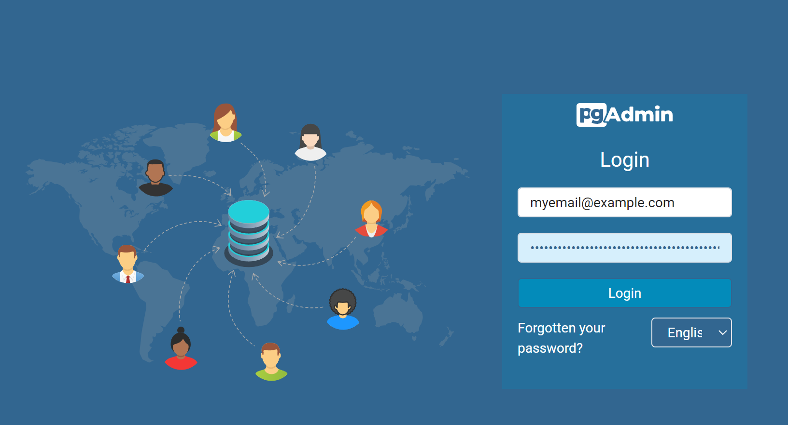
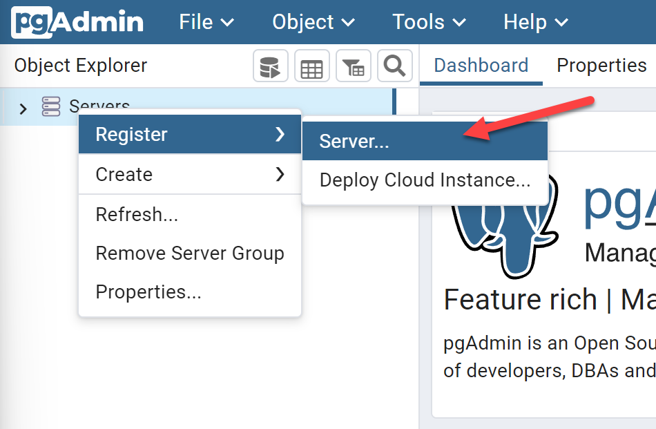
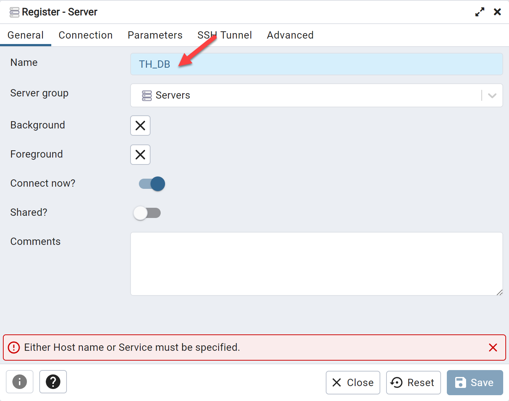
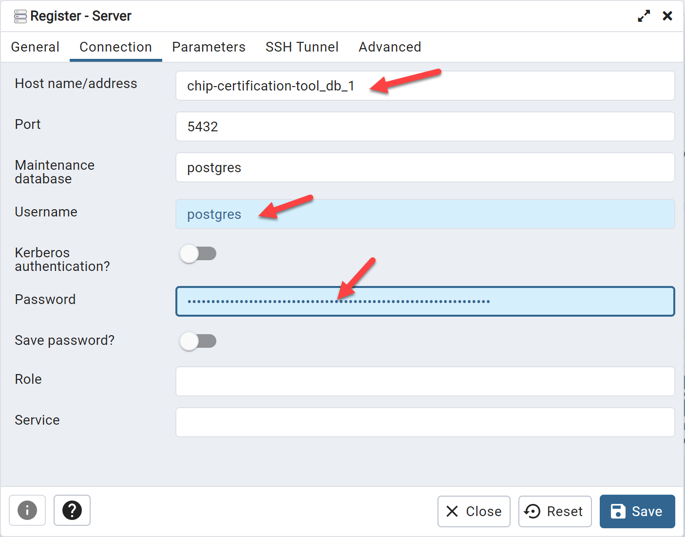
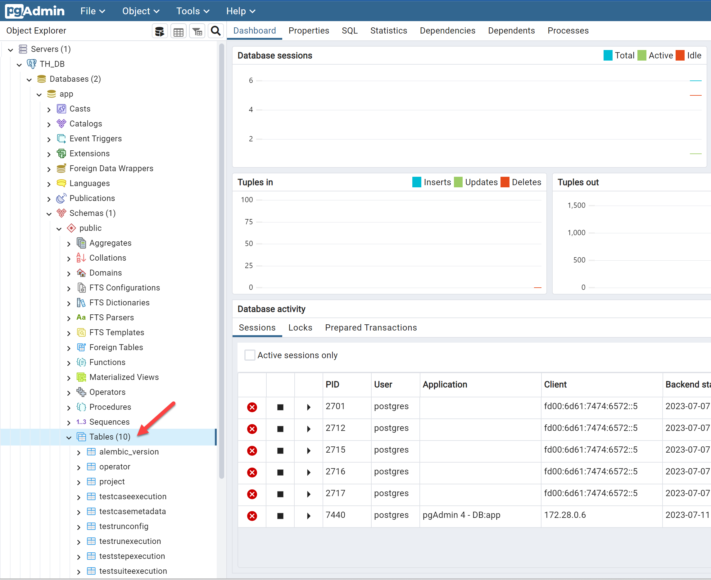
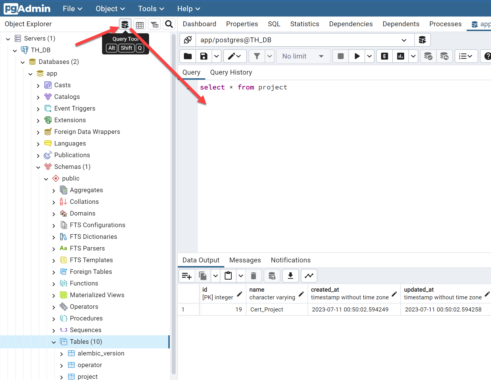

////
 *
 * Copyright (c) 2023 Project CHIP Authors
 *
 * Licensed under the Apache License, Version 2.0 (the "License");
 * you may not use this file except in compliance with the License.
 * You may obtain a copy of the License at
 *
 * http://www.apache.org/licenses/LICENSE-2.0
 *
 * Unless required by applicable law or agreed to in writing, software
 * distributed under the License is distributed on an "AS IS" BASIS,
 * WITHOUT WARRANTIES OR CONDITIONS OF ANY KIND, either express or implied.
 * See the License for the specific language governing permissions and
 * limitations under the License.
////
= Accessing the TH PostgreSQL database
ifdef::env-github[]
:tip-caption: :bulb:
:note-caption: :information_source:
:important-caption: :heavy_exclamation_mark:
:caution-caption: :fire:
:warning-caption: :warning:
endif::[]
ifndef::env-github[]
:icons: font
endif::[]
:idprefix:
:idseparator: -
:sectlinks:
:sectanchors:
:sectnumlevels: 4
:toc-title:
:toc:

:image-keep-aspect-ratio: true

[discrete]
== *Revision History*

|===
| *Revision*  | *Date*       | *Author*                            | *Description*                                                                                                       
| 1           | 20-Jul-2023  | [CSA]Raul Marquez               | * Initial version.
|===

:sectnums:
== pgAdmin setup
=== Setup command

To setup *pgAdmin*, run the following command from the TH Ubuntu command line:

[source,bash]
-----------------
docker run \
--name=my_pgadmin \
--network=chip-default \
-p 5050:80 \
-e 'PGADMIN_DEFAULT_EMAIL=myemail@example.com' \
-e 'PGADMIN_DEFAULT_PASSWORD=SuperSecret' \
-d dpage/pgadmin4
-----------------

=== Command breakdown
`name`: Container name, in this case, '_my_pgadmin_'.

`network`: The network the pgAdmin container should join, '_chip-default_' is the network the TH containers are in.

`-p 5050:80`: This will map port 80 from the pgAdmin container to port 5050 on the host.

`PGADMIN_DEFAULT_EMAIL` / `PGADMIN_DEFAULT_PASSWORD`: This is the user that will be used to login to the pgAdmin GUI (this is NOT the DB username and password).

`-d dpage/pgadmin4`: Specifies the pgAdmin image to use.

Once the container is up and running, you can access the *pgAdmin GUI* by navigating to `http://{host}:5050` in your browser.

== TH PostgreSQL database connection
=== pgAdmin login
pgAdmin will provide you this login screen, enter the credentials you setup in the docker command here.

=== Enter connection details
Right click on 'Servers', then choose _Register_ > _Server_.

[Enter connection details]

In the General tab, enter the Server Name, it can be any you want, in this case, TH_DB.

[Enter connection details]

In the Connection tab, enter the Host name/address, Username, and Password, then hit ‘Save’

[Enter connection details]

`Host name/address`: This should match the name of the DB container.

`Username` / `Password`: These are stored in the *default.env* file in the https://github.com/project-chip/certification-tool[certification-tool^] repo.

=== Explore tables and run queries
To see the available tables, drill down to _Servers_ > _Databases_ > _app_ > _Schemas_ > _public_ > _Tables_.

To run a query, click on the 'Query Tool' icon, it will provide an editor where you can execute queries.

