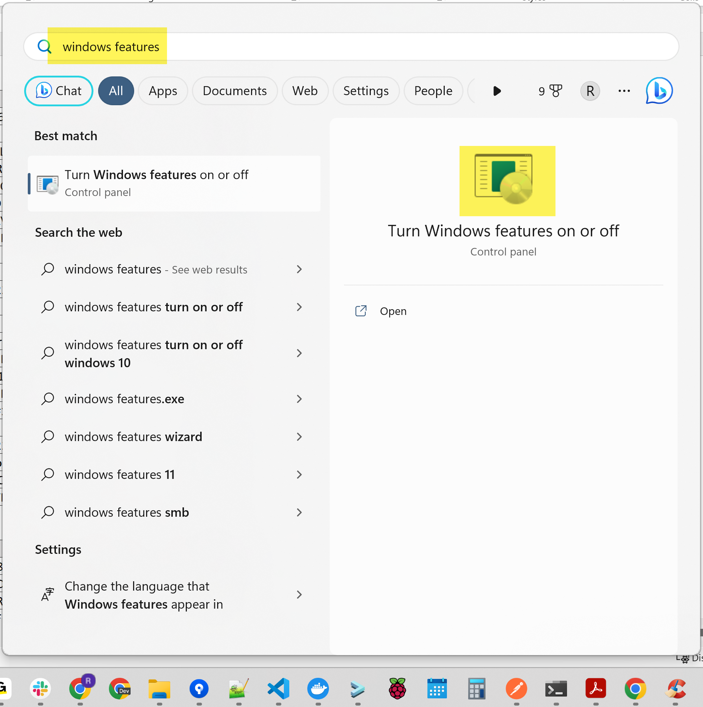
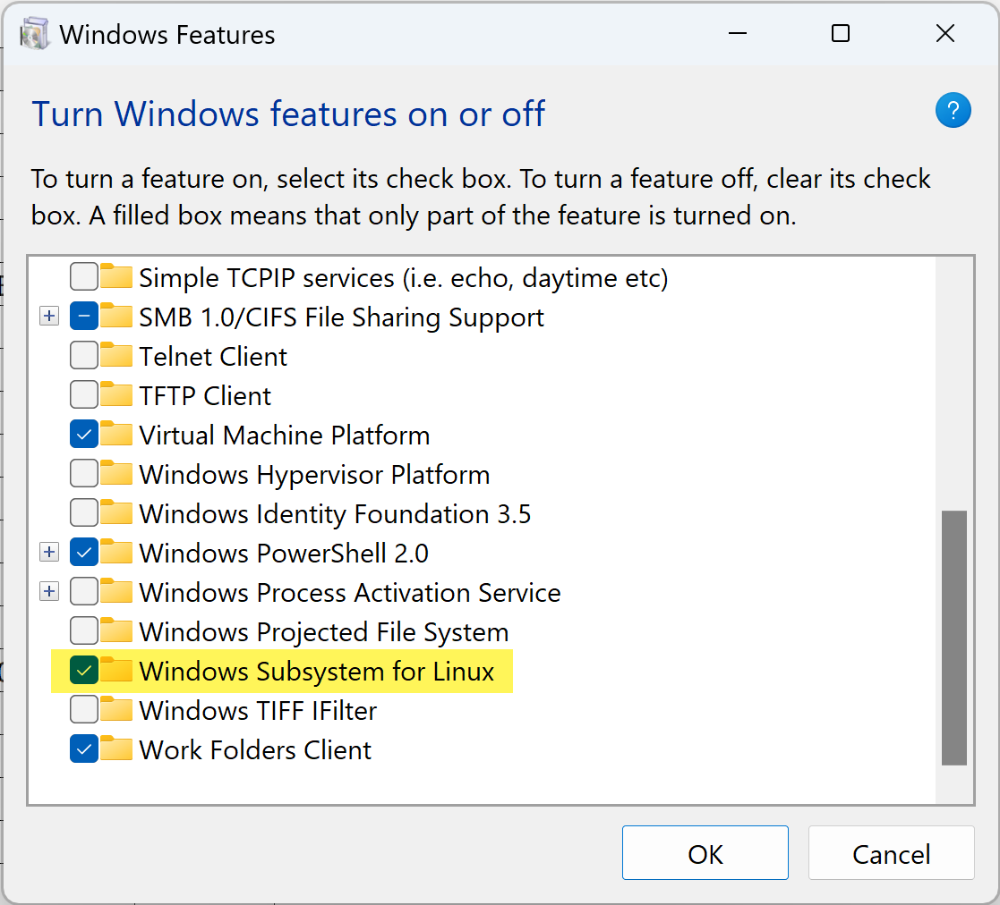
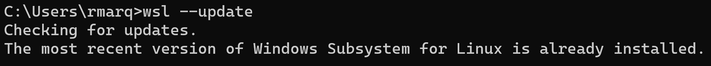
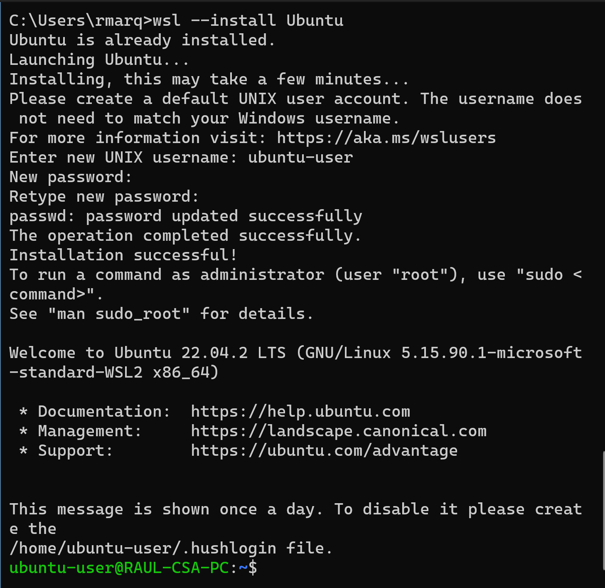
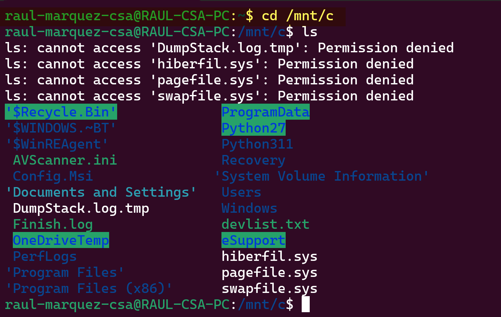

////
 *
 * Copyright (c) 2023 Project CHIP Authors
 *
 * Licensed under the Apache License, Version 2.0 (the "License");
 * you may not use this file except in compliance with the License.
 * You may obtain a copy of the License at
 *
 * http://www.apache.org/licenses/LICENSE-2.0
 *
 * Unless required by applicable law or agreed to in writing, software
 * distributed under the License is distributed on an "AS IS" BASIS,
 * WITHOUT WARRANTIES OR CONDITIONS OF ANY KIND, either express or implied.
 * See the License for the specific language governing permissions and
 * limitations under the License.
////
= Install Ubuntu Linux Subsystem (WSL) in Windows
ifdef::env-github[]
:tip-caption: :bulb:
:note-caption: :information_source:
:important-caption: :heavy_exclamation_mark:
:caution-caption: :fire:
:warning-caption: :warning:
endif::[]
ifndef::env-github[]
:icons: font
endif::[]
:idprefix:
:idseparator: -
:sectlinks:
:sectanchors:
:sectnumlevels: 4
:toc-title:
:toc:

[discrete]
== *Revision History*

|===
| *Revision*  | *Date*       | *Author*                            | *Description*
| 1           | 20-Jul-2023  | [CSA]Raul Marquez               | * Initial version.
|===

:sectnums:
== Verify Windows Subsystem for Linux (WSL) is enabled
Search for '_windows features_' and click on the '_Turn Windows features on or off_' result

[Verify Windows Subsystem for Linux (WSL) is enabled]

If '_Windows Subsystem for Linux_' isn’t checked, check it and restart the computer, if it’s already checked you can move on to the next section

[Verify Windows Subsystem for Linux (WSL) is enabled]

== Update WSL
Open a command prompt and run this command

[source,bash]
-----------------
wsl --update
-----------------

If it’s already up to date, you will see an output similar to this

[Update WSL]

Otherwise, wait until WSL is updated

== Install Ubuntu
To install Ubuntu, run this command

[source,bash]
-----------------
wsl --install Ubuntu
-----------------

You will be prompted for a new UNIX username and password, enter them, you will see an output similar to this

[Install Ubuntu]

At this point, you will be logged into the Ubuntu instance with the user/pass you provided

To login again in the future, run this command

[source,bash]
-----------------
wsl -d Ubuntu
-----------------

== Access your Windows files
You can access you Windows files and folders by going to the /mnt/c folder

[source,bash]
-----------------
cd /mnt/c
-----------------

[Access your Windows files]

== Reset the Ubuntu instance
If for any reason you need to reset the Ubuntu instance, run this command

[source,bash]
-----------------
wsl --unregister Ubuntu
-----------------

Then, repeat the install command from the previous section